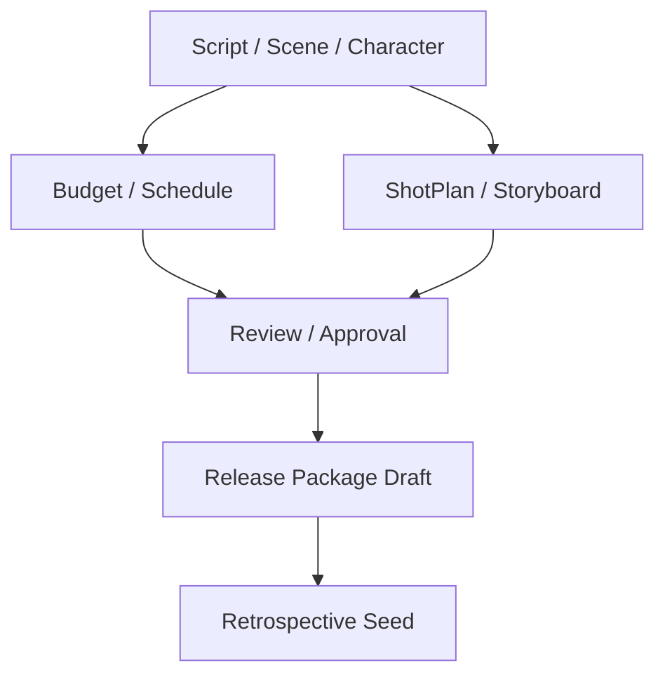
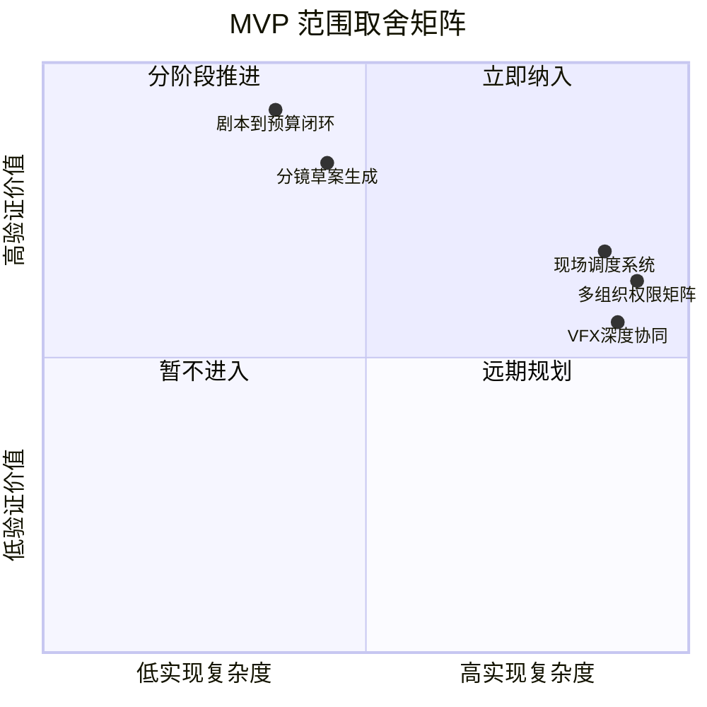
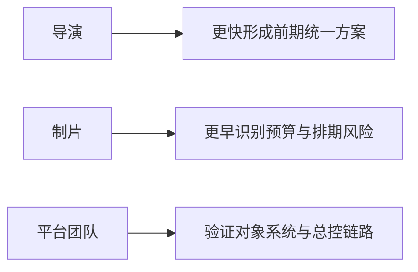
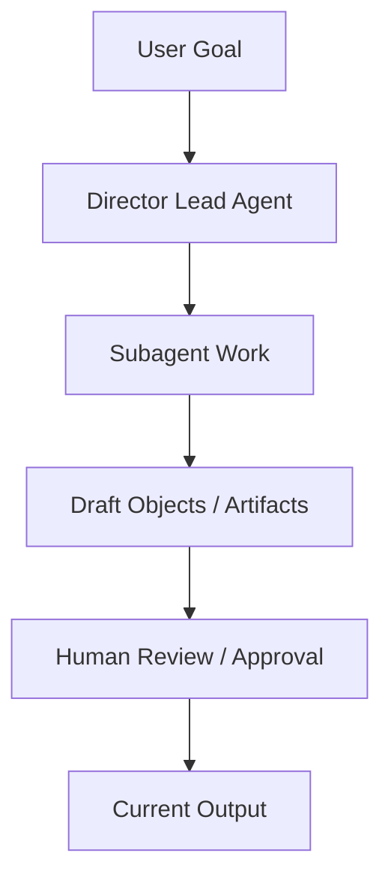
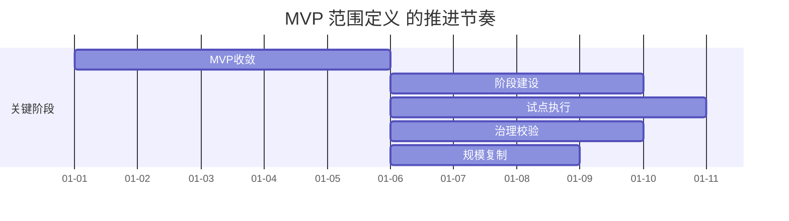

# 81. MVP 范围定义

这一篇聚焦：

**为什么电影导演智能体平台的第一版不能试图“一步做完整个电影工业操作系统”，而必须先定义一个边界清晰、价值可验证、实现可控的 MVP。**

---

## 1. 为什么 81 要从 MVP 开始

前面的 01-80 已经把平台的业务模型、对象体系、运行时架构和工程落点铺得很完整。

但一旦进入研发落地，就必须回到一个更现实的问题：

**第一版到底做什么，不做什么。**

如果不先收敛 MVP，团队很容易出现两种失控：

- 范围过大，迟迟没有第一版能跑起来
- 功能过散，做了很多点但没有形成真实闭环

所以 81 的任务不是继续扩展想象空间，而是把 01-80 的设计压缩成：

- 第一版必须做的
- 第一版明确不做的
- 第一版如何证明自己有价值

---

## 2. 为什么电影平台的 MVP 不应该从“全流程自动化”开始

一个常见误区是：

- 既然目标是电影导演智能体平台，那 MVP 就应该覆盖开发、前期、拍摄、后期、发行全链路

这在战略层是对的，但在执行层几乎一定会失败。

原因包括：

- 依赖对象过多
- 依赖角色过多
- 依赖治理边界过多
- 依赖真实项目协同太重

更现实的策略是：

- 先做一个“前期可运行闭环 + 基础治理能力”的 MVP

这样既能体现平台价值，又能避免一开始进入过重的现场执行和企业化复杂度。

---

## 3. 建议的 MVP 核心目标

建议第一版只回答一个关键问题：

**DeerFlow 能不能被改造成一个真正可用的“前期导演总控平台”，让剧本、场景、角色、预算、排期、分镜和治理链形成基本闭环。**

换句话说，MVP 的核心目标不是：

- 取代整套电影工业软件

而是：

- 证明“对象系统 + 导演总控 + 委派 + 治理 + 产物”这条主链是跑得通的

---

## 4. 一张总览图：MVP 边界

这张图说明：

- MVP 不需要做完整电影全流程
- 但必须做出一个“前期到治理”的正式闭环

---

## 5. 建议 MVP 纳入范围的能力

### 对象层

- `Project`
- `Script`
- `Scene`
- `Character`
- `BudgetDraft`
- `ScheduleDraft`
- `ShotPlan`
- `Storyboard`

### 运行时层

- `director` Lead Agent
- 3-5 个核心 movie subagents
- `MovieThreadState` 最小版本
- movie factory 最小装配

### 治理层

- `Review`
- `ApprovalRequest`
- `ReleasePackage` draft

### 产物层

- 剧本分析报告
- 场景清单
- 初版预算
- 初版排期
- 分镜包
- review 报告

---

## 6. 建议 MVP 明确不纳入范围的能力

为了避免失控，建议第一版明确不做下面这些重能力。

### 现场执行层

- on-set 调度系统
- take 级跟踪
- dailies 自动流程

### 重后期层

- 精细 VFX 协同
- 声音版本管理
- 调色主版本链

### 重企业化层

- 多项目资源池
- 多组织权限矩阵
- 复杂计费与 ROI 自动化报表

### 深度自动化层

- 全自动复杂排期优化
- 全自动镜头几何规划
- 全自动交付合规检查

如果把范围判断放到“验证价值 / 实现复杂度”的矩阵里看，MVP 的取舍边界会更直观：

---

## 7. 为什么 MVP 要优先聚焦前期闭环

前期闭环是最适合 DeerFlow 当前架构验证价值的切入点，因为它：

- 以结构化对象为主
- 以多角色协作为主
- 以状态、审批、产物为主
- 对实时现场联动依赖较弱

也就是说，它几乎正好卡在 DeerFlow 当前“多智能体 + 状态 + artifacts”能力最强的区域。

---

## 8. 一张用户价值图：MVP 能给谁带来价值

这张图说明：

- MVP 的价值必须同时被业务侧和平台侧感知

---

## 9. MVP 的核心用户旅程应该是什么

建议第一版至少跑通下面这条主旅程：

1. 导入剧本或剧本草稿
2. 自动或半自动生成 `Script / Scene / Character`
3. 生成预算草案与排期草案
4. 生成镜头计划与分镜草案
5. 发起 review round
6. 形成 approval request
7. 导出 release package draft

这条旅程的好处是：

- 有创作
- 有规划
- 有治理
- 有交付

它能很好证明平台不是“只会写文档”，而是真的能推进一个项目。

---

## 10. MVP 成功的最低标准是什么

建议至少定义三类成功标准。

### 功能成功标准

- 能跑通完整主旅程
- 能生成关键对象和关键产物
- 能形成最小 review / approval / package 闭环

### 工程成功标准

- 角色装配稳定
- 状态回写稳定
- artifact 管理稳定
- 关键委派成功率可接受

### 业务成功标准

- 一次真实或准真实项目能明显节省前期整理时间
- 风险能更早暴露
- 输出文档比手工初版更完整

---

## 11. 为什么 MVP 需要“半自动”而不是追求全自动

电影制作平台第一版不应该追求：

- 用户一键提交后系统全自动跑完

更合适的方式是：

- 主智能体推进
- 人在关键节点 review / approve / override

原因是：

- 这更符合真实制作流程
- 也更有利于发现对象和工作流设计问题

换句话说，MVP 的重点是：

- 证明协作闭环

而不是：

- 追求炫技式自动化

---

## 12. 一张人机协同图：MVP 的操作模式

这张图说明：

- MVP 更适合人机协同，而不是全自动黑箱

---

## 13. MVP 对应的最小角色集合

建议第一版最小角色集合为：

- `director`
- `producer`
- `script_analyst`
- `scheduler`
- `storyboard`

必要时可选补：

- `post_supervisor`

这套角色已经足够支撑：

- 前期结构化
- 风险识别
- 基础治理
- 基础交付

---

## 14. MVP 对应的最小技术骨架

第一版建议至少落下面这些骨架：

- `director` Lead Agent profile
- movie role registry
- `MovieThreadState` 最小字段集
- 5-8 个 movie tools
- 3-5 个 movie skills
- 基础 artifact / package / archive 路径

这些骨架比 UI 大而全更重要，因为它们决定后面是否能真正扩展。

---

## 15. 为什么 MVP 还要包含最小治理链

有些团队会想：

- 第一版先只做创作生成和文档生成

但如果没有 review / approval / package 这条治理链，第一版就很难证明：

- 平台能推进项目，而不只是生成内容

所以建议 MVP 即使很轻，也必须有：

- review round
- approval request
- package draft

这是第一版区别于“纯文档生成器”的关键。

---

## 16. 第一版推荐交付物清单

建议第一版至少有下面这些可见交付物：

- 项目概览摘要
- 剧本结构报告
- 场景清单
- 角色清单
- 预算草案
- 排期草案
- 镜头计划
- 分镜包
- review 报告
- release package draft

---

## 17. 这一篇与后续文档的关系

这一篇回答的是：

**如果现在就要启动电影导演智能体平台研发，第一版应该做到哪里，才既不虚，也不重。**

后面三篇会继续把 MVP 拆成研发阶段：

- 82：第一阶段研发计划
- 83：第二阶段研发计划
- 84：第三阶段研发计划

---

## 18. 这一篇最重要的结论

### 结论一
MVP 的目标不是做完整电影工业平台，而是做出“前期对象闭环 + 基础治理闭环 + 基础交付闭环”。

### 结论二
第一版必须同时覆盖对象、总控、委派、治理和产物，缺任何一块都会退化成碎片化原型。

### 结论三
对 DeerFlow 来说，最合适的 MVP 切口是前期导演总控平台，而不是从现场执行或企业级治理重区开始。

---

<!-- movie-visuals:start -->
## 补充图示：换一种视角看本篇

下面这张 甘特图 把“MVP 范围定义”再压缩成一个可快速扫读的结构视图，便于先抓关键关系，再回到正文细节。

<!-- movie-visuals:end -->

<!-- movie-doc-nav:start -->
## 文档导航

- 总入口：[README.md](./README.md)
- 阅读地图：[00-reading-map.md](./00-reading-map.md)
- 所在分组：81-90 MVP、试点与企业落地
- 上一篇：[80. 观测、日志与评估](./80-observability-logging-and-evaluation.md)
- 下一篇：[82. 第一阶段研发计划](./82-phase-1-development-plan.md)

### 同组文档
- 81. MVP 范围定义（当前）
- [82. 第一阶段研发计划](./82-phase-1-development-plan.md)
- [83. 第二阶段研发计划](./83-phase-2-development-plan.md)
- [84. 第三阶段研发计划](./84-phase-3-development-plan.md)
- [85. 试点项目实施手册](./85-pilot-project-implementation-manual.md)
- [86. 团队组织与角色分工](./86-team-organization-and-role-allocation.md)
- [87. 数据治理与资产治理](./87-data-and-asset-governance.md)
- [88. 安全、权限与审计](./88-security-permissions-and-audit.md)
- [89. 评估指标与 ROI](./89-metrics-and-roi.md)
- [90. 企业级落地路线图](./90-enterprise-rollout-roadmap.md)
<!-- movie-doc-nav:end -->
