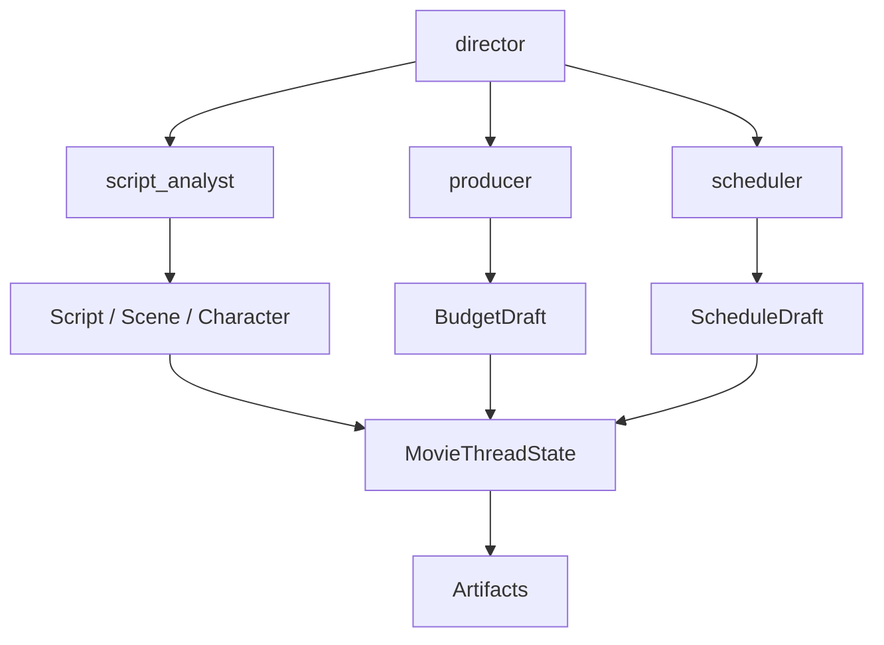
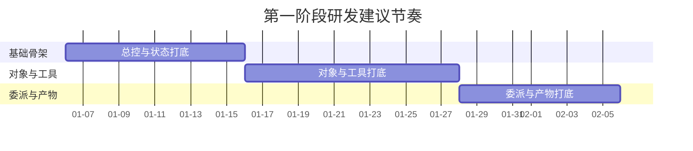
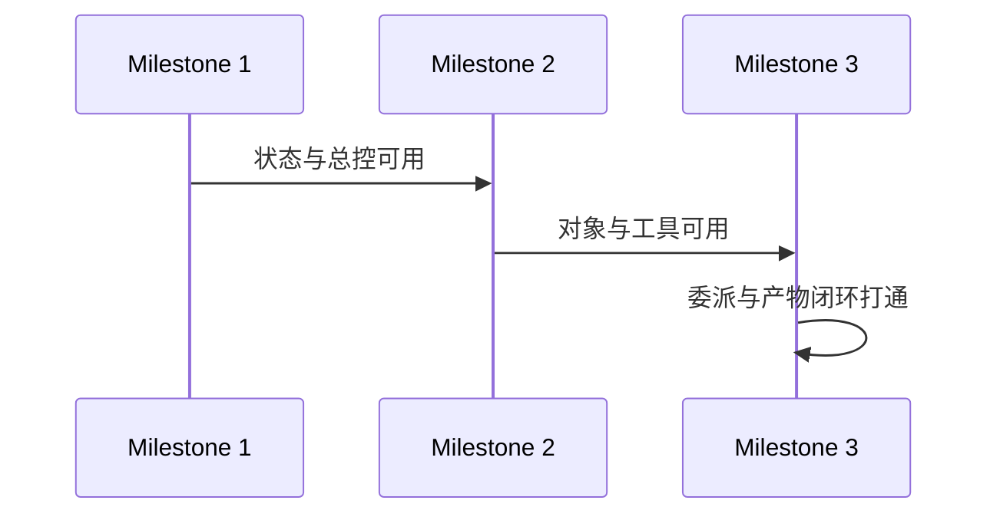
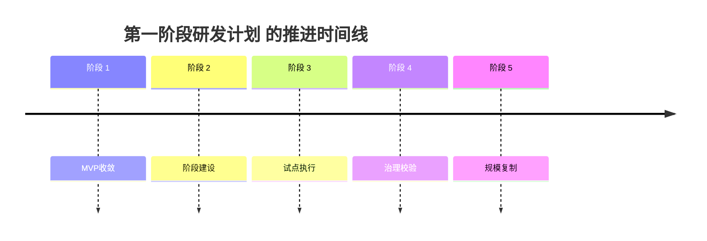

# 82. 第一阶段研发计划

这一篇聚焦：

**如果 81 已经把 MVP 边界确定为“前期对象闭环 + 基础治理闭环”，那么第一阶段研发最应该做哪些事情，才能尽快把平台从概念变成第一个可运行骨架。**

---

## 1. 第一阶段的核心目标

第一阶段不追求“完整可用产品”，而追求：

**先把电影平台最关键的运行骨架跑起来。**

建议把目标明确为四件事：

- 有导演总控入口
- 有最小对象系统
- 有最小委派系统
- 有最小状态回写与 artifact 输出

---

## 2. 为什么第一阶段不能一开始就做治理重区

虽然治理很重要，但第一阶段的关键不是先做完整审批后台，而是先证明：

- 对象链路能跑通
- 总控能委派
- 结果能回写
- artifact 能导出

否则治理层再完整，也会建立在不稳定的运行骨架上。

---

## 3. 第一阶段建议交付范围

### 运行时骨架

- `director` Lead Agent profile
- 3-4 个基础 movie roles
- movie factory 最小装配

### 对象骨架

- `Project`
- `Script`
- `Scene`
- `Character`
- `BudgetDraft`
- `ScheduleDraft`

### 状态骨架

- `MovieThreadState` 最小字段
- active refs
- next actions
- basic risk summary

### 工具与产物骨架

- 剧本解析
- 预算草案
- 排期草案
- 基础 artifact 导出

---

## 4. 一张阶段一总览图

这张图说明：

- 第一阶段的重点是先让前期主链跑通

---

## 5. 第一阶段建议拆成三个里程碑

### 里程碑 1：总控与状态打底

- `director` profile
- registry 初版
- `MovieThreadState` 最小结构

### 里程碑 2：对象与工具打底

- 剧本解析工具
- Scene / Character 提取
- Budget / Schedule 草案工具

### 里程碑 3：委派与产物打底

- `task` 协议增强
- 结构化返回
- artifact 基础导出

### 一张里程碑甘特图

这张图强调第一阶段不是功能清单，而是有依赖关系的节奏安排。

---

## 6. 第一阶段优先实现哪些角色

建议只做下面四个：

- `director`
- `script_analyst`
- `producer`
- `scheduler`

原因很简单：

- 这四个角色已经足够构成前期最核心的规划闭环

---

## 7. 一张里程碑时序图

这张图说明：

- 第一阶段的关键不是平铺做功能
- 而是按依赖关系分层推进

---

## 8. 第一阶段的工程落点

建议优先改这些位置：

- `agents/lead_agent/*`
- `agents/factory.py`
- `agents/thread_state.py`
- `tools/builtins/task_tool.py`
- `subagents/*`
- 新增 movie tools / skills 目录

这会让第一阶段尽量围绕现有骨架增量演进，而不是平行开新系统。

---

## 9. 第一阶段的退出标准

建议至少满足下面这些条件，才能认为阶段一完成：

- 可以导入剧本并生成 `Script / Scene / Character`
- 可以生成预算与排期草案
- 主智能体能按 phase 委派
- 状态能稳定回写
- artifact 能导出基础报告

---

## 10. 第一阶段最需要规避的风险

### 风险一：对象设计过重
导致进度拖慢。

### 风险二：角色过多
导致委派链条还没稳定就过度复杂。

### 风险三：工具过多
导致接口不稳定。

### 风险四：没有固定 demo 旅程
导致每周都在做不同方向，无法验证进展。

---

## 11. 为什么第一阶段最好用“固定 demo 剧本”

建议第一阶段不要在多个项目上同时试。

更合适的方式是：

- 选一个固定 demo 剧本
- 用它做所有对象、状态、artifact 和委派链路验证

这样团队更容易：

- 对齐输出
- 发现 schema 问题
- 对比不同版本改造效果

---

## 12. 第一阶段的产出物

建议阶段一结束时至少产出：

- 技术骨架说明
- demo 项目线程
- 基础对象样例
- 基础 artifact 样例
- 阶段一评估报告

---

## 13. 这一篇与后续文档的关系

这一篇回答的是：

**MVP 启动后，第一阶段研发到底先做什么，才能最快搭出可运行骨架。**

后面两篇会继续推进：

- 83：第二阶段研发计划
- 84：第三阶段研发计划

---

## 14. 这一篇最重要的结论

### 结论一
第一阶段的重点不是功能面子，而是导演总控、对象骨架、委派协议、状态回写这四条主链先打通。

### 结论二
最合适的阶段一闭环，是用少量角色和少量对象跑通一个稳定的 demo 前期项目。

### 结论三
如果阶段一没有形成固定 demo 旅程和清晰退出标准，后面阶段二、阶段三会很容易失速。

---

<!-- movie-visuals:start -->
## 补充图示：换一种视角看本篇

下面这张 时间线 把“第一阶段研发计划”再压缩成一个可快速扫读的结构视图，便于先抓关键关系，再回到正文细节。

<!-- movie-visuals:end -->

<!-- movie-doc-nav:start -->
## 文档导航

- 总入口：[README.md](./README.md)
- 阅读地图：[00-reading-map.md](./00-reading-map.md)
- 所在分组：81-90 MVP、试点与企业落地
- 上一篇：[81. MVP 范围定义](./81-mvp-scope-definition.md)
- 下一篇：[83. 第二阶段研发计划](./83-phase-2-development-plan.md)

### 同组文档
- [81. MVP 范围定义](./81-mvp-scope-definition.md)
- 82. 第一阶段研发计划（当前）
- [83. 第二阶段研发计划](./83-phase-2-development-plan.md)
- [84. 第三阶段研发计划](./84-phase-3-development-plan.md)
- [85. 试点项目实施手册](./85-pilot-project-implementation-manual.md)
- [86. 团队组织与角色分工](./86-team-organization-and-role-allocation.md)
- [87. 数据治理与资产治理](./87-data-and-asset-governance.md)
- [88. 安全、权限与审计](./88-security-permissions-and-audit.md)
- [89. 评估指标与 ROI](./89-metrics-and-roi.md)
- [90. 企业级落地路线图](./90-enterprise-rollout-roadmap.md)
<!-- movie-doc-nav:end -->
