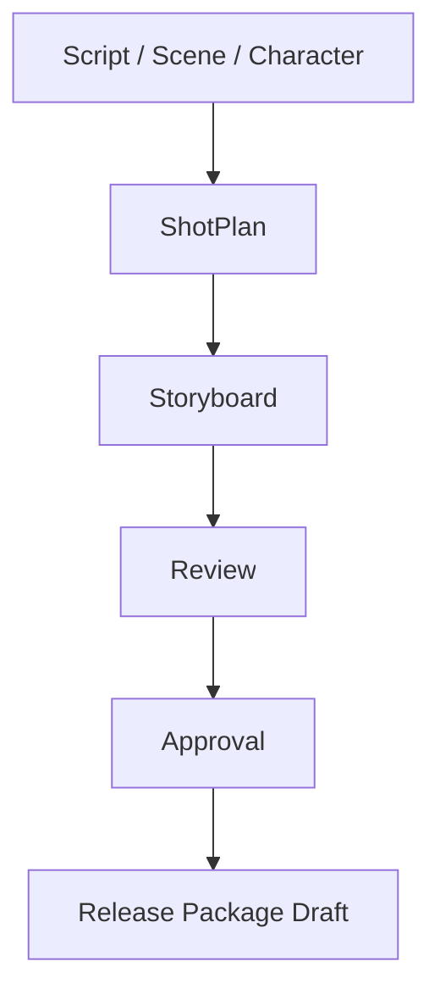
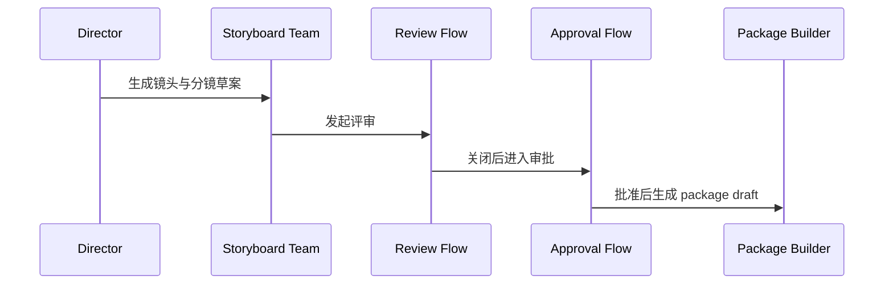

# 83. 第二阶段研发计划

这一篇聚焦：

**当第一阶段已经把前期导演总控的骨架搭起来之后，第二阶段最应该做哪些增强，才能把系统从“能跑”推进到“能形成稳定闭环和可用演示”。**

---

## 1. 第二阶段的核心目标

第二阶段建议聚焦一个关键目标：

**把前期对象闭环扩展成“视觉执行闭环 + 基础治理闭环”。**

也就是说，第二阶段不再只是：

- 生成剧本结构
- 生成预算和排期草案

还要补上：

- 镜头计划与分镜链
- review / approval 链
- package draft 链

---

## 2. 为什么第二阶段要优先补视觉和治理

因为 MVP 想真正体现平台价值，不能只停留在表格和分析报告层。

它必须能证明：

- 平台可以把创作目标推进到视觉执行对象
- 平台可以把 draft 结果推进到治理边界

这两点一旦成立，系统才真正像“平台”，而不只是“前期文档助手”。

---

## 3. 第二阶段建议交付范围

### 新增对象层

- `ShotPlan`
- `Storyboard`
- `Review`
- `ApprovalRequest`
- `ReleasePackage` draft

### 新增角色层

- `storyboard`
- `cinematography`
- 轻量 `post_supervisor`

### 新增运行时层

- gate-aware 委派
- review queue / approval queue
- artifact current / draft 区分

---

## 4. 一张阶段二总览图

这张图说明：

- 第二阶段要把平台推进到“视觉执行 + 治理闭环”

---

## 5. 第二阶段建议拆成三个里程碑

### 里程碑 1：视觉执行对象建立

- `ShotPlan`
- `Storyboard`
- 对应 artifact 导出

### 里程碑 2：治理对象建立

- `Review`
- `ApprovalRequest`
- 基础 queue 与状态摘要

### 里程碑 3：package 草案建立

- manifest
- package draft
- current / approved 边界

---

## 6. 第二阶段的关键技术动作

建议优先做：

- movie tools 扩展到视觉和治理工具
- movie skills 扩展到分镜和 review
- task 协议接入 expected outputs 和 blocked / escalated 状态
- `MovieThreadState` 接入 approval / review 摘要

这些动作会直接把 61-70 的设计往真实闭环推进。

---

## 7. 为什么第二阶段就应该开始做 package draft

有些团队会想把 package 留到很后面再做。

但电影平台如果没有 package 草案，就很难证明：

- 对象和 artifact 真能进入正式交付边界

所以即使第二阶段只做轻量 package draft，也非常有价值。

---

## 8. 一张治理链 sequence 图

这张图说明：

- 第二阶段的闭环重点，是把视觉结果推进到治理结果

---

## 9. 第二阶段的退出标准

建议至少满足下面这些条件：

- 可生成 `ShotPlan / Storyboard`
- review round 可闭环
- approval request 可形成正式记录
- release package draft 可生成 manifest
- `MovieThreadState` 能反映治理摘要

---

## 10. 第二阶段的主要风险

### 风险一：视觉对象和 artifact 脱节

### 风险二：review / approval 只停留在文档，不进入状态机

### 风险三：package 只是目录打包，没有 manifest 驱动

这些风险如果不控制，第二阶段看起来很丰富，但平台感会很弱。

---

## 11. 第二阶段的关键验收方式

建议用下面这条 demo 旅程验收：

1. 从剧本与场景出发
2. 生成镜头与分镜
3. 发起 review
4. 形成 approval
5. 生成 package draft

如果这条链路能稳定跑通，第二阶段就成立。

---

## 12. 这一篇与后续文档的关系

这一篇回答的是：

**在第一阶段搭好骨架以后，第二阶段该如何把平台推进到视觉执行和治理闭环。**

下一篇会继续推进到更完整的沉淀与企业化准备：

- 84：第三阶段研发计划

---

## 13. 这一篇最重要的结论

### 结论一
第二阶段的重点，是让平台从“能生成前期对象”进化到“能推进视觉执行对象并形成治理闭环”。

### 结论二
镜头 / 分镜 / review / approval / package 这条链，是第二阶段最值得优先打通的主线。

### 结论三
如果第二阶段没有把视觉执行与治理真正串起来，MVP 仍然会像一个增强型文档系统，而不像平台。
