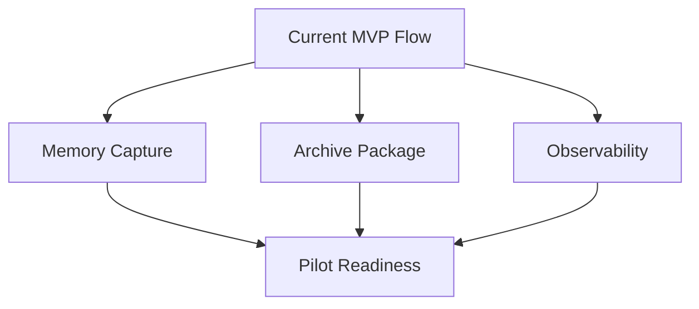
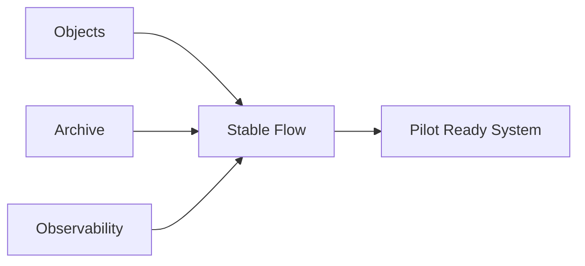
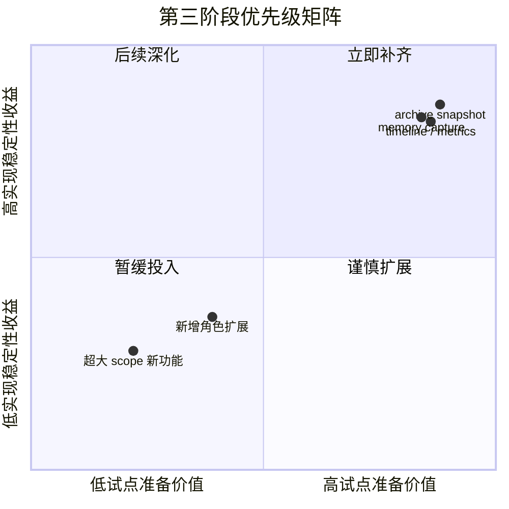
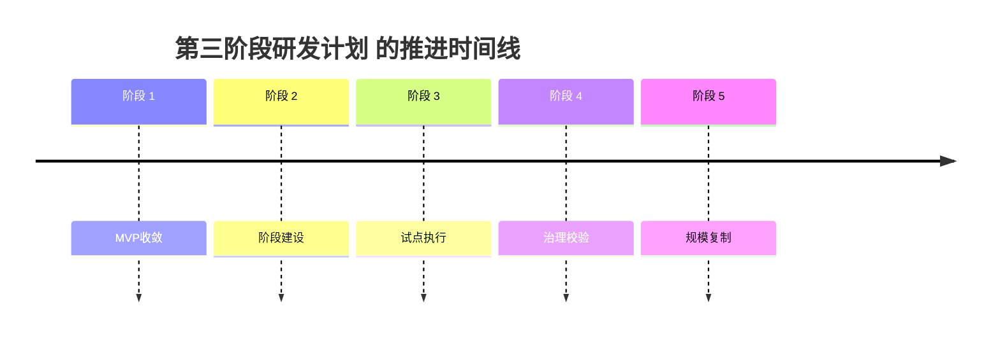

# 84. 第三阶段研发计划

这一篇聚焦：

**当第一阶段和第二阶段已经把前期闭环、视觉执行闭环和基础治理闭环搭起来之后，第三阶段最应该做哪些事情，才能让系统具备试点、沉淀和更强可扩展性的准备。**

---

## 1. 第三阶段的核心目标

第三阶段建议聚焦：

**把 MVP 从“可演示闭环”推进到“可试点闭环”。**

这意味着第三阶段的重点，不再只是新功能数量，而是：

- 稳定性
- 沉淀能力
- 交付完整性
- 可试点实施性

---

## 2. 为什么第三阶段不建议继续盲目扩功能

到了第三阶段，平台已经有相当多的对象和流程。

这时如果继续横向加很多新角色、新对象，很容易出现：

- demo 看起来越来越大
- 但真实试点反而更难落地

所以第三阶段更应该优先做：

- 记忆沉淀
- archive / package 完整性
- 观测与评估
- 试点配套能力

---

## 3. 第三阶段建议交付范围

### 沉淀层

- `ProjectMemory`
- `LessonLearned`
- `ReusableTemplate`

### 文件与归档层

- `ArchivePackage`
- archive snapshot
- current / approved / archived 完整边界

### 观测层

- timeline
- 关键运行指标
- demo / pilot eval 报告

### 试点准备层

- 固定试点流程
- 项目模板
- 基础操作手册

---

## 4. 一张阶段三总览图

这张图说明：

- 第三阶段重点是把 MVP 做成可试点系统

---

## 5. 第三阶段建议拆成三个里程碑

### 里程碑 1：沉淀闭环

- memory capture
- lessons learned
- reusable templates

### 里程碑 2：归档闭环

- archive package
- snapshot 验证
- artifact lineage 补齐

### 里程碑 3：评估与试点闭环

- timeline / logs / eval reports
- 试点操作文档
- 固定 demo 项目模板

---

## 6. 为什么记忆沉淀要放进第三阶段

因为：

- 第一阶段重点是骨架
- 第二阶段重点是闭环
- 第三阶段才适合开始稳态提炼经验

如果过早做深记忆层，团队容易在系统还不稳定时沉淀大量噪声。

而到了第三阶段，平台已经有一定稳定产物和流程，开始做记忆沉淀就更靠谱。

---

## 7. 为什么 archive 与 observability 要在第三阶段补齐

试点一旦开始，团队就会非常关注：

- 哪个版本是正式版
- 历史快照能不能回看
- 哪些问题高频发生
- 哪些环节最卡

这些问题都指向：

- archive 能力
- observability 能力

所以第三阶段必须把它们补齐。

---

## 8. 一张质量收口图

这张图说明：

- 第三阶段的关键不是新增业务范围
- 而是把已有范围做稳、做可追踪、做可试点

---

## 9. 第三阶段的退出标准

建议至少满足下面这些条件：

- memory capture 能形成结构化沉淀
- archive snapshot 能稳定生成并恢复定位
- timeline / metrics 可用于诊断
- 有一套固定的 pilot runbook 草稿

---

## 10. 第三阶段最需要规避的风险

### 风险一：为了“更完整”而无限扩 scope

### 风险二：记忆层堆材料但不可检索

### 风险三：archive 只是拷贝文件，没有恢复入口

### 风险四：有很多日志但没有真正可读的指标视图

---

## 11. 第三阶段的关键验收方式

建议做两类验收：

### 第一类：工程验收

- package / archive / memory / metrics 是否都能跑通

### 第二类：试点演练验收

- 用固定 demo 项目跑一次完整试点预演

这样第三阶段结束时，系统才是真正“能拿去试”的。

---

## 12. 这一篇与后续文档的关系

这一篇回答的是：

**MVP 在骨架和闭环都搭好之后，第三阶段应该怎么做，才能进入真正的试点准备。**

后面几篇会继续把试点、组织与治理层展开：

- 85：试点项目实施手册
- 86：团队组织与角色分工
- 87：数据治理与资产治理

如果把第三阶段的投入重点放进矩阵里看，会更容易理解为什么这一阶段不该再盲目加业务范围：

---

## 13. 这一篇最重要的结论

### 结论一
第三阶段的重点，不是盲目扩功能，而是把记忆、归档、观测和试点准备做实。

### 结论二
只有把 archive、memory、metrics 和 runbook 补齐，MVP 才能真正从 demo 进化到 pilot-ready。

### 结论三
如果第三阶段没有把“可试点性”作为核心目标，团队会很容易在看似丰富的功能中失去真实落地能力。

---

<!-- movie-visuals:start -->
## 补充图示：换一种视角看本篇

下面这张 时间线 把“第三阶段研发计划”再压缩成一个可快速扫读的结构视图，便于先抓关键关系，再回到正文细节。

<!-- movie-visuals:end -->

<!-- movie-doc-nav:start -->
## 文档导航

- 总入口：[README.md](./README.md)
- 阅读地图：[00-reading-map.md](./00-reading-map.md)
- 所在分组：81-90 MVP、试点与企业落地
- 上一篇：[83. 第二阶段研发计划](./83-phase-2-development-plan.md)
- 下一篇：[85. 试点项目实施手册](./85-pilot-project-implementation-manual.md)

### 同组文档
- [81. MVP 范围定义](./81-mvp-scope-definition.md)
- [82. 第一阶段研发计划](./82-phase-1-development-plan.md)
- [83. 第二阶段研发计划](./83-phase-2-development-plan.md)
- 84. 第三阶段研发计划（当前）
- [85. 试点项目实施手册](./85-pilot-project-implementation-manual.md)
- [86. 团队组织与角色分工](./86-team-organization-and-role-allocation.md)
- [87. 数据治理与资产治理](./87-data-and-asset-governance.md)
- [88. 安全、权限与审计](./88-security-permissions-and-audit.md)
- [89. 评估指标与 ROI](./89-metrics-and-roi.md)
- [90. 企业级落地路线图](./90-enterprise-rollout-roadmap.md)
<!-- movie-doc-nav:end -->
