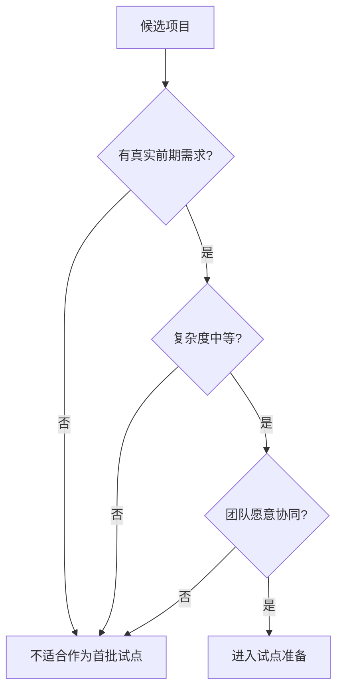
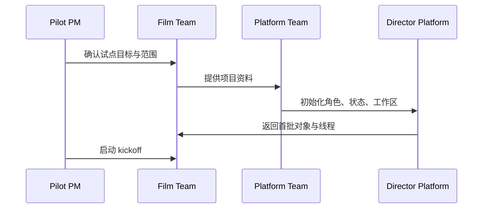

# 85. 试点项目实施手册

这一篇聚焦：

**当平台已经具备 pilot-ready 的基本条件之后，团队应该如何选择试点项目、如何启动、如何运行、如何验收，才能把电影导演智能体平台真正带入真实项目环境。**

---

## 1. 为什么试点手册非常关键

很多平台型项目在研发阶段看起来很顺，但一进入真实试点就开始失速。

原因通常不是技术完全不可用，而是：

- 没有选对试点项目
- 没有明确试点范围
- 没有试点操作手册
- 没有把研发视角切换成实施视角

所以 85 的任务是把前面的研发计划，正式翻译成：

- 试点怎么选
- 试点怎么跑
- 试点怎么验收

---

## 2. 试点项目应该怎么选

建议优先选择满足下面条件的项目。

### 条件一：前期工作量真实存在
要有真实剧本、真实场景拆解、真实预算和排期需求。

### 条件二：复杂度中等
不能太简单，否则看不出平台价值；也不能一开始就极其复杂，否则试点风险太高。

### 条件三：团队愿意协同
试点项目必须有愿意配合的平台用户，而不是被动接受者。

### 条件四：允许保留人工审批
试点阶段最好允许人机协同，而不是要求系统一步到位全自动。

---

## 3. 不建议作为第一批试点的项目类型

建议先不要选择：

- 极高预算长片
- 重 VFX、重多地拍摄、重多组织协同的大项目
- 时间窗口极端紧张、无法容纳试点摩擦的项目
- 权责边界极不清晰的临时拼接项目

第一批试点最重要的是：

- 稳定验证闭环

而不是挑战最大难度。

---

## 4. 一张试点筛选图

这张图说明：

- 试点选题本身就是成功率最大的前置变量之一

---

## 5. 试点启动前必须准备什么

建议至少准备四类东西。

### 项目材料

- 当前剧本
- 角色表
- 基础项目背景
- 初始目标与约束

### 平台配置

- `director` 和核心角色配置
- movie tools / skills 装配
- 项目 workspace 初始化

### 实施规则

- 人工 review 节点
- approval 边界
- 问题升级渠道

### 成功标准

- 本次试点想验证什么
- 以什么结果视为成功

---

## 6. 建议的试点启动清单

建议 kickoff 前至少完成下面这些清单。

- 项目目标定义
- 试点范围定义
- 角色分工确认
- 项目资料导入
- 线程初始化
- 工作区初始化
- 评估基线记录

这一步看起来很“流程化”，但它能显著降低后面试点跑偏的概率。

---

## 7. 一张试点启动 sequence 图

这张图说明：

- 试点不是“把系统扔给用户”就开始
- 它需要明确的启动流程

---

## 8. 试点期间建议怎么运行

建议用“阶段工作坊 + 日常运行”的方式组织。

### 阶段工作坊
用于关键阶段切换，例如：

- 剧本导入与锁稿前
- 预算与排期第一次联动前
- 分镜与 review 轮次前

### 日常运行
用于持续推进：

- 主智能体推进任务
- 团队 review 结果
- 处理风险与升级

这样既能保留试点节奏，也不会让系统运行脱离真实项目。

---

## 9. 建议的试点周节奏

### 每周固定节奏

- 周初：明确本周目标与对象范围
- 周中：运行主链并 review 中间结果
- 周末：记录风险、问题、lesson learned

### 每阶段固定节奏

- 阶段开始：确认输入材料与目标
- 阶段中：跟踪 blocked / approval / escalation
- 阶段结束：导出阶段 package 与复盘摘要

---

## 10. 试点中最重要的不是“结果完全正确”，而是“闭环是否成立”

第一批试点最值得验证的不是：

- 每一份预算是不是已经行业级精确
- 每一份分镜是不是已经完全可拍

而是：

- 对象链路是否成立
- 委派链路是否成立
- review / approval 是否成立
- artifact / package / archive 是否成立

因为这些闭环一旦成立，质量可以继续打磨；
如果闭环不成立，质量再高也很难扩展。

---

## 11. 建议在试点里保留哪些人工环节

建议第一批试点保留下面几类人工环节。

- 关键 review
- 关键 approval
- 关键 override
- 重大风险升级

这并不意味着平台不够强，而是意味着：

- 试点阶段要优先验证协作闭环和组织接受度

---

## 12. 一张人机协同试点图

这张图说明：

- 试点阶段的人机协同，不是妥协，而是合理策略

---

## 13. 试点应该记录哪些关键数据

建议至少记录：

- 输入材料完整度
- 主链运行次数
- review round 次数
- escalation 次数
- 关键产物生成次数
- 返工点
- 用户主观评价

这些数据会直接进入 89 的 ROI 和价值评估。

---

## 14. 试点验收标准建议

建议从三类标准验收。

### 功能验收

- 主旅程是否跑通

### 组织验收

- 团队是否愿意继续使用

### 价值验收

- 是否明显减少手工整理
- 是否更早识别风险
- 是否提高文档和交付的一致性

---

## 15. 试点结束后应该产出什么

建议至少产出：

- 试点评估报告
- 问题清单
- lesson learned
- 下一轮版本范围建议
- 模板与流程修订建议

这样试点就不会停留在“体验过一次”。

---

## 16. 这一篇与后续文档的关系

这一篇回答的是：

**如果平台已经准备好进入真实环境，团队应该如何设计、启动和运行第一批试点项目。**

后面几篇会继续把试点背后的组织与治理层补齐：

- 86：团队组织与角色分工
- 87：数据治理与资产治理
- 88：安全、权限与审计

---

## 17. 这一篇最重要的结论

### 结论一
试点成功的关键，首先是项目选择和实施方法，而不只是模型效果。

### 结论二
第一批试点最重要的目标，是验证对象、委派、治理和产物闭环，而不是追求一切都全自动且完美。

### 结论三
没有试点手册，平台很容易在真实项目里失速；有清晰 runbook，团队才能把研发成果真正变成实施能力。
