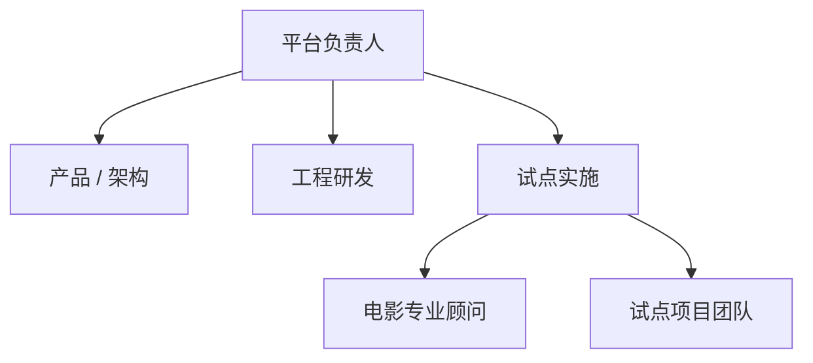
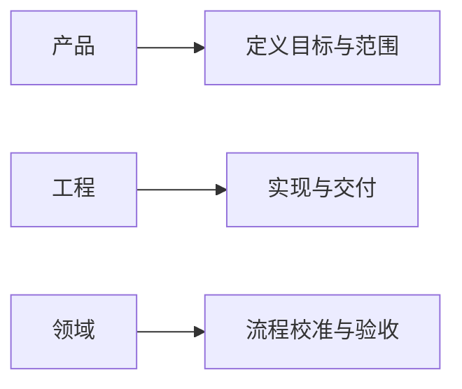
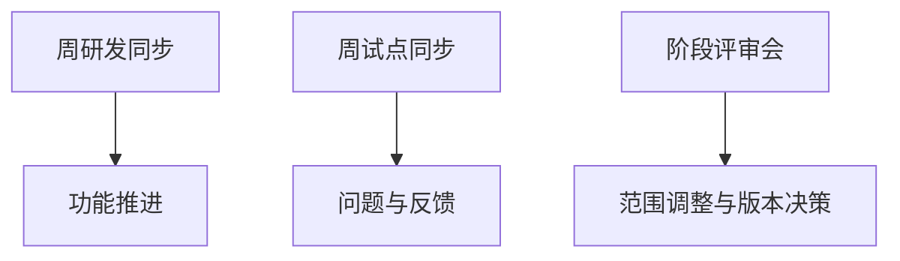

# 86. 团队组织与角色分工

这一篇聚焦：

**为什么电影导演智能体平台的落地不只是技术问题，还必须把平台团队、电影专业团队、试点项目团队的角色边界和协作方式明确下来，才能让系统真正被持续使用。**

---

## 1. 为什么组织设计是平台落地的必要条件

很多平台项目容易有一个错觉：

- 只要技术做出来，组织自然会适配

但电影导演智能体平台的现实是：

- 它横跨产品、研发、制片、导演、后期、项目管理

如果组织边界不清晰，很快就会出现：

- 平台团队不知道该听谁的
- 电影团队不知道该怎么接入
- 项目里出了问题没人兜底

所以 86 解决的是：

**谁负责什么，谁和谁协作，谁在什么节点做最终决策。**

---

## 2. 建议先把团队分成三层

### 第一层：平台核心团队
负责：

- 架构
- 后端
- 前端
- agent runtime
- tools / skills / state

### 第二层：电影领域协作团队
负责：

- 剧本、制片、排期、分镜、后期等专业方法输入

### 第三层：试点项目团队
负责：

- 提供真实项目材料
- 执行试点
- 提供反馈

这三层缺一不可。

---

## 3. 一张组织结构图

这张图说明：

- 平台落地需要同时有技术线和实施线

---

## 4. 建议的核心角色

### 平台负责人
负责：

- 战略范围
- 资源协调
- 阶段目标

### 产品 / 流程负责人
负责：

- 平台工作流设计
- 用户旅程
- 试点范围管理

### 技术负责人
负责：

- 架构
- 质量
- 研发节奏

### 电影领域顾问
负责：

- 校准真实制作流程
- 校准角色边界与交付物

### Pilot PM
负责：

- 试点日程
- 跨团队对齐
- 风险跟踪

---

## 5. 为什么电影领域顾问必须早期介入

如果没有电影专业顾问早期介入，平台团队很容易：

- 把真实流程想简单
- 把关键交付物理解错
- 把角色边界做反

所以电影顾问不是“上线前验收的人”，而应该是：

- 设计期共同定义的人
- 试点期共同判断的人

---

## 6. 建议用“产品-工程-领域”三角协同

电影平台最怕两个极端：

- 只听工程视角，最后变成技术玩具
- 只听领域视角，最后无法工程化

更稳的方式是：

- 产品负责把业务问题结构化
- 工程负责把结构落成系统
- 领域负责校准现实可用性

这样三方共同对关键节点负责。

---

## 7. 一张 RACI 风格协同图

这张图说明：

- 三方缺一，平台都会偏掉

---

## 8. 为什么试点项目里还要有“平台使用 owner”

即使项目里有导演、制片、平台团队，也建议明确一个：

- 平台使用 owner

这个角色负责：

- 收集项目材料
- 发起线程
- 协调 review 节点
- 汇总试点反馈

否则真实项目里会出现：

- 大家都觉得系统有价值
- 但没人负责把它真正用起来

---

## 9. 团队分工建议：研发阶段 vs 试点阶段

### 研发阶段更重要的角色

- 架构
- 后端
- agent 工程
- 电影顾问

### 试点阶段更重要的角色

- Pilot PM
- 平台使用 owner
- 试点项目导演 / 制片接口人
- 数据与评估负责人

也就是说，项目往前走时，团队重心会发生迁移。

---

## 10. 为什么组织节奏也要设计

落地不是只看角色，还要看节奏。

建议至少有三种固定节奏：

- 周研发同步
- 周试点运行同步
- 阶段评审会

如果没有这些稳定节奏，平台会在“设计、实现、试点”三条线之间反复脱节。

---

## 11. 一张协作节奏图

这张图说明：

- 组织不是静态结构
- 它也需要稳定运转节奏

---

## 12. 建议的最小团队配置

如果是第一轮试点，建议至少有：

- 1 名平台负责人 / 产品负责人
- 1 名技术负责人
- 2-3 名核心工程人员
- 1 名电影领域顾问
- 1 名 Pilot PM
- 1 名试点项目接口人

这套配置已经可以支撑首批试点。

---

## 13. 最需要规避的组织风险

### 风险一：平台团队和试点团队脱节

### 风险二：电影领域顾问介入太晚

### 风险三：没有明确 owner

### 风险四：所有问题都堆给技术负责人

这些问题一旦出现，平台往往不是技术崩，而是组织崩。

---

## 14. 这一篇与后续文档的关系

这一篇回答的是：

**电影导演智能体平台落地时，团队该怎么组织，角色该怎么分，节奏该怎么跑。**

后面几篇会继续把治理层展开：

- 87：数据治理与资产治理
- 88：安全、权限与审计
- 89：评估指标与 ROI

---

## 15. 这一篇最重要的结论

### 结论一
平台落地不是单纯技术实施，而是“产品-工程-领域-试点”多角色协同工程。

### 结论二
角色边界、owner 机制和协作节奏如果不提前设计，平台很容易在真实试点中因为组织失配而失速。

### 结论三
首批团队配置不需要很大，但必须同时覆盖平台、工程、领域和实施四类关键能力。
