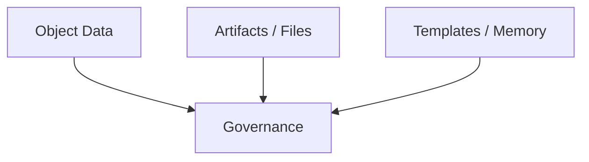
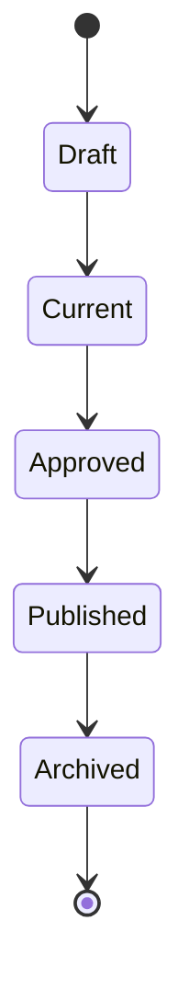
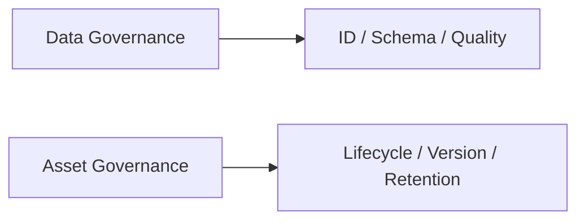

# 87. 数据治理与资产治理

这一篇聚焦：

**为什么电影导演智能体平台一旦进入真实试点和持续演进阶段，就必须把对象数据、文件资产、模板知识和历史快照纳入正式治理体系，否则平台能力越强，数据与资产风险反而会越大。**

---

## 1. 为什么数据治理和资产治理必须单独成篇

前面已经讲过：

- 对象系统
- 状态系统
- artifact 系统
- archive 系统

但这些系统一旦真实运行起来，就会马上遇到治理问题：

- 数据怎么命名
- 资产怎么分类
- 哪些是 current
- 哪些能复用
- 哪些应该保留

如果这些问题不提前定义，平台越往后越难收拾。

---

## 2. 为什么电影平台的数据和资产特别复杂

电影项目的数据和资产同时具有：

- 结构化对象
- 半结构化文档
- 图片与视觉参考
- 清单与包
- 历史快照

这意味着治理难点不只是“数据表设计”，还包括：

- 文件与对象如何对齐
- 资产如何跨阶段继承
- 模板如何复用
- 历史如何归档

---

## 3. 一张治理范围图

这张图说明：

- 治理范围必须同时覆盖对象、文件和知识资产

---

## 4. 建议先把治理对象分成四类

### 第一类：主数据
例如：

- 项目
- 剧本
- 场景
- 角色

### 第二类：执行数据
例如：

- 预算
- 排期
- review
- approval

### 第三类：内容资产
例如：

- 分镜图
- 参考图
- 报告
- package

### 第四类：知识资产
例如：

- reusable templates
- lessons learned
- project memory

---

## 5. 为什么主数据必须有统一命名与 ID 策略

如果没有统一 ID 和命名，平台很快会出现：

- 一个场景多个名字
- 一个角色多个别名
- 同一份预算多套引用路径

所以建议尽早定义：

- 对象 ID 规则
- artifact ID 规则
- package ID 规则
- archive ID 规则

这样后面 lineage、检索、审计都会容易很多。

---

## 6. 为什么资产治理不能只靠目录结构

目录结构当然重要，但资产治理更重要的是：

- 元数据
- 版本边界
- 来源引用
- 生命周期

如果没有这些，目录再整齐，后面还是会出现：

- 不知道当前该用哪版
- 不知道哪些资产能复用
- 不知道哪些历史必须保留

---

## 7. 一张资产生命周期图

这张图说明：

- 资产治理的关键，是生命周期边界清晰

---

## 8. 治理体系至少要回答哪些问题

### 数据质量问题

- 字段是否完整
- 引用是否一致

### 资产质量问题

- manifest 是否完整
- 当前版本是否清晰

### 生命周期问题

- 谁能 current
- 谁能 archived

### 复用问题

- 哪些模板可以跨项目复用
- 哪些只能项目内使用

---

## 9. 为什么模板和知识资产也要治理

模板如果不治理，会很快出现：

- 多套重复模板
- 过时模板还在被用
- 项目专属经验误当通用模板

所以知识资产也应该至少有：

- owner
- status
- applicability
- superseded_by

这样平台才不会在“沉淀知识”的同时累积知识噪声。

---

## 10. 一张数据与资产双轨治理图

这张图说明：

- 数据治理和资产治理彼此关联，但不完全相同

---

## 11. 建议的治理角色

建议至少明确：

- 数据 owner
- 资产 owner
- 模板 owner
- archive owner

这些 owner 不一定是不同人，但职责必须明确。

否则到了真实项目里，常见情况会变成：

- 出问题了，但没人知道该由谁修

---

## 12. 建议第一版治理重点

第一版不需要做成重型治理平台。

建议先做到：

- ID 规范
- current / archived 边界
- manifest 规范
- 模板状态规范
- archive 保留规则

这已经足够支撑试点。

---

## 13. 这一篇与后续文档的关系

这一篇回答的是：

**电影平台在试点和持续演进阶段，应该如何治理对象数据、文件资产和知识资产。**

后面几篇会继续补齐控制层与价值层：

- 88：安全、权限与审计
- 89：评估指标与 ROI
- 90：企业级落地路线图

---

## 14. 这一篇最重要的结论

### 结论一
电影平台的数据治理重点不只是 schema，而是对象引用、ID 规则和版本边界。

### 结论二
资产治理重点不只是目录，而是 lifecycle、manifest、retention 和 lineage。

### 结论三
如果试点前不建立最小治理规则，平台越成功，后期的数据和资产混乱成本就越高。
