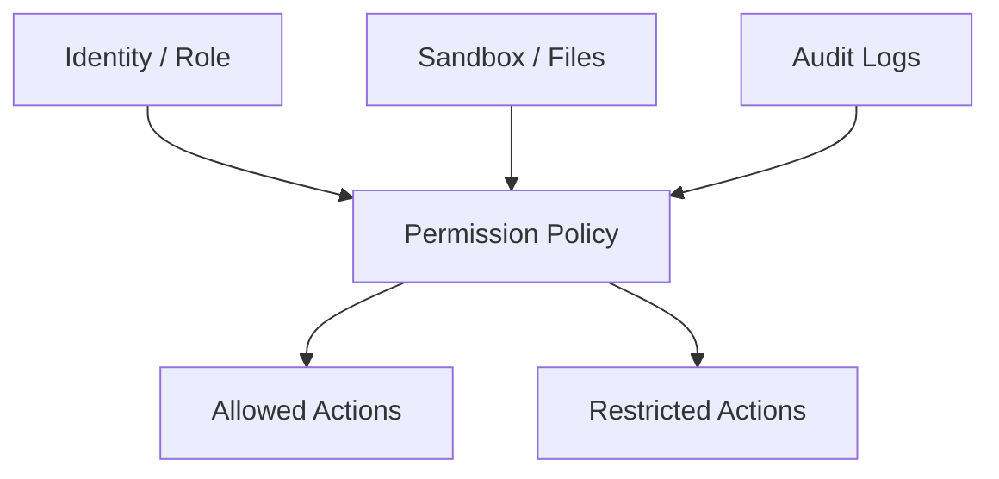
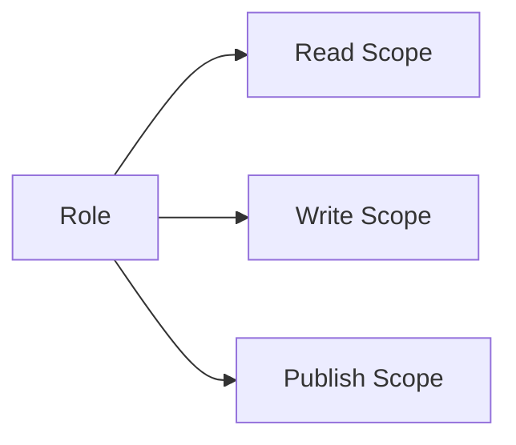
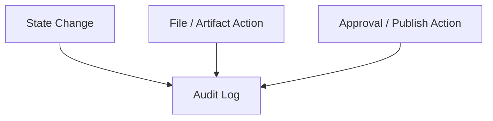
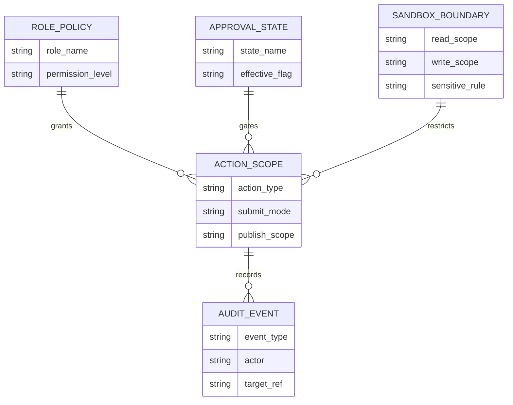
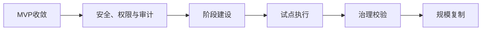

# 88. 安全、权限与审计

这一篇聚焦：

**为什么电影导演智能体平台一旦进入真实项目，就必须把安全、权限和审计设计成平台的正式主能力，而不能只依赖 prompt 约束或人工默认习惯。**

---

## 1. 为什么 88 必须在企业化之前讲清楚

平台一旦进入真实项目，就会处理：

- 未公开剧本
- 预算与合同敏感信息
- 演员与团队档期
- 视觉素材
- 外部交付包

这些内容天然带有较强的：

- 商业敏感性
- 权限敏感性
- 审计要求

如果安全和权限不清晰，平台越强、风险越大。

---

## 2. 为什么电影平台不能只靠“大家小心使用”

很多团队早期会默认：

- 先把系统做出来，再靠使用规范约束

这在真实项目里是不够的。

因为平台里很多动作不是口头行为，而是系统动作：

- 读取文件
- 导出 artifact
- 组装 package
- current / publish / archive 切换

这些动作必须有系统级边界。

---

## 3. 一张总览图：安全控制面

这张图说明：

- 安全不是单点功能
- 它贯穿角色、文件、动作和审计四条链

---

## 4. 建议先把权限分成三层

### 第一层：读取权限
能看什么对象、什么文件、什么资产。

### 第二层：写入权限
能生成什么 draft、能改哪些对象状态。

### 第三层：发布权限
能不能：

- current
- approve
- publish
- archive

这三层必须明确分开。

---

## 5. 为什么“可建议”和“可提交”必须区分

电影平台里的很多角色都可以提出建议，但并不应该拥有最终提交权限。

例如：

- `storyboard` 可以建议视觉方案
- `scheduler` 可以建议重排
- `producer` 可以建议风险处置

但最终：

- 谁能 current
- 谁能 approve
- 谁能 publish

应该受到更严格控制。

这意味着权限系统里一定要区分：

- `suggest`
- `submit`
- `approve`
- `publish`

---

## 6. 为什么 sandbox 是安全体系的一部分

从当前 DeerFlow 仓库可以看到已经有：

- `sandbox/security.py`
- `sandbox/middleware.py`
- `sandbox/tools.py`
- `agents/middlewares/sandbox_audit_middleware.py`

这说明现有系统已经有很好的安全入口。

对电影平台来说，sandbox 的价值不仅是隔离执行环境，还包括：

- 限制文件读写范围
- 限制敏感目录访问
- 记录文件操作轨迹

这会直接影响 artifact、package 和 archive 的可信度。

---

## 7. 一张权限边界图

这张图说明：

- 权限不是一个布尔值
- 它是多层边界

---

## 8. 审计为什么不是可选项

电影平台一旦进入真实项目，很快就会遇到下面的问题：

- 谁改了 current 版
- 谁触发了 archive
- 谁生成了对外 package
- 谁 override 了某个 gate

这些问题如果不能回答，平台就很难获得组织信任。

所以审计至少要覆盖：

- 关键状态切换
- 关键文件操作
- 关键审批动作
- 关键 override 动作

---

## 9. 一张审计事件图

这张图说明：

- 审计日志应该覆盖对象、文件、治理三个层面

---

## 10. 为什么权限配置必须和角色配置、状态机联动

权限不能只和角色静态绑定。

因为电影项目里，权限往往还受：

- 当前 phase
- 当前 control state
- 当前审批结果

影响。

例如：

- 某角色在前期可以生成 draft，但在 release 阶段不能直接生成 package
- 某对象只有在 approval 生效后才能 current

所以权限系统最好至少感知：

- role
- phase
- state
- approval status

---

## 11. 建议优先审计哪些关键动作

### 对象动作

- 创建 / 更新 / current / archive

### 文件动作

- 导出 artifact
- 组装 package
- seal archive

### 治理动作

- 发起 approval
- 通过 / 驳回
- override
- escalation close

这些动作最值得优先纳入 audit。

---

## 12. 为什么试点阶段也要做最小安全体系

有些团队会想：

- 安全和审计留到企业化再做

这通常会太晚。

因为试点阶段一旦形成错误习惯，后面很难改：

- current 切换无日志
- package 组装无记录
- override 无责任人

所以即使试点阶段安全体系可以轻量，也必须先有“最小可追踪边界”。

---

## 13. 建议的代码落点

较自然的落点包括：

- `backend/packages/harness/deerflow/sandbox/security.py`
- `backend/packages/harness/deerflow/agents/middlewares/sandbox_audit_middleware.py`
- config / factory / role permission policies
- 审批与发布动作的 audit hooks

这些点可以组成电影平台的最小安全控制面。

---

## 14. 第一版实现建议

第一版建议先做到：

- role-based read / write / publish scope
- sandbox 访问边界
- 关键动作结构化审计日志
- override / publish / archive 留痕

暂时不要一开始就做：

- 超复杂 ABAC / PBAC 混合模型
- 大规模组织级 IAM 集成
- 细粒度跨组织零信任网关

---

## 15. 这一篇与后续文档的关系

这一篇回答的是：

**电影平台进入真实项目后，如何建立最小但正式的安全、权限和审计边界。**

后面两篇会继续把价值评估与企业化路线收口：

- 89：评估指标与 ROI
- 90：企业级落地路线图

如果把安全控制面单独抽成关系图，会更容易看出“身份、权限、动作、审计”为什么必须一起设计：

---

## 16. 这一篇最重要的结论

### 结论一
安全、权限和审计不是企业化后补的外壳，而是电影平台进入真实项目的基础信任条件。

### 结论二
设计重点是区分建议、提交、批准、发布四类动作，并对关键状态和文件动作做最小审计。

### 结论三
在 DeerFlow 中，以 sandbox、安全中间件、角色权限策略和治理动作钩子为基础建立最小控制面，是试点和企业化之间最重要的安全桥梁。

---

<!-- movie-visuals:start -->
## 补充图示：换一种视角看本篇

下面这张 流程图 把“安全、权限与审计”再压缩成一个可快速扫读的结构视图，便于先抓关键关系，再回到正文细节。

<!-- movie-visuals:end -->

<!-- movie-doc-nav:start -->
## 文档导航

- 总入口：[README.md](./README.md)
- 阅读地图：[00-reading-map.md](./00-reading-map.md)
- 所在分组：81-90 MVP、试点与企业落地
- 上一篇：[87. 数据治理与资产治理](./87-data-and-asset-governance.md)
- 下一篇：[89. 评估指标与 ROI](./89-metrics-and-roi.md)

### 同组文档
- [81. MVP 范围定义](./81-mvp-scope-definition.md)
- [82. 第一阶段研发计划](./82-phase-1-development-plan.md)
- [83. 第二阶段研发计划](./83-phase-2-development-plan.md)
- [84. 第三阶段研发计划](./84-phase-3-development-plan.md)
- [85. 试点项目实施手册](./85-pilot-project-implementation-manual.md)
- [86. 团队组织与角色分工](./86-team-organization-and-role-allocation.md)
- [87. 数据治理与资产治理](./87-data-and-asset-governance.md)
- 88. 安全、权限与审计（当前）
- [89. 评估指标与 ROI](./89-metrics-and-roi.md)
- [90. 企业级落地路线图](./90-enterprise-rollout-roadmap.md)
<!-- movie-doc-nav:end -->
