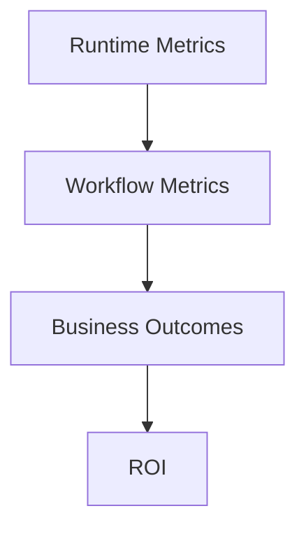
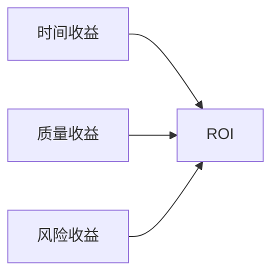
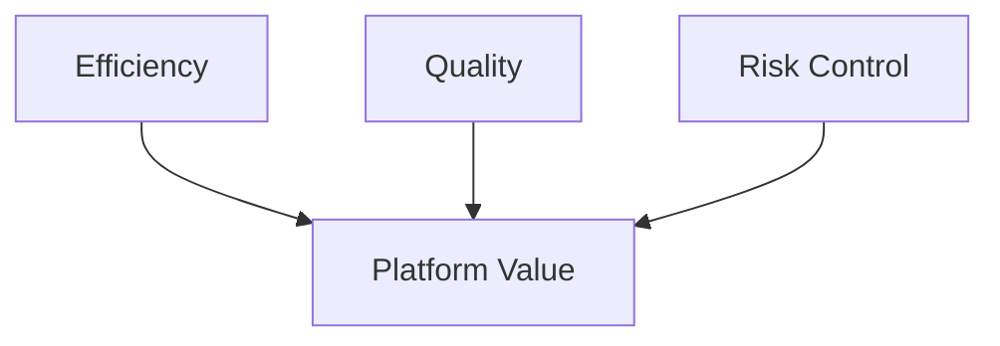
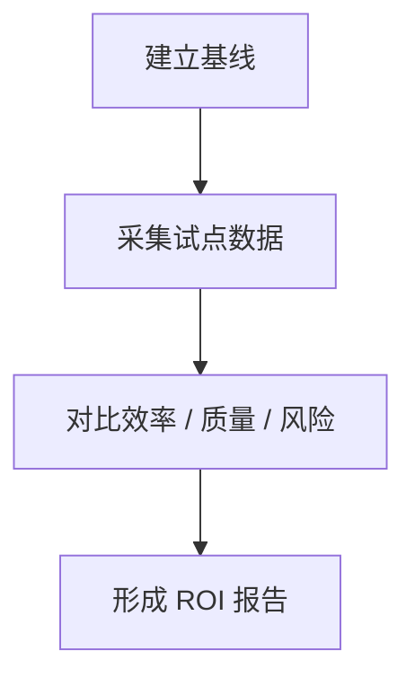

# 89. 评估指标与 ROI

这一篇聚焦：

**为什么电影导演智能体平台不能只靠“感觉好像更高效了”来证明价值，而必须建立一套从运行指标、工作流指标到业务 ROI 的正式评估框架。**

---

## 1. 为什么 ROI 不能等到很后面才讨论

平台类项目最常见的质疑不是：

- 技术能不能做

而是：

- 值不值得持续投入

如果没有清晰的指标和 ROI 框架，平台很容易进入：

- 做了很多功能
- 但组织看不到价值证据

所以 89 的任务，就是把前面 80 的观测能力正式翻译成：

- 可以被管理层和业务方理解的价值框架

---

## 2. 为什么电影平台的 ROI 特别难算

因为它的价值不只体现在“省了多少人工”。

它还可能体现在：

- 更早识别风险
- 更少返工
- 更快对齐团队
- 更稳定形成交付物

所以 ROI 必须同时考虑：

- 效率收益
- 质量收益
- 风险收益
- 组织收益

---

## 3. 一张总览图：指标到 ROI 的关系

这张图说明：

- ROI 不是直接从情绪得出的
- 它需要从观测指标逐级推导

---

## 4. 建议把评估指标分成四层

### 第一层：运行质量指标

- 延迟
- 成功率
- 重试率

### 第二层：工作流指标

- review reopen rate
- approval turnaround time
- escalation resolution time

### 第三层：业务效率指标

- 剧本到预算首版时间
- 排期首版时间
- 分镜草案形成时间

### 第四层：业务结果指标

- 返工次数
- 风险前置发现率
- 交付缺件率
- 团队满意度

---

## 5. 为什么不能只看“节省时间”

电影平台如果只看时间，会漏掉很多更重要的价值。

例如：

- 一次更早的风险识别，可能比节省两小时文档整理更有价值
- 一次减少返工，可能比单次生成速度更关键

所以建议至少同时看三类收益：

- 时间收益
- 质量收益
- 风险收益

---

## 6. 一张价值构成图

这张图说明：

- ROI 必须是多维收益合成结果

---

## 7. 建议优先跟踪的效率指标

### 前期效率

- 剧本导入到场景结构化时间
- 场景结构化到预算首版时间
- 场景结构化到排期首版时间

### 视觉效率

- ShotPlan 首版时间
- Storyboard 草案时间

### 治理效率

- review 关闭时间
- approval 生效时间
- package draft 生成时间

这些指标在试点里最容易被验证。

---

## 8. 建议优先跟踪的质量指标

- 对象完整度
- 产物完整度
- review reopen rate
- 关键 artifact current 一致性
- package manifest 缺件率

这些指标能直接反映平台有没有让流程更稳。

---

## 9. 建议优先跟踪的风险指标

- 高优先级风险前置发现率
- blocked 阶段时长
- escalation 平均解决时间
- 回退次数

这些指标特别适合说明：

- 平台并不只是加速器
- 它还是风险前置器

---

## 10. 一张平衡计分图

这张图说明：

- 平台价值最好用平衡视角看，而不是单指标判断

---

## 11. ROI 可以怎么估算

建议先用一个相对保守的估算框架：

### 收益项

- 节省的前期整理工时
- 节省的返工工时
- 提前暴露风险避免的成本
- 交付一致性提升减少的补件成本

### 成本项

- 平台研发成本
- 模型与基础设施成本
- 试点实施成本
- 培训与组织接入成本

### 基础公式

`ROI = (总收益 - 总成本) / 总成本`

第一版不需要把公式做得极复杂，但一定要有。

---

## 12. 为什么还要看“采用率”和“保留率”

如果平台真的有价值，用户应该表现出：

- 愿意持续使用
- 愿意把更多流程交给平台

所以建议还要跟踪：

- 周使用率
- 核心旅程完成率
- 试点后继续使用意愿

这些指标会帮助判断：

- 平台是“演示好看”
- 还是“真实可用”

---

## 13. 为什么 ROI 评估要有基线

如果没有基线，后面所有价值判断都容易变成主观感受。

建议在试点前就记录：

- 传统方式下相同步骤耗时
- 传统方式下常见返工点
- 传统方式下常见缺件点

这样试点后的数据才有参照物。

---

## 14. 一张 ROI 评估流程图

这张图说明：

- ROI 必须建立在基线与对比之上

---

## 15. 第一版实现建议

第一版建议先做到：

- 基线采集模板
- 关键效率指标
- 关键质量指标
- 关键风险指标
- 简单 ROI 报告模板

暂时不要一开始就做：

- 超复杂财务模型
- 大规模多项目 ROI 仪表盘
- 精细分角色成本核算引擎

---

## 16. 这一篇与后续文档的关系

这一篇回答的是：

**电影平台应该如何把运行观测转化成可被业务和管理层理解的价值证明。**

下一篇会把这些价值判断进一步放到企业级落地路径中：

- 90：企业级落地路线图

---

## 17. 这一篇最重要的结论

### 结论一
电影平台的 ROI 不能只看节省时间，还必须同时看质量收益和风险收益。

### 结论二
80 的观测体系和 89 的 ROI 框架必须联动，否则技术信号很难转化成组织决策依据。

### 结论三
第一版 ROI 评估不需要极端精细，但必须尽早建立基线、指标和报告模板，否则平台很难获得持续投入。
