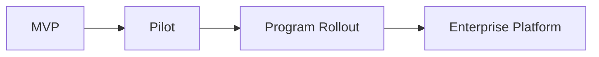
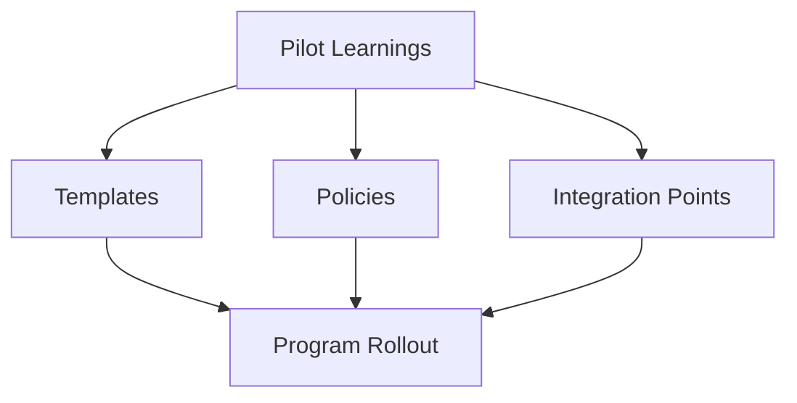
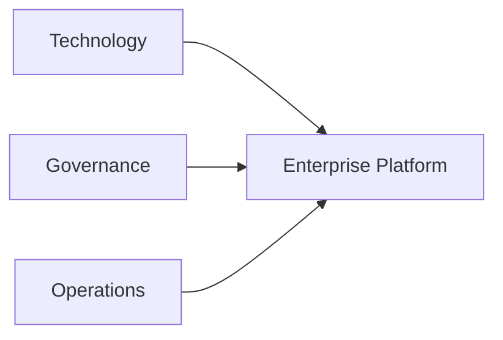
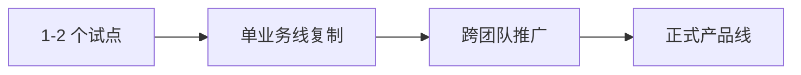

# 90. 企业级落地路线图

这一篇聚焦：

**为什么电影导演智能体平台从 MVP、试点到真正企业级落地，不是一跳到位的事情，而必须沿着一条清晰的阶段化路线，把能力、组织、治理、集成和商业价值逐步放大。**

---

## 1. 为什么 90 是整个 20 号总计划的收口

20 号文档一开始就提出，这整套文档的目标不是只回答：

- AI 能做什么

而是要把：

- 行业流程
- 平台建模
- 源码扩展
- 研发落地
- 企业化路径

完整打通。

到了 90，前面的所有内容终于汇成一个最终问题：

**如果这套平台真的有价值，它该如何从一套试点系统成长为企业级能力。**

---

## 2. 什么叫“企业级落地”

这里说的企业级，不只是：

- 功能更多

而是：

- 多项目可用
- 多团队可用
- 有治理边界
- 有安全边界
- 有评估机制
- 有持续投入理由

也就是说，企业级落地意味着平台从“试点工具”变成“组织能力”。

---

## 3. 一张总览图：从 MVP 到企业级的四段路线

这张图说明：

- 企业级落地是分阶段放大的

---

## 4. 建议把企业级路线分成四个阶段

### 阶段一：MVP
目标：

- 跑通前期对象与治理闭环

### 阶段二：Pilot
目标：

- 在真实项目中验证闭环与价值

### 阶段三：Program Rollout
目标：

- 在多个项目或一个业务线里复制模板化实践

### 阶段四：Enterprise Platform
目标：

- 形成跨项目、跨团队、带治理和评估的正式平台

---

## 5. 为什么试点成功不等于企业成功

试点成功只能说明：

- 在某个项目、某种条件下，平台有价值

但企业级成功还需要额外证明：

- 能标准化复制
- 能稳定治理
- 能融入现有组织
- 能持续产出 ROI

所以从试点走向企业，真正的挑战往往不是模型能力，而是：

- 组织能力
- 治理能力
- 集成能力

---

## 6. Program Rollout 阶段最重要的事情是什么

建议聚焦三件事。

### 第一，模板化
把试点里有效的：

- role config
- skill packs
- package templates
- pilot runbook

沉淀成可复制模板。

### 第二，治理化
把试点里的隐性操作变成：

- 权限规则
- 审批规则
- archive 规则

### 第三，集成化
开始考虑与外部系统的连接，例如：

- 项目管理系统
- 文件系统
- 审批系统

---

## 7. 一张放大路径图

这张图说明：

- 企业化不是重复试点
- 而是把试点结果沉淀成可复制系统

---

## 8. 企业级阶段新增的核心要求

### 治理要求

- 多组织权限
- 审计可追踪
- 数据与资产治理

### 工程要求

- 稳定观测
- 可配置角色体系
- 更可靠的 package / archive

### 业务要求

- 模板化项目接入
- 试点转常规使用
- 价值可持续验证

---

## 9. 为什么企业化阶段要开始看“平台运营”

一旦进入企业级，平台就不再只是研发项目，而是需要运营。

这包括：

- 模板维护
- 角色版本管理
- skill 版本管理
- 指标月报
- 项目接入支持

如果没有平台运营能力，企业化平台很容易迅速积累技术债和流程债。

---

## 10. 一张企业化能力图

这张图说明：

- 企业级平台是技术、治理、运营三者共同组成的

---

## 11. 企业级落地最重要的三个决定点

建议至少在下面三个节点做正式决策。

### 决定点一：是否从 MVP 进入试点
看的是：

- 闭环是否成立

### 决定点二：是否从试点进入 program rollout
看的是：

- 价值是否成立
- 组织是否接受

### 决定点三：是否从 rollout 进入企业平台
看的是：

- 模板化复制是否成立
- 治理和安全是否成立

---

## 12. 企业级路线中最常见的失败模式

### 失败模式一：试点成功后直接无限扩范围

### 失败模式二：忽略治理与安全，导致组织不敢推广

### 失败模式三：只有技术版本，没有运营版本

### 失败模式四：看不到可持续 ROI，资源支持断掉

这些都不是技术 bug，但都足以让平台企业化失败。

---

## 13. 建议的企业级路线节奏

### 第一步：1-2 个试点项目
验证闭环和价值。

### 第二步：1 条业务线复制
验证模板化与治理化。

### 第三步：跨项目、跨团队推广
验证平台运营与指标体系。

### 第四步：形成正式产品线
进入企业级平台阶段。

---

## 14. 一张时间阶段图

这张图说明：

- 企业化更像爬坡，而不是开关式切换

---

## 15. 什么时候可以认为企业级落地成立

建议至少满足下面几个条件：

- 多个项目能复用同一套平台能力
- 角色、模板、skills、tools 有稳定版本管理
- 安全、审计、治理可被组织接受
- 管理层能看到稳定 ROI

满足这些条件时，平台才真正从“创新项目”变成“组织能力”。

---

## 16. 这一篇与整套文档的关系

这一篇回答的是：

**当电影导演智能体平台已经完成方案、建模、研发、试点这些步骤之后，最终应当如何走向真正的企业级落地。**

它也是 20 号总规划的最后一块拼图：

- 行业流程
- 平台建模
- 源码扩展
- 研发实施
- 企业级平台化

在这里完整闭环。

---

## 17. 这一篇最重要的结论

### 结论一
企业级落地不是功能堆出来的，而是通过 MVP、Pilot、Program Rollout、Enterprise Platform 四段路线逐步放大的。

### 结论二
从试点到企业的关键，不只是技术做得更深，而是模板化、治理化、集成化和运营化是否成立。

### 结论三
如果能把前面 01-89 的设计真正按这条路线执行，DeerFlow 才有机会从一个通用多智能体底座，演进成面向大规模电影制作的企业级导演智能体平台。

---

---

<!-- movie-doc-nav:start -->
## 文档导航

- 总入口：[README.md](./README.md)
- 阅读地图：[00-reading-map.md](./00-reading-map.md)
- 所在分组：81-90 MVP、试点与企业落地
- 上一篇：[89. 评估指标与 ROI](./89-metrics-and-roi.md)
- 下一篇：[91. 2026 模型版图与电影 AI 技术栈](./91-2026-model-landscape-and-film-ai-stack.md)

### 同组文档
- [81. MVP 范围定义](./81-mvp-scope-definition.md)
- [82. 第一阶段研发计划](./82-phase-1-development-plan.md)
- [83. 第二阶段研发计划](./83-phase-2-development-plan.md)
- [84. 第三阶段研发计划](./84-phase-3-development-plan.md)
- [85. 试点项目实施手册](./85-pilot-project-implementation-manual.md)
- [86. 团队组织与角色分工](./86-team-organization-and-role-allocation.md)
- [87. 数据治理与资产治理](./87-data-and-asset-governance.md)
- [88. 安全、权限与审计](./88-security-permissions-and-audit.md)
- [89. 评估指标与 ROI](./89-metrics-and-roi.md)
- 90. 企业级落地路线图（当前）
<!-- movie-doc-nav:end -->
