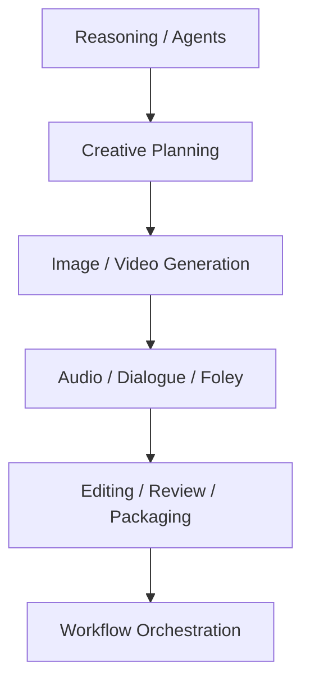
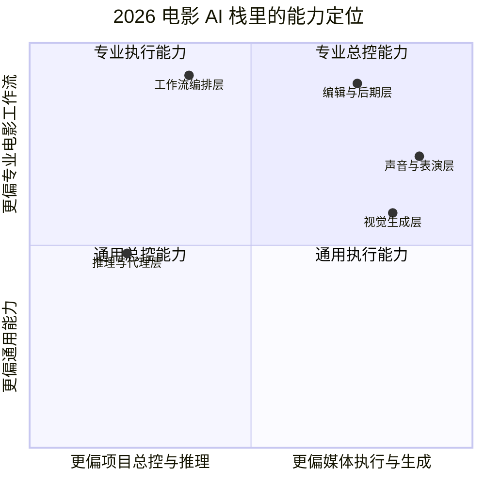
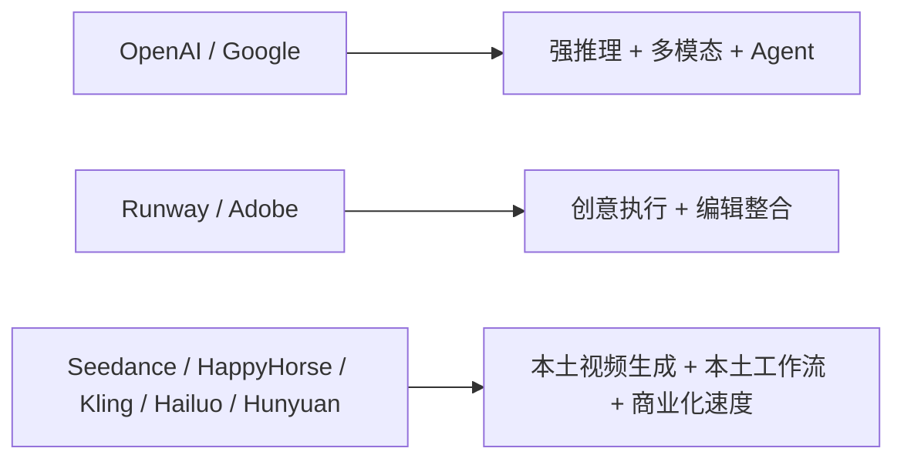
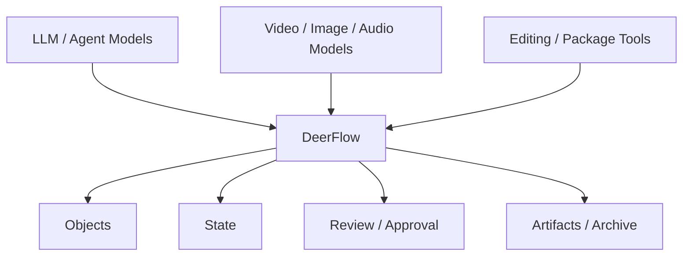
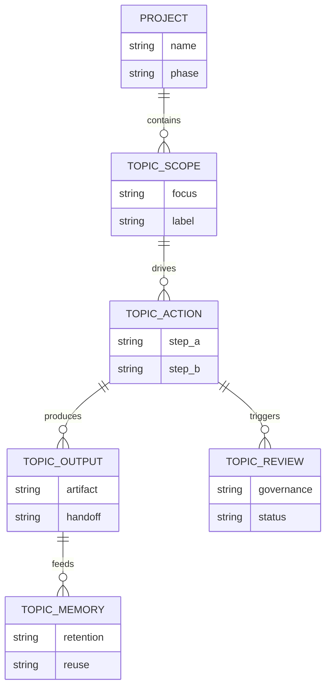

# 91. 2026 模型版图与电影 AI 技术栈

这一篇聚焦：

**截至 2026 年，电影制作 AI 化已经不再只是“文生视频”这一个点，而是由推理模型、视频模型、音频模型、编辑模型、代理式工作流共同构成的一整套生产栈。**

---

## 1. 为什么要先重画 2026 年的模型版图

如果我们还用 2023-2024 年的认知看电影 AI，结论往往会失真：

- 只盯着 text-to-video
- 忽略长上下文推理
- 忽略原生音频
- 忽略角色与场景一致性
- 忽略 agent 化工作流

但从 2025 到 2026，主流厂商已经把能力往五个方向推深：

1. 更强的长上下文与 agent 推理
2. 更高的一致性与镜头控制
3. 视频原生音频与对白同步
4. 编辑级、后期级 AI 辅助
5. 以工作流和工具链为中心的创作平台

对 DeerFlow 来说，这意味着切入点不能只放在“生成内容”，而应该放在：

- 多模型协作
- 多角色协作
- 多阶段协作

---

## 2. 2026 年电影 AI 技术栈可以怎么分层

建议把当前能力分成五层。

### 第一层：推理与代理层
负责：

- 长文档理解
- 剧本拆解
- 任务规划
- 多智能体协调

代表能力来源：

- OpenAI GPT‑4.1 / GPT‑4.5 / GPT‑5.x 路线
- Gemini 2.5 Pro / Flash / Computer Use 路线

### 第二层：视觉生成层
负责：

- 文生图
- 图生视频
- 角色与场景一致性
- 多镜头视觉扩展

代表能力来源：

- Veo 3 / 3.1
- Runway Gen‑4 / 4.5
- Seedance 2.0
- HappyHorse-1.0
- Kling 2.0 / 3.0
- Hailuo 02 / 2.3
- HunyuanVideo 1.5

### 第三层：声音与表演层
负责：

- 原生音频
- 对白 / Foley / 环境声
- 多角色数字人

代表能力来源：

- Veo 3 原生音频
- Seedance 2.0 联合音视频生成
- Kling 3.0 多语言音频
- HunyuanVideo‑Avatar / Foley

### 第四层：编辑与后期层
负责：

- 镜头延展
- 媒体检索
- 颜色与时间细修
- 剪辑辅助

代表能力来源：

- Adobe Firefly Video / Premiere Generative Extend / Media Intelligence

### 第五层：工作流编排层
负责：

- 把模型能力转成正式生产流程
- 组织对象、审批、版本、归档

DeerFlow 的价值主要落在这一层。

---

## 3. 一张总览图：2026 电影 AI 栈

这张图说明：

- 电影 AI 化已经不是单模型能力
- 而是一个分层工作流问题

### 一张模型定位矩阵

这张图把前面的“五层技术栈”换成了一个更适合做产品定位判断的视角，便于理解 DeerFlow 为什么更应站在编排层而不是单点生成层。

---

## 4. 2026 年最关键的模型趋势，不是“更炫”，而是“更可控”

这轮变化里，真正影响电影制作的，不只是清晰度提升，而是控制力提升。

### 过去的痛点

- 人物不一致
- 场景不一致
- 镜头语言漂移
- 音视频不同步
- 无法进入正式工作流

### 2025-2026 的明显变化

- Runway Gen‑4 开始强调 consistent characters、locations、objects across scenes
- Veo 3 把“视频 + 音频”合到一个模型体验里
- Kling 3.0 明确强调 narrative control 和 consistency
- Hailuo 02 / 2.3 把复杂动作和成本效率放到竞争焦点
- Adobe Firefly 把“商业安全 + 编辑集成”推到专业创意工作流

这说明 2026 年的竞争核心，已经从“能不能生成”转成：

- 能不能一致
- 能不能控制
- 能不能进入正式 production pipeline

---

## 5. OpenAI 路线对电影制作意味着什么

OpenAI 在 2025 年先后发布了 GPT‑4.5、GPT‑4.1 系列，并把更强 agent 工作流能力与更长上下文推向 API 侧；同时又继续推进 Sora 2 这样的生成视频路线。([GPT‑4.5](https://openai.com/index/introducing-gpt-4-5/), [GPT‑4.1](https://openai.com/index/gpt-4-1//), [Sora 2](https://openai.com/index/sora-2/))

这条路线对电影制作最重要的，不只是“生成视频”，而是：

- 更适合拆剧本、拆任务、拆阶段
- 更适合处理长项目文档
- 更适合做导演总控与项目级代理

对 DeerFlow 来说，OpenAI 路线的核心价值更偏：

- 总控智能体
- 状态读取
- 工作流推进

而不是单独替代所有视觉模型。

但 2026 年这里出现了一个必须补上的现实变量：  
OpenAI 帮助中心已经宣布 Sora web 与 app 体验将在 2026 年 4 月 26 日终止，Sora API 则将在 2026 年 9 月 24 日终止。  
这意味着从电影平台视角看，OpenAI 路线的长期稳定价值更应该理解为：

- 推理
- 总控
- 脚本理解
- agent 工作流

而不应该再把 Sora 2 当成一个可以长期锚定的独立视频生产面板。([Sora discontinuation FAQ](https://help.openai.com/zh-hant/articles/20001152-what-to-know-about-the-sora-discontinuation))

---

## 6. Google 路线对电影制作意味着什么

Google 在 2025 年把 Gemini 2.5 作为更强 reasoning / coding / multimodal 路线推出，同时又在 I/O 2025 推出 Veo 3、Imagen 4 和面向创作者的 Flow。([Gemini 2.5](https://blog.google/innovation-and-ai/models-and-research/google-deepmind/gemini-model-thinking-updates-march-2025/), [Gemini 2.5 family](https://blog.google/products-and-platforms/products/gemini/gemini-2-5-model-family-expands/), [Veo 3 / Imagen 4 / Flow 总发布](https://blog.google/technology/ai/generative-media-models-io-2025), [Flow](https://blog.google/innovation-and-ai/products/google-flow-veo-ai-filmmaking-tool/))

Google 这一套对电影生产的价值主要落在：

- 多模态理解
- 视频原生音频
- AI filmmaking interface
- 从 prompt 到 clip 的更直接电影化体验

尤其 Flow 很值得关注，因为它不再只是模型 API，而是明确以 filmmaking tool 的姿态进入创作环节。

---

## 7. Runway 路线对电影制作意味着什么

Runway 在 2025-2026 把重心推向：

- Gen‑4 的一致性与世界连续性
- Gen‑4.5 的更高控制与保真
- GWM‑1 的 world model 路线
- AI Film Festival、IMAX 放映、生产合作伙伴等产业动作

([Gen‑4](https://runwayml.com/research/introducing-runway-gen-4), [Gen‑4.5](https://runwayml.com/research/introducing-runway-gen-4.5), [GWM‑1](https://runwayml.com/research/introducing-runway-gwm-1), [AIFF x IMAX](https://runwayml.com/news/runway-imax-aiff-presentation), [Runway x Fabula](https://runwayml.com/news/runway-fabula-partnership))

这条路线最接近电影工业里的：

- previs
- reference generation
- world consistency
- 长镜头 / 多镜头风格统一

对 DeerFlow 来说，Runway 更适合作为：

- 视觉执行层
- 角色与场景一致性层

而不是项目总控层。

---

## 8. Adobe 路线对电影制作意味着什么

Adobe 在 2025 年把 Firefly Video Model 推到 public beta 和 general availability，并把 Premiere Pro 的 Generative Extend、Media Intelligence 等直接嵌进专业编辑工作流；到 2026 年又继续把 Firefly 扩成聚合 30+ 模型的创意工作室。([Firefly Video 公测](https://news.adobe.com/news/2025/02/firefly-web-app-commercially-safe), [Firefly 2025 一体化升级](https://news.adobe.com/news/2025/04/adobe-revolutionizes-ai-assisted-creativity-firefly), [Premiere AI 能力](https://news.adobe.com/news/2025/04/new-ai-innovation-in-industry), [2026 Firefly 视频升级](https://blog.adobe.com/en/publish/2026/04/15/adobe-extends-leadership-video-unleashing-new-ai-powered-creation-firefly-reinventing-color-editors-in-premiere))

Adobe 路线的意义在于：

- 它把 AI 拉回了“专业后期工具”语境
- 它强调 commercial safety、编辑可控性、现有软件融合

这对电影工业特别重要，因为专业团队真正需要的往往不是“再来一个生成器”，而是：

- 进入现有编辑和交付链条的 AI

---

## 9. 中国模型路线为什么值得单独看

中国在 2025-2026 这轮视频生成竞争里非常活跃，而且路径很鲜明：

- 字节 Seedance 2.0：强调 unified multimodal audio-video generation、四模态输入、多模态参考与编辑、导演级镜头 / 叙事控制
- 阿里 HappyHorse-1.0：在 2026 年 4 月成为突然冲上前排的视频模型变量，说明阿里也开始进入一线视频模型竞争
- 可灵 Kling：强调叙事控制、一致性、多语言音频、商业化速度
- MiniMax Hailuo：强调质量 / 价格比、复杂动作、生产级视频
- 腾讯 Hunyuan：强调开源、可定制、视频+数字人+Foley 的生态化

([Seedance 2.0 官方发布](https://seed.bytedance.com/en/blog/official-launch-of-seedance-2-0), [Caixin: Alibaba Unveils HappyHorse](https://www.caixinglobal.com/2026-04-10/alibaba-unveils-happyhorse-after-ai-model-tops-video-rankings-under-alias-102432775.html), [Global Times: Another AI black horse](https://www.globaltimes.cn/page/202604/1358648.shtml), [Kling 2.0](https://ir.kuaishou.com/zh-hans/news-releases/news-release-details/kling-ai-advances-20-era-empowering-everyone-tell-great-stories), [Kling 3.0](https://ir.kuaishou.com/news-releases/news-release-details/kling-ai-launches-30-model-ushering-era-where-everyone-can-be/), [Hailuo 02](https://www.minimax.io/news/minimax-hailuo-02), [Hailuo 2.3](https://www.minimax.io/news/minimax-hailuo-23), [HunyuanVideo](https://github.com/Tencent-Hunyuan/HunyuanVideo), [HunyuanVideo-Avatar](https://github.com/Tencent-Hunyuan/HunyuanVideo-Avatar), [HunyuanCustom](https://github.com/Tencent-Hunyuan/HunyuanCustom))

这意味着中国电影行业并不是只能“等国外工具成熟”，而是已经出现：

- 本土视频模型
- 本土开源路线
- 本土商业化平台

更重要的是，2026 年中国视频模型前排的变化速度明显加快了：

- Seedance 2.0 把“多模态参考 + 联合音视频 + 可编辑性”推到一线
- HappyHorse-1.0 又说明前沿榜单和行业注意力可能在几周内重排

这会直接强化一个对 DeerFlow 非常重要的判断：

- 平台不能死绑任何单一视频模型
- 必须具备模型注册、路由、替换和退场迁移能力

对中国电影来说，这会直接影响：

- 成本结构
- 供应链自主性
- 风格与文化表达的控制权

---

## 10. 一张中外模型路线对比图

这张图说明：

- 2026 年没有“唯一大一统模型”
- 更像是多路线组合竞争

---

## 11. 对电影制作最关键的 6 个能力信号

建议把当前模型能力重点看成 6 个信号。

### 信号一：长上下文
能否吃下：

- 剧本
- 人物小传
- 世界观设定
- 分镜与 review 记录

### 信号二：角色一致性
能否跨镜头保持同一人、同一服装、同一空间逻辑。

### 信号三：镜头控制
能否控制：

- 机位
- 构图
- 运动
- 长短镜头节奏

### 信号四：音视频一体
能否在同一工作流里处理：

- 环境音
- 口型
- 对白

### 信号五：编辑链整合
能否进入：

- NLE
- package
- archive

### 信号六：Agent 化
能否让模型不只是生成，而是：

- 读状态
- 推进流程
- 管控版本

---

## 12. 2026 年的真正趋势：从模型竞赛转向工作流竞赛

如果只看模型榜单，容易觉得竞争点是：

- 谁更清晰
- 谁更真实

但放到电影工业里，真正的竞争越来越像：

- 谁更能被编排
- 谁更能进入已有 pipeline
- 谁更适合多人协作
- 谁更容易治理

这就是 DeerFlow 的窗口。

因为 DeerFlow 并不需要自己成为“最强视频模型”，它更应该成为：

- 最会组织模型协作、对象协作和阶段协作的工作流底座

---

## 13. DeerFlow 在这张版图里的最佳位置

建议不要把 DeerFlow 理解成“又一个生成模型入口”。

更准确的定位是：

- 上接推理模型和项目状态
- 中接角色化 task 委派
- 下接视频 / 图像 / 音频 / 编辑模型
- 侧接审批、review、package、archive

也就是说，DeerFlow 的竞争优势不在单点生成，而在：

- orchestration
- governance
- traceability
- repeatability

---

## 14. 一张 DeerFlow 定位图

这张图说明：

- DeerFlow 最适合做“电影 AI 操作系统”
- 而不是做单一模型替代品

---

## 15. 这一篇最重要的结论

### 结论一
到 2026 年，电影 AI 技术栈已经从“单点生成模型”演进成“推理 + 生成 + 编辑 + 工作流”的复合栈。

### 结论二
真正影响电影制作的，不只是画质，而是一致性、控制力、原生音频、编辑整合和 agent 化。

### 结论三
DeerFlow 的最佳切入点，不是与 Veo、Runway、Kling、Seedance、HappyHorse 正面竞争，而是成为把这些模型纳入正式项目工作流的编排、替换与治理层。

---

## 16. 参考资料

- [OpenAI: Introducing GPT‑4.1 in the API](https://openai.com/index/gpt-4-1//)
- [OpenAI: Introducing GPT‑4.5](https://openai.com/index/introducing-gpt-4-5/)
- [OpenAI: Sora 2](https://openai.com/index/sora-2/)
- [OpenAI Help Center: What to know about the Sora discontinuation](https://help.openai.com/zh-hant/articles/20001152-what-to-know-about-the-sora-discontinuation)
- [Google: Gemini 2.5](https://blog.google/innovation-and-ai/models-and-research/google-deepmind/gemini-model-thinking-updates-march-2025/)
- [Google: Gemini 2.5 family expands](https://blog.google/products-and-platforms/products/gemini/gemini-2-5-model-family-expands/)
- [Google: Veo 3 / Imagen 4 / Flow](https://blog.google/technology/ai/generative-media-models-io-2025)
- [Google: Meet Flow](https://blog.google/innovation-and-ai/products/google-flow-veo-ai-filmmaking-tool/)
- [Google: Veo 3.1 Lite](https://blog.google/innovation-and-ai/technology/ai/veo-3-1-lite/)
- [Runway: Introducing Gen‑4](https://runwayml.com/research/introducing-runway-gen-4)
- [Runway: Introducing Gen‑4.5](https://runwayml.com/research/introducing-runway-gen-4.5)
- [Runway: Introducing GWM‑1](https://runwayml.com/research/introducing-runway-gwm-1)
- [Adobe: Firefly Video Model in public beta](https://news.adobe.com/news/2025/02/firefly-web-app-commercially-safe)
- [Adobe: Firefly 2025 all-in-one update](https://news.adobe.com/news/2025/04/adobe-revolutionizes-ai-assisted-creativity-firefly)
- [Adobe: Premiere Pro AI innovations](https://news.adobe.com/news/2025/04/new-ai-innovation-in-industry)
- [Adobe Blog 2026: new Firefly video capabilities](https://blog.adobe.com/en/publish/2026/04/15/adobe-extends-leadership-video-unleashing-new-ai-powered-creation-firefly-reinventing-color-editors-in-premiere)
- [ByteDance Seed: Official launch of Seedance 2.0](https://seed.bytedance.com/en/blog/official-launch-of-seedance-2-0)
- [Caixin Global: Alibaba unveils HappyHorse](https://www.caixinglobal.com/2026-04-10/alibaba-unveils-happyhorse-after-ai-model-tops-video-rankings-under-alias-102432775.html)
- [Global Times: Another AI ‘black horse’](https://www.globaltimes.cn/page/202604/1358648.shtml)
- [Kuaishou IR: Kling 2.0](https://ir.kuaishou.com/zh-hans/news-releases/news-release-details/kling-ai-advances-20-era-empowering-everyone-tell-great-stories)
- [Kuaishou IR: Kling 3.0](https://ir.kuaishou.com/news-releases/news-release-details/kling-ai-launches-30-model-ushering-era-where-everyone-can-be/)
- [MiniMax: Hailuo 02](https://www.minimax.io/news/minimax-hailuo-02)
- [MiniMax: Hailuo 2.3](https://www.minimax.io/news/minimax-hailuo-23)
- [Tencent HunyuanVideo GitHub](https://github.com/Tencent-Hunyuan/HunyuanVideo)
- [Tencent HunyuanVideo-Avatar GitHub](https://github.com/Tencent-Hunyuan/HunyuanVideo-Avatar)
- [Tencent HunyuanCustom GitHub](https://github.com/Tencent-Hunyuan/HunyuanCustom)

---

<!-- movie-visuals:start -->
## 补充图示：换一种视角看本篇

下面这张 ER 图 把“2026 模型版图与电影 AI 技术栈”再压缩成一个可快速扫读的结构视图，便于先抓关键关系，再回到正文细节。

<!-- movie-visuals:end -->

<!-- movie-doc-nav:start -->
## 文档导航

- 总入口：[README.md](./README.md)
- 阅读地图：[00-reading-map.md](./00-reading-map.md)
- 所在分组：91-102 行业趋势、导演案例与收益分析
- 上一篇：[90. 企业级落地路线图](./90-enterprise-rollout-roadmap.md)
- 下一篇：[92. 2026 好莱坞电影制作 AI 化趋势](./92-hollywood-ai-film-production-trends-2026.md)

### 同组文档
- 91. 2026 模型版图与电影 AI 技术栈（当前）
- [92. 2026 好莱坞电影制作 AI 化趋势](./92-hollywood-ai-film-production-trends-2026.md)
- [93. 2026 中国电影制作 AI 化趋势](./93-china-film-ai-production-trends-2026.md)
- [94. 导演案例：Christopher Nolan 在 AI 时代的工作法重构](./94-director-case-christopher-nolan.md)
- [95. 导演案例：James Cameron 在 AI 时代的系统工程电影观](./95-director-case-james-cameron.md)
- [96. 导演案例：Denis Villeneuve 在 AI 时代如何守住“存在感”](./96-director-case-denis-villeneuve.md)
- [97. 导演案例：张艺谋与中国电影作者工业化的 AI 路径](./97-director-case-zhang-yimou.md)
- [98. 导演案例：郭帆与中国科幻工业化的 AI 操作系统](./98-director-case-guo-fan.md)
- [99. DeerFlow 作为 2026 电影 AI 操作系统的总体收益框架](./99-deerflow-ai-film-operating-system-overview.md)
- [100. DeerFlow 在好莱坞电影制作 AI 化中的收益地图](./100-deerflow-benefit-map-for-hollywood.md)
- [101. DeerFlow 在中国电影制作 AI 化中的收益地图](./101-deerflow-benefit-map-for-china-film.md)
- [102. DeerFlow 在 2026-2027 电影行业中的 ROI、治理与落地路线图](./102-deerflow-roi-governance-and-adoption-roadmap-2026.md)
<!-- movie-doc-nav:end -->
