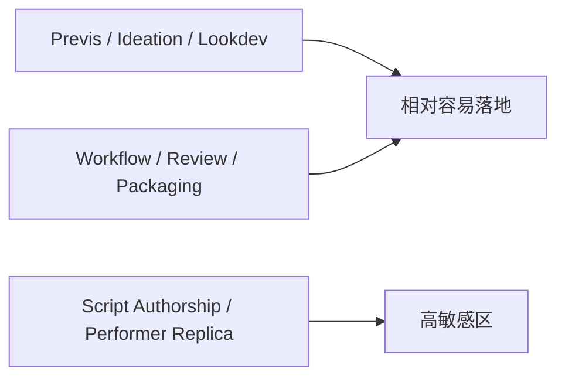
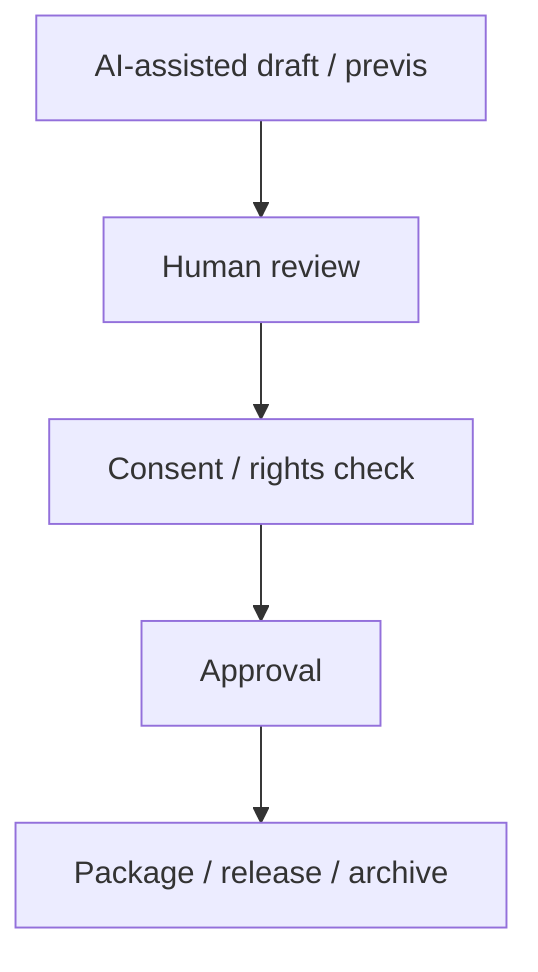
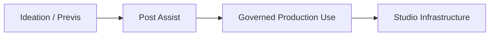

# 92. 2026 好莱坞电影制作 AI 化趋势

这一篇聚焦：

**到 2026 年，好莱坞对 AI 的态度已经不再是单纯的“支持”或“反对”，而是在创意机会、工会保护、版权与肖像权、预演与后期效率之间重新划边界。**

---

## 1. 好莱坞 2026 的核心变化，不是 AI 进入了电影，而是 AI 被重新分层

过去两年，好莱坞关于 AI 的讨论常被简化成一个问题：

- AI 会不会取代电影人？

但到了 2026 年，更真实的情况是：

- 在写作和表演边界，工会与立法正在加保护
- 在 previs、pitch、VFX prep、交付辅助层，AI 正在加速进入生产
- 在 studio 层，AI 被越来越多地看作 infrastructure，而不是 standalone gimmick

这意味着，真正重要的不是“AI 能不能用”，而是：

- 在哪一层用
- 谁来批准
- 谁承担责任
- 是否留痕

---

## 2. 罢工之后，好莱坞的第一原则是“先设边界，再谈效率”

2023 年 WGA 合同把生成式 AI 明确拉进了写作劳动边界：AI 不能被认定为 writer，也不能被用来削弱作家 credit 或分成边界。([WGA 2023 合同](https://www.wgacontract2023.org/wgacontract/files/memorandum-of-agreement-for-the-2023-wga-theatrical-and-television-basic-agreement.pdf))

SAG‑AFTRA 2023 TV/Theatrical Agreement 则把数字替身、同意机制、补偿机制、背景演员最小人数等写进了正式合同框架，并在 2025-2026 持续推动 NO FAKES Act 和州级 digital replica 保护。([SAG‑AFTRA 2023 TV/Theatrical Contracts](https://www.sagaftra.org/contracts-industry-resources/contracts/2023-tvtheatrical-contracts), [SAG AI Resources](https://www.sagaftra.org/contracts-industry-resources/contracts/2023-tvtheatrical-contracts/artificial-intelligence-resources), [NO FAKES Act two-pager](https://www.sagaftra.org/sites/default/files/2026-03/NO%20FAKES%20Policy%20Two-Pager.pdf))

这说明好莱坞真正形成的第一原则不是：

- 先全面上 AI

而是：

- 先定义权利与 consent
- 再让 AI 进入 production

---

## 3. 一张总览图：好莱坞 AI 使用的“允许区 / 敏感区”

这张图说明：

- 好莱坞并不是一刀切地接受或拒绝 AI
- 它是在不同层做不同治理

---

## 4. 2026 好莱坞最现实的落地区：previs、pitch、lookdev、post 辅助

从现实动作看，最先成熟的不是“整部电影 AI 化”，而是：

- 概念验证
- 镜头预演
- 风格探索
- 后期编辑辅助

Google 推出 Flow，明确把它定位为 built for filmmakers 的 AI filmmaking tool；Runway 则一边推 Gen‑4 / 4.5，一边通过 AI Film Festival、IMAX 放映和 production partnership 把工具往创作管线里送；Adobe 把 Firefly / Premiere 直接嵌进专业后期流程。([Flow](https://blog.google/innovation-and-ai/products/google-flow-veo-ai-filmmaking-tool/), [Runway x AIFF IMAX](https://runwayml.com/news/runway-imax-aiff-presentation), [Runway x Fabula](https://runwayml.com/news/runway-fabula-partnership), [Adobe Premiere AI](https://news.adobe.com/news/2025/04/new-ai-innovation-in-industry))

这说明：

- 好莱坞最先接受的是“降沟通成本、降试错成本”的 AI
- 而不是马上把它放到最终 authorship 位置

---

## 5. 2026 的另一个明显趋势：studio 和平台开始把 AI 当基础设施

Runway 2026 AI Summit 的议题已经不再只是展示 demo，而是把企业、工作流、创意负责人、法律负责人一起拉进来讨论“如何把 AI 接进 existing pipelines”。([Runway AI Summit 2026](https://summit.runwayml.com/))

Netflix 2026 年收购 InterPositive 的公开说法，也是“technology should serve storytellers and the creative process”，强调 creator-led innovation，而不是 replacement。([Netflix: Why InterPositive Is Joining Netflix](https://about.netflix.com/news/why-interpositive-is-joining-netflix))

这说明到 2026 年，好莱坞头部公司越来越倾向把 AI 放在：

- pipeline infrastructure
- creator tooling
- decision support

而不是只把它作为 marketing stunt。

---

## 6. 工会、州法与联邦提案，正在把“肖像权”从合同问题推向政策问题

SAG‑AFTRA 在 2025 年继续推动 NO FAKES Act，并支持州级数字肖像保护；加州也在继续强化针对 nonconsensual digital replicas 的救济机制。([SAG on NO FAKES reintroduction](https://www.sagaftra.org/sag-aftra-leaders-take-capitol-hill-no-fakes-act-reintroduction), [SAG on enhanced protections in California](https://www.sagaftra.org/sag-aftra-applauds-gov-newsom-enhancing-protections-against-nonconsensual-digital-replicas))

这对电影平台的启示非常直接：

- 任何面向好莱坞的 AI film OS，都不能只做功能
- 必须把 consent、scope、audit、revocation 做成正式能力

---

## 7. 一张治理链图：好莱坞 AI 使用的最小合法路径

这张图说明：

- 在好莱坞环境里，AI 输出不可能直接跳到最终使用
- 中间必须有 rights 和 approval 关口

---

## 8. 预演和视觉沟通层，为什么会先成为 AI 最大受益区

好莱坞成熟工业的一个特点是：

- 每个环节已经有很多专业角色
- 沟通成本极高

于是 AI 在下面这些动作上特别容易产生正收益：

- 剧本到 look reference
- shot list 到 storyboard draft
- pitch deck 到 moodboard
- previs 的快速迭代

因为这类动作的核心收益是：

- 更快对齐
- 更快试错
- 更早暴露问题

而不是直接替代核心创作判断。

---

## 9. 2026 好莱坞的新风险：不是“AI 不够强”，而是“AI 太容易越权”

从好莱坞视角看，真正担心的往往不是：

- AI 生成得不够好

而是：

- 它越过了署名边界
- 它越过了肖像边界
- 它越过了集体协商边界

因此，一个能在好莱坞落地的系统，必须天然支持：

- human-in-the-loop
- explicit consent
- role-based permissions
- structured audit log

这恰恰是 DeerFlow 这类工作流底座比单模型产品更有优势的地方。

---

## 10. 好莱坞 2026 最值得关注的三条路线

### 路线一：创意预演路线
代表信号：

- Flow
- Runway partnership / AIFF
- Studio internal ideation tools

### 路线二：后期辅助路线
代表信号：

- Adobe Premiere AI
- media intelligence
- generative extend

### 路线三：权利与治理路线
代表信号：

- WGA AI 条款
- SAG‑AFTRA AI 条款
- NO FAKES Act

换句话说，好莱坞的真实趋势不是“某个模型胜出”，而是这三条路线共同推进。

---

## 11. 一张路线图：好莱坞 AI 采用曲线

这张图说明：

- 好莱坞的采用曲线，是从低风险创意区向高治理生产区扩展

---

## 12. DeerFlow 为什么适合好莱坞，而不是与好莱坞对着干

从好莱坞视角看，最可落地的系统并不是：

- 一个替代所有专业岗位的超级模型

而是：

- 一个能把专业岗位、审批、对象、版本和 AI 工具组织起来的 film OS

DeerFlow 的匹配点主要有五个：

1. 适合做 director / producer 级总控
2. 适合把 AI 输出纳入 review / approval
3. 适合对接多模型，不押注单一模型
4. 适合追踪 artifact、package、archive
5. 适合在人类 author 仍为核心的前提下提高效率

---

## 13. DeerFlow 在好莱坞场景里的收益，不应以“替代人数”计算

建议用下面三类收益来描述。

### 第一类：沟通收益

- 更快把剧本翻译成场景、镜头、参考板
- 更快对齐导演、摄影、制片、后期

### 第二类：治理收益

- 明确 current / approved / published
- 明确 consent / approval / audit

### 第三类：风险收益

- 更早发现版本错位
- 更早发现 rights 问题
- 更早发现 package 缺件

这比简单说“少多少人”更符合好莱坞接受逻辑。

---

## 14. 这一篇最重要的结论

### 结论一
到 2026 年，好莱坞对 AI 的主流态度已经从“是否使用”转向“在什么层使用、如何治理使用”。

### 结论二
最先成熟的落地区是 previs、lookdev、review、post assist，而不是完全替代 writer 或 performer。

### 结论三
DeerFlow 与好莱坞最匹配的价值，不是替代创作者，而是把 AI 纳入一个可审批、可追踪、可审计的电影工作流系统。

---

## 15. 参考资料

- [WGA 2023 Theatrical and Television Basic Agreement](https://www.wgacontract2023.org/wgacontract/files/memorandum-of-agreement-for-the-2023-wga-theatrical-and-television-basic-agreement.pdf)
- [SAG‑AFTRA 2023 TV/Theatrical Contracts](https://www.sagaftra.org/contracts-industry-resources/contracts/2023-tvtheatrical-contracts)
- [SAG‑AFTRA AI Resources](https://www.sagaftra.org/contracts-industry-resources/contracts/2023-tvtheatrical-contracts/artificial-intelligence-resources)
- [NO FAKES Act policy two-pager](https://www.sagaftra.org/sites/default/files/2026-03/NO%20FAKES%20Policy%20Two-Pager.pdf)
- [SAG‑AFTRA on NO FAKES reintroduction](https://www.sagaftra.org/sag-aftra-leaders-take-capitol-hill-no-fakes-act-reintroduction)
- [SAG‑AFTRA on California replica protections](https://www.sagaftra.org/sag-aftra-applauds-gov-newsom-enhancing-protections-against-nonconsensual-digital-replicas)
- [Google Flow](https://blog.google/innovation-and-ai/products/google-flow-veo-ai-filmmaking-tool/)
- [Runway x IMAX AIFF](https://runwayml.com/news/runway-imax-aiff-presentation)
- [Runway x Fabula](https://runwayml.com/news/runway-fabula-partnership)
- [Runway AI Summit 2026](https://summit.runwayml.com/)
- [Adobe Premiere AI innovations](https://news.adobe.com/news/2025/04/new-ai-innovation-in-industry)
- [Netflix: Why InterPositive Is Joining Netflix](https://about.netflix.com/news/why-interpositive-is-joining-netflix)

---

---

<!-- movie-doc-nav:start -->
## 文档导航

- 总入口：[README.md](./README.md)
- 阅读地图：[00-reading-map.md](./00-reading-map.md)
- 所在分组：91-102 行业趋势、导演案例与收益分析
- 上一篇：[91. 2026 模型版图与电影 AI 技术栈](./91-2026-model-landscape-and-film-ai-stack.md)
- 下一篇：[93. 2026 中国电影制作 AI 化趋势](./93-china-film-ai-production-trends-2026.md)

### 同组文档
- [91. 2026 模型版图与电影 AI 技术栈](./91-2026-model-landscape-and-film-ai-stack.md)
- 92. 2026 好莱坞电影制作 AI 化趋势（当前）
- [93. 2026 中国电影制作 AI 化趋势](./93-china-film-ai-production-trends-2026.md)
- [94. 导演案例：Christopher Nolan 在 AI 时代的工作法重构](./94-director-case-christopher-nolan.md)
- [95. 导演案例：James Cameron 在 AI 时代的系统工程电影观](./95-director-case-james-cameron.md)
- [96. 导演案例：Denis Villeneuve 在 AI 时代如何守住“存在感”](./96-director-case-denis-villeneuve.md)
- [97. 导演案例：张艺谋与中国电影作者工业化的 AI 路径](./97-director-case-zhang-yimou.md)
- [98. 导演案例：郭帆与中国科幻工业化的 AI 操作系统](./98-director-case-guo-fan.md)
- [99. DeerFlow 作为 2026 电影 AI 操作系统的总体收益框架](./99-deerflow-ai-film-operating-system-overview.md)
- [100. DeerFlow 在好莱坞电影制作 AI 化中的收益地图](./100-deerflow-benefit-map-for-hollywood.md)
- [101. DeerFlow 在中国电影制作 AI 化中的收益地图](./101-deerflow-benefit-map-for-china-film.md)
- [102. DeerFlow 在 2026-2027 电影行业中的 ROI、治理与落地路线图](./102-deerflow-roi-governance-and-adoption-roadmap-2026.md)
<!-- movie-doc-nav:end -->
