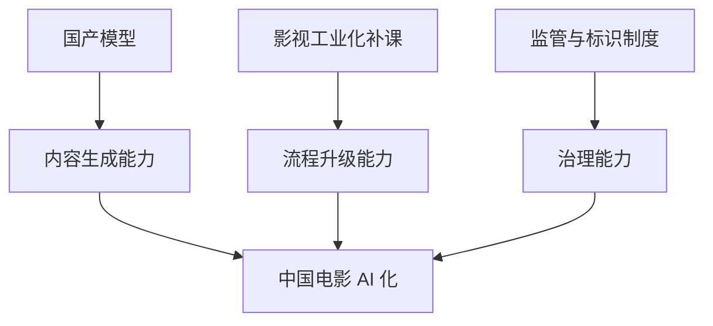
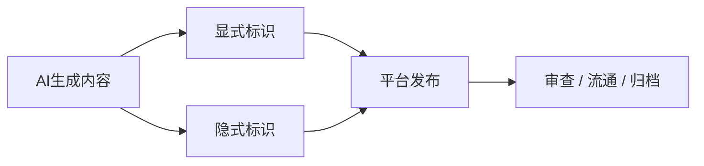
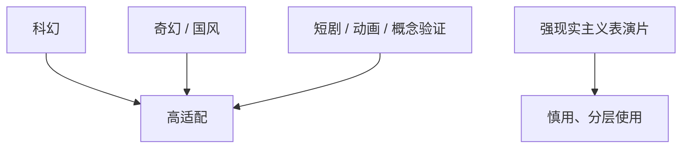
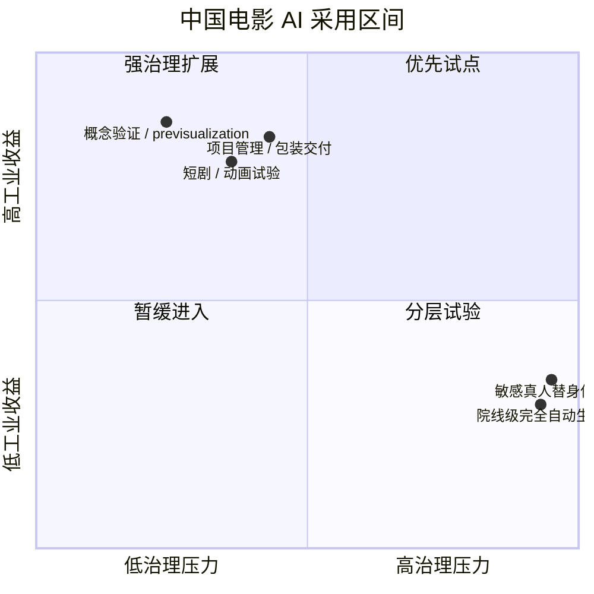
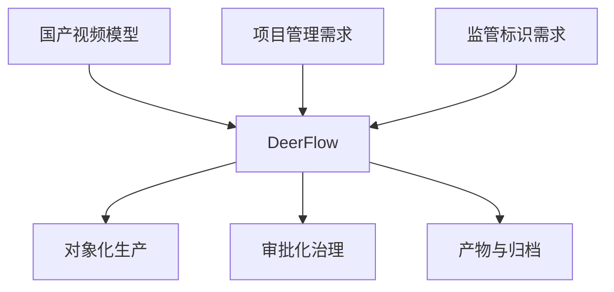
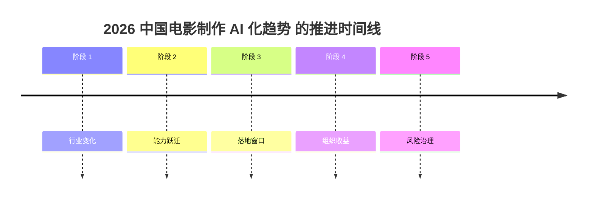

# 93. 2026 中国电影制作 AI 化趋势

这一篇聚焦：

**到 2026 年，中国电影与视听产业的 AI 化，已经不只是“工具可用”这件事，而是在本土模型、工业化补课、监管标识、短剧试验、科幻产业与影视工业升级之间形成了一条非常中国式的加速曲线。**

---

## 1. 中国电影 AI 化的真实背景：不是先有成熟工业，再加 AI

好莱坞的很多 AI 讨论，建立在较成熟的工业链上；
中国的情况更复杂。

中国电影行业一边在补：

- 工业化
- 视效链
- 项目管理
- 虚拟拍摄

一边又在直接迎来：

- 国产视频大模型
- 开源视频模型
- AI 短剧 / AI 动画 / AI 预演

这意味着中国的 AI 化，并不是给一套很稳定的旧系统“锦上添花”，而更像：

- 在工业化升级过程中，顺手把 AI 一起装上

这会带来更大的跳跃空间，也会带来更大的治理挑战。

---

## 2. 中国 2025-2026 的一个关键变量：本土视频模型已经不是陪跑者

从公开发布和产业新闻看，2025-2026 年中国的视频模型并不只是追赶，而是在若干方向形成了自己的节奏：

- ByteDance Seedance 2.0：强调统一多模态音视频联合生成，支持 text / image / audio / video 四模态输入、多模态参考与编辑
- Alibaba HappyHorse-1.0：在 2026 年 4 月成为突然冲上前排的阿里视频模型变量，说明中国视频模型竞争正在继续扩容
- Kuaishou Kling 2.0 / 2.1 / 3.0：强调 narrative control、consistency、多语言音频和商业化速度
- MiniMax Hailuo 02 / 2.3：强调复杂动作、成本效率和生产级视频
- Tencent HunyuanVideo / Avatar / Foley / Custom：强调开源、可定制和生态延展

([Seedance 2.0 官方发布](https://seed.bytedance.com/en/blog/official-launch-of-seedance-2-0), [Caixin: Alibaba Unveils HappyHorse](https://www.caixinglobal.com/2026-04-10/alibaba-unveils-happyhorse-after-ai-model-tops-video-rankings-under-alias-102432775.html), [Global Times: Another AI black horse](https://www.globaltimes.cn/page/202604/1358648.shtml), [Kling 2.0](https://ir.kuaishou.com/zh-hans/news-releases/news-release-details/kling-ai-advances-20-era-empowering-everyone-tell-great-stories), [Kling 3.0](https://ir.kuaishou.com/news-releases/news-release-details/kling-ai-launches-30-model-ushering-era-where-everyone-can-be/), [Hailuo 02](https://www.minimax.io/news/minimax-hailuo-02), [Hailuo 2.3](https://www.minimax.io/news/minimax-hailuo-23), [HunyuanVideo](https://github.com/Tencent-Hunyuan/HunyuanVideo))

这意味着中国电影团队在 2026 年做 AI 工作流，不必只依赖海外平台。

更关键的是，这也说明中国视频模型竞争已经从“少数几家并跑”走向了“前排快速换位”：

- Seedance 2.0 证明中国模型可以把联合音视频和导演级控制推到全球一线
- HappyHorse-1.0 则证明新的竞争者可以突然改写行业心智和榜单排序

这会直接影响中国电影团队的技术策略：

- 不能围绕单一模型设计全套流程
- 必须为模型切换、AB 测试、供应商更替和 API 上下线预留空间

---

## 3. 一张总览图：中国电影 AI 化的三股力量

这张图说明：

- 中国电影 AI 化不是单一技术变量
- 而是模型、工业化、监管三股力量共同推动

---

## 4. 国产模型为什么会对中国电影特别重要

原因不只是“自主可控”这句大话。

更实际的原因包括：

- 中文 prompt 和中文语境更自然
- 本土审美风格与文化素材更容易被纳入训练和调优方向
- 商业合作和工作流接入更容易本地化
- 成本与服务响应更适合中国项目节奏

这会直接影响：

- 科幻片世界观开发
- 历史 / 奇幻 / 国风题材视觉设定
- 短剧和中低预算项目的试错成本

---

## 5. 中国视听行业的另一条重要趋势：AI 正在快速先从短剧和试验型内容切入

官方与行业报道已经能看到一条非常清晰的路径：

- AIGC 短剧
- AI 单元动画
- AI 概念验证片
- AI 参与的特效与美术预演

例如《三星堆：未来启示录》被描述为国内首部获得网络剧片发行许可证的 AIGC 科幻短剧集，《新世界加载中》被描述为全球首部 AI 单元动画故事集。([天津网信办转载文章](https://www.tjcac.gov.cn/xxh/202511/t20251104_7169654.html))

这说明中国电影与视听产业的 AI 化，很可能不是先从院线长片全流程爆发，而是先从：

- 短剧
- 动画
- 科幻概念内容
- 宣发 / 预演

这些风险更低、迭代更快的区域放大。

---

## 6. 监管已经不再是未来问题，而是现在问题

2025 年 3 月，中国网信办发布《人工智能生成合成内容标识办法》，明确了显式标识、隐式标识、服务提供者责任等要求，且适用对象明确包括文本、图片、音频、视频、虚拟场景等。([CAC 官方办法](https://www.cac.gov.cn/2025-03/14/c_1743654684782215.htm))

这件事对电影 AI 工作流的意义非常大：

- AI 不是“想怎么混进流程都可以”
- 文件、视频、交互场景需要有正式标识和管理逻辑

这意味着中国版本的 film OS，必须天然支持：

- provenance
- watermark / metadata
- package-level labeling

---

## 7. 一张治理链图：中国环境下的 AI 内容最小合规链

这张图说明：

- 在中国场景里，AI 内容治理必须进入文件和发布层

---

## 8. 中国电影工业化升级，正给 AI 工作流创造非常现实的落点

从产业报道看，中国电影的“电影+科技”叙事，在 2025 年已经明显加速：

- 电影科技创新论坛
- 影视制作车
- 虚拟拍摄
- 视效工业链
- 数据管理与项目管理中的 AI

一线从业者也在公开提到：

- AI 初期更多落在文生图、图生视频
- 更深层则会进入数据管理、数据分析整合、项目管理

([“电影+科技”报道](https://zjnews.zjol.com.cn/zjnews/202507/t20250708_31099058.shtml), [2025 金鸡百花电影节：电影人说 AI](https://wxb.xzdw.gov.cn/wlcb/cbgz/202511/t20251116_623737.html))

这和 DeerFlow 特别契合，因为 DeerFlow 的天然强项恰好不是最终视觉生成，而是：

- 项目管理
- 状态推进
- 任务委派
- artifact 组织

这也是为什么像 Seedance 2.0、HappyHorse-1.0 这种前沿模型变化，最终会强化 DeerFlow 的价值：

- 模型越快变化
- 越需要一个稳定的项目与治理中枢

---

## 9. “中国式 AI 影视化”的最大机会，不在于完全替代，而在于缩短工业化差距

如果只从“替代拍摄”理解 AI，会把问题看窄。

对中国电影更大的机会其实在于：

- 缩短 preproduction 对齐时间
- 把项目知识显式化
- 降低中低预算项目的试错成本
- 把概念图、分镜、视觉包更快做出来
- 把 review、approval、package 做得更有秩序

这实际上是在帮助中国电影做一件更大的事：

- 把原本还没完全成熟的工业环节快速结构化

---

## 10. 为什么中国科幻会成为 AI 结合电影工业最重要的试验场

中国科幻题材具备几个典型特征：

- 世界观重
- 视觉设定重
- 视效依赖重
- 工业协同重

这和 AI 特别匹配，因为 AI 可以先帮助解决：

- 世界观视觉探索
- 大量概念验证
- 预演与镜头试错
- 数据和项目复杂度管理

《2025 中国科幻产业报告》显示 2024 年中国科幻产业总营收达到 1089.6 亿元，科幻影视是五大核心板块之一。([数字中国建设峰会转载](https://www.digitalchina.gov.cn/2025/szzg/xyzx/202504/t20250401_4997926.htm))

这意味着科幻不是边缘题材，而是中国影视 AI 工业化最适合放大的主战场之一。

---

## 11. 一张题材适配图：中国哪些类型最适合先做 AI 化

这张图说明：

- 并不是所有中国电影类型都应同速采用 AI
- 题材差异会显著影响收益结构

---

## 12. 中国电影团队对 AI 的主流态度：拥抱工具，但保留叙事主权

这一点在公开表述里已经非常明显。

张艺谋一方面在《三体》电影筹备中明确组建 AI 小组，用“中国制造”的 AI 平台帮助视觉设计；另一方面又强调 AI 时代冲击下仍要坚守电影初心。([新华网专访](https://www.news.cn/ent/20241021/1299131d0fbd4c9c836accb0027dfe97/c.html), [央视专访](https://people.cctv.com/2025/11/17/ARTIcFgQtPQK40ql5Ezfa1th251116.shtml))

郭帆则更明确提出：

- AI 是“超级工具”
- 它能降本增效
- 但有情感深度的叙事核心仍然要靠创作者自己

([郭帆 2026 文章](https://finance.sina.com.cn/jjxw/2026-04-04/doc-inhtiiqc8036312.shtml))

这几乎可以概括中国电影主流创作者对 AI 的最佳共识：

- 工具可以更智能
- 叙事主权不能外包

---

## 13. DeerFlow 为什么特别适合中国电影场景

中国电影场景的几个典型问题是：

- 流程压缩
- 临时变更多
- 口头沟通比例高
- 资料分散
- 决策留痕弱

而 DeerFlow 正好擅长把这些混乱点转成：

- 线程级状态
- 对象级事实源
- review / approval / escalation
- artifact / package / archive

换句话说，DeerFlow 能提供的不是“再多一个模型”，而是：

- 把国产模型、海外模型和人工审批组织进一个可运行项目系统

这对中国电影尤其重要，因为很多收益都来自：

- 流程更清楚
- 责任更清楚
- current 版本更清楚

而不只是“镜头更好看”。

如果把中国场景的 AI 采用区间放进矩阵，会更容易看出为什么“模型能力”和“工业治理能力”必须同步推进：

---

## 14. 一张 DeerFlow 价值图：中国电影版

这张图说明：

- 对中国电影来说，DeerFlow 最大的价值是把“模型能力”转成“工业流程能力”

---

## 15. 这一篇最重要的结论

### 结论一
到 2026 年，中国电影 AI 化最重要的特点，不是模型数量多，而是本土模型、工业化升级和监管要求同时到位。

### 结论二
中国电影最适合先放大的，不是全类型全流程，而是科幻、奇幻、动画、短剧、概念验证和前期工业链。

### 结论三
DeerFlow 在中国电影场景里的核心价值，不是替代导演，而是把国产模型和项目流程组织成一个可审、可追、可迭代的 film OS。

---

## 16. 参考资料

- [CAC: 人工智能生成合成内容标识办法](https://www.cac.gov.cn/2025-03/14/c_1743654684782215.htm)
- [广东网信办转载：用 AI“拍”电影](https://www.cagd.gov.cn/v/2024/12/6458.html)
- [天津网信办转载：从“可看”到“好看”，AIGC 短剧要努力](https://www.tjcac.gov.cn/xxh/202511/t20251104_7169654.html)
- [2025 年中国金鸡百花电影节：电影人说 AI](https://wxb.xzdw.gov.cn/wlcb/cbgz/202511/t20251116_623737.html)
- [中国日报：AI 驱动全球视听产业革新](https://caijing.chinadaily.com.cn/a/202503/31/WS67ea3320a31008317a2af846.html)
- [数字中国建设峰会：科幻 + AI](https://www.digitalchina.gov.cn/2025/szzg/xyzx/202504/t20250401_4997926.htm)
- [字节 Seed：Official launch of Seedance 2.0](https://seed.bytedance.com/en/blog/official-launch-of-seedance-2-0)
- [Caixin Global：Alibaba unveils HappyHorse](https://www.caixinglobal.com/2026-04-10/alibaba-unveils-happyhorse-after-ai-model-tops-video-rankings-under-alias-102432775.html)
- [Global Times：Another AI ‘black horse’](https://www.globaltimes.cn/page/202604/1358648.shtml)
- [Kuaishou IR: Kling 2.0](https://ir.kuaishou.com/zh-hans/news-releases/news-release-details/kling-ai-advances-20-era-empowering-everyone-tell-great-stories)
- [Kuaishou IR: Kling 3.0](https://ir.kuaishou.com/news-releases/news-release-details/kling-ai-launches-30-model-ushering-era-where-everyone-can-be/)
- [MiniMax: Hailuo 02](https://www.minimax.io/news/minimax-hailuo-02)
- [MiniMax: Hailuo 2.3](https://www.minimax.io/news/minimax-hailuo-23)
- [Tencent HunyuanVideo GitHub](https://github.com/Tencent-Hunyuan/HunyuanVideo)

---

<!-- movie-visuals:start -->
## 补充图示：换一种视角看本篇

下面这张 时间线 把“2026 中国电影制作 AI 化趋势”再压缩成一个可快速扫读的结构视图，便于先抓关键关系，再回到正文细节。

<!-- movie-visuals:end -->

<!-- movie-doc-nav:start -->
## 文档导航

- 总入口：[README.md](./README.md)
- 阅读地图：[00-reading-map.md](./00-reading-map.md)
- 所在分组：91-102 行业趋势、导演案例与收益分析
- 上一篇：[92. 2026 好莱坞电影制作 AI 化趋势](./92-hollywood-ai-film-production-trends-2026.md)
- 下一篇：[94. 导演案例：Christopher Nolan 在 AI 时代的工作法重构](./94-director-case-christopher-nolan.md)

### 同组文档
- [91. 2026 模型版图与电影 AI 技术栈](./91-2026-model-landscape-and-film-ai-stack.md)
- [92. 2026 好莱坞电影制作 AI 化趋势](./92-hollywood-ai-film-production-trends-2026.md)
- 93. 2026 中国电影制作 AI 化趋势（当前）
- [94. 导演案例：Christopher Nolan 在 AI 时代的工作法重构](./94-director-case-christopher-nolan.md)
- [95. 导演案例：James Cameron 在 AI 时代的系统工程电影观](./95-director-case-james-cameron.md)
- [96. 导演案例：Denis Villeneuve 在 AI 时代如何守住“存在感”](./96-director-case-denis-villeneuve.md)
- [97. 导演案例：张艺谋与中国电影作者工业化的 AI 路径](./97-director-case-zhang-yimou.md)
- [98. 导演案例：郭帆与中国科幻工业化的 AI 操作系统](./98-director-case-guo-fan.md)
- [99. DeerFlow 作为 2026 电影 AI 操作系统的总体收益框架](./99-deerflow-ai-film-operating-system-overview.md)
- [100. DeerFlow 在好莱坞电影制作 AI 化中的收益地图](./100-deerflow-benefit-map-for-hollywood.md)
- [101. DeerFlow 在中国电影制作 AI 化中的收益地图](./101-deerflow-benefit-map-for-china-film.md)
- [102. DeerFlow 在 2026-2027 电影行业中的 ROI、治理与落地路线图](./102-deerflow-roi-governance-and-adoption-roadmap-2026.md)
<!-- movie-doc-nav:end -->
