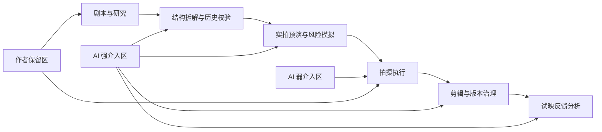
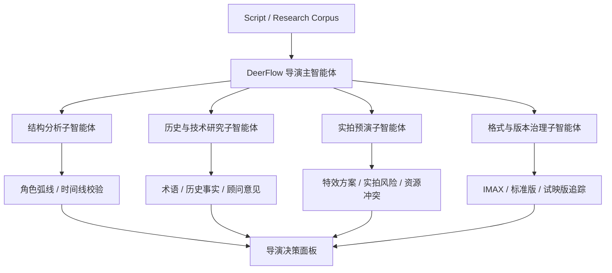
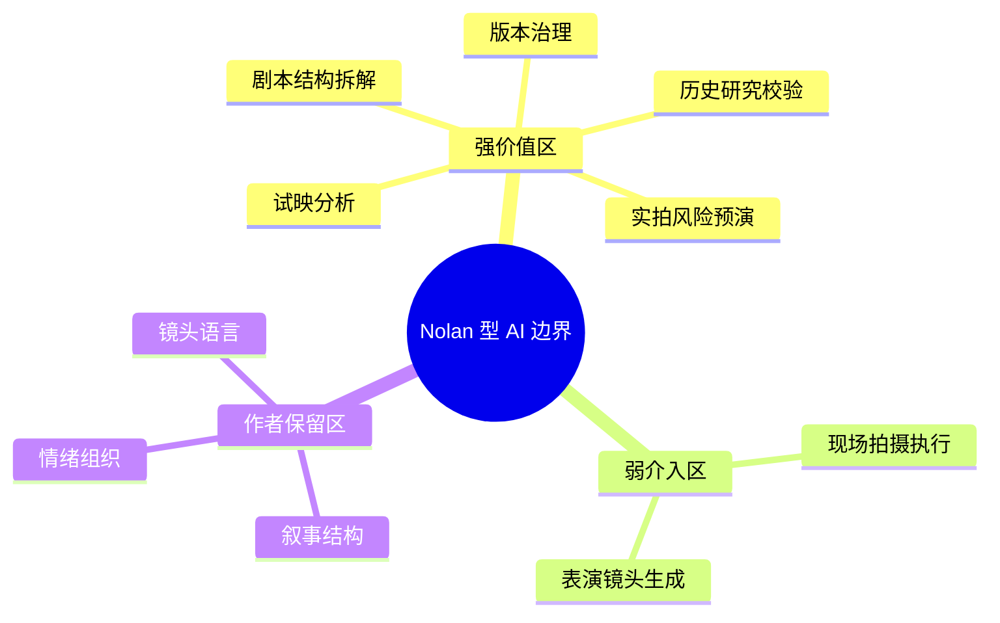
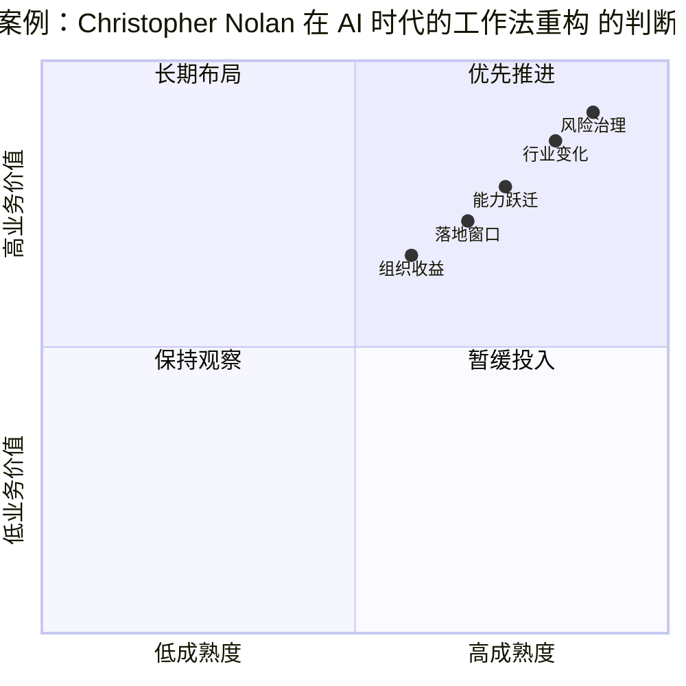

# 94. 导演案例：Christopher Nolan 在 AI 时代的工作法重构

这一篇聚焦：

**Christopher Nolan 并不是“拒绝技术”的导演，而是“只接受能提升电影本体的技术”的导演。到了 2026 年，真正适合 Nolan 型作者的 AI，不是替代镜头语言，而是强化剧本理解、历史研究、实拍预演、格式管理与后期版本治理。**

---

## 1. 为什么 Nolan 是理解电影 AI 边界的关键样本

Nolan 的方法论很适合拿来判断电影制作 AI 化的边界。

原因不是因为他“保守”，而是因为他一直都非常清楚地区分：

- 什么是服务于电影体验的技术
- 什么是会稀释电影体验的技术
- 什么是必须保留在人类创作者手中的决策

从公开采访看，Nolan 对技术的态度其实非常一致：

- 他会使用最先进的拍摄与放映技术，但前提是能提升观看体验
- 他不会为了“更省事”而放弃对质感、格式与空间感的控制
- 他并不反对数字工具本身，剪辑本来就是在电脑上完成
- 他反对的是让工具反过来决定电影语言

这也是为什么在 2026 年的语境里，Nolan 不是一个“AI 会不会用”的问题，而是一个“AI 应该被限制在哪些层面”的问题。

---

## 2. 从公开信息看，Nolan 型工作法的四个核心原则

### 2.1 技术必须服务于沉浸式电影体验

在 2024 年围绕《奥本海默》的访谈里，Nolan 明确把 IMAX、大画幅与胶片理解为“最接近人眼观看世界的方式”，并强调格式并不是噱头，而是主观体验的一部分。  
这意味着他对技术的评判标准，不是“新不新”，而是“能不能增强观众进入人物头脑和情境的能力”。

### 2.2 人脸、时间结构与主观感受是核心资产

《奥本海默》相关访谈反复出现一个信号：Nolan 与摄影指导 Hoyte van Hoytema 这次把大量 IMAX 能力用在“人脸”而不是风景上。  
这说明他真正关心的，不只是大场面，而是如何让形式手段去承托人物心理。

### 2.3 他是技术现实主义者，而不是技术浪漫主义者

Nolan 在访谈里说得很直接：剪辑当然在电脑上完成，因为那是实际可行的方法；但拍摄与最终成片则应使用最合适的介质。  
换句话说，他并不迷信“纯手工”，而是相信：

- 工具可以现代化
- 决策权不能外包
- 质感不能为了效率被牺牲

### 2.4 2025 之后，他本人也已经站到 AI 治理一线

DGA 在 2025 年宣布 Nolan 当选主席时，明确提到他担任公会的 Artificial Intelligence Committee 主席；DGA 在 2024-2025 年的公开表态里，也持续强调 AI 可以作为工具，但不能替代导演团队职责，且需要透明和保护机制。  
这说明 Nolan 已经不是在“旁观 AI”，而是在直接参与行业规则建设。

---

## 3. 对 Nolan 型项目来说，哪些 AI 用法是高价值、低冲突的

如果把电影生产拆开，Nolan 型项目最适合 AI 的，不是最终镜头生成，而是前置理解和后置治理。

### 适合优先引入的环节

- 历史与技术研究辅助
- 长剧本结构拆解
- 角色时间线校验
- 实拍特效风险预演
- 大画幅版本管理与交付检查
- 试映反馈聚类与结构性分析

### 不适合作为第一优先的环节

- 直接生成关键表演镜头
- 用生成式画面替代实拍主体
- 让模型自动决定镜头语法
- 让模型主导剪辑节奏与情绪结构

原因很简单：

- Nolan 型电影的价值密度，集中在作者性结构与拍摄完成度
- AI 最该帮助的是降低复杂度，不是接管审美

---

## 4. 一张边界图：Nolan 型项目里的 AI 应该放在哪里

这张图背后的原则是：

- AI 可以显著增强“理解、预演、校验、治理”
- AI 不应主导“表演、镜头决定、情绪组织”

---

## 5. DeerFlow 如何服务 Nolan 型工作流

DeerFlow 在这里最有价值的，不是成为“画面生成器”，而是成为一个作者型项目的控制中枢。

### 5.1 剧本与资料层

DeerFlow 可以把：

- 原著
- 剧本版本
- 历史资料
- 科学顾问意见
- 导演阐述

统一编织成一个可查询、可拆解、可追踪的项目知识层。

这对 Nolan 型项目尤其重要，因为这类项目往往：

- 文本密度高
- 时间线复杂
- 角色动机层级深
- 研究资料庞大

### 5.2 实拍优先的预演层

对 Nolan 而言，AI 最有用的预演不是“帮我拍一版电影”，而是：

- 帮我判断哪些镜头必须实拍
- 帮我模拟实拍方案的风险与资源压力
- 帮我在正式搭景、爆破、特摄前先完成多轮决策

DeerFlow 可以把分镜、特效方案、场景约束、摄影格式、拍摄窗口统一到一个对象体系里，让导演与摄影、特效、制片之间形成更快的闭环。

### 5.3 大画幅与版本治理层

Nolan 型项目还有一个经常被忽略的现实问题：  
格式、交付、放映体验的治理成本非常高。

DeerFlow 可以承担：

- 不同放映版本的格式追踪
- 声画、字幕、包装检查
- 版本差异记录
- 试映意见与改动映射

对于高度强调 theatrical experience 的导演，这一层的收益其实非常现实。

---

## 6. 一张流程图：DeerFlow 在 Nolan 型项目中的位置

---

## 7. 对 Nolan 型项目，DeerFlow 能带来哪些收益

下面这些收益不是“空泛提效”，而是直接落在作者型大片最痛的地方。

| 收益维度 | 传统问题 | DeerFlow + AI 的改善方向 |
|------|------|---------------------------|
| 剧本理解 | 复杂叙事项目跨部门理解不一致 | 把剧本、研究、顾问意见拆成统一知识对象 |
| 实拍决策 | 大量高成本镜头要靠会议反复磨 | 用预演和约束检查把错误前移 |
| 研究管理 | 历史、科学、术语材料分散 | 建立可检索、可追责的研究中枢 |
| 版本治理 | 大画幅、多格式版本链条复杂 | 用对象化版本系统减少交付混乱 |
| 试映反馈 | 主观意见多，结构归因难 | 把反馈聚类成角色、节奏、理解难点等问题 |

---

## 8. 如果把它做成一个试点，最合理的落地顺序是什么

建议不是一上来就做“AI 生成镜头”，而是分三步：

### 第一步：做导演知识台与剧本拆解台

先让 DeerFlow 能稳定处理：

- 剧本版本比对
- 时间线图谱
- 角色动机链
- 资料索引

### 第二步：做实拍预演与风险面板

聚焦于：

- 场景难度
- 拍摄资源冲突
- 特效执行路径
- 关键镜头优先级

### 第三步：做版本治理与试映分析

把：

- 包装版本
- 交付清单
- 放映格式
- 试映意见

接成一个正式的治理闭环。

如果把 Nolan 型项目里的 AI 作用层再压成一张图，会更容易看出为什么它更适合做“复杂度清扫器”而不是“作者替身”：

---

## 9. 核心结论

对于 Christopher Nolan 这种导演，AI 的正确位置不是“替代作者性”，而是“为作者性扫清复杂度”。

真正有价值的方向是：

- 让研究更快进入决策
- 让实拍风险在开机前暴露
- 让版本治理更稳
- 让导演把精力保留给结构、表演与电影语言

所以，如果 DeerFlow 想服务 Nolan 型作者，它应该像：

- 一个导演级知识系统
- 一个跨部门预演系统
- 一个大项目版本治理系统

而不是一个“自动出片工具”。

---

## 参考资料

- [Christopher Nolan interview via NPR Illinois / Fresh Air](https://www.nprillinois.org/2024-02-02/like-it-or-not-we-live-in-oppenheimers-world-says-director-christopher-nolan)
- [ASC: Clubhouse Conversations on Oppenheimer](https://theasc.com/videos/clubhouse-conversations-oppenheimer)
- [ASC: Oppenheimer examined in American Cinematographer](https://theasc.com/news/oppenheimer-october-2023-ac)
- [DGA: Christopher Nolan Elected DGA President](https://www.dga.org/News/PressReleases/2025/250920_ChristopherNolanElectedDGAPresident_NationalBoardAndOfficersChosen)
- [DGA: Participates in Roundtable Discussion on AI](https://www.dga.org/News/Guild-News/2024/March2024/DGA-Participates-in-Roundtable-Discussion-on-AI)
- [Sight and Sound: Christopher Nolan, a showman’s odyssey](https://www.bfi.org.uk/sight-and-sound/interviews/christopher-nolan-showmans-odyssey-oppenheimer)

---

<!-- movie-visuals:start -->
## 补充图示：换一种视角看本篇

下面这张 象限图 把“导演案例：Christopher Nolan 在 AI 时代的工作法重构”再压缩成一个可快速扫读的结构视图，便于先抓关键关系，再回到正文细节。

<!-- movie-visuals:end -->

<!-- movie-doc-nav:start -->
## 文档导航

- 总入口：[README.md](./README.md)
- 阅读地图：[00-reading-map.md](./00-reading-map.md)
- 所在分组：91-102 行业趋势、导演案例与收益分析
- 上一篇：[93. 2026 中国电影制作 AI 化趋势](./93-china-film-ai-production-trends-2026.md)
- 下一篇：[95. 导演案例：James Cameron 在 AI 时代的系统工程电影观](./95-director-case-james-cameron.md)

### 同组文档
- [91. 2026 模型版图与电影 AI 技术栈](./91-2026-model-landscape-and-film-ai-stack.md)
- [92. 2026 好莱坞电影制作 AI 化趋势](./92-hollywood-ai-film-production-trends-2026.md)
- [93. 2026 中国电影制作 AI 化趋势](./93-china-film-ai-production-trends-2026.md)
- 94. 导演案例：Christopher Nolan 在 AI 时代的工作法重构（当前）
- [95. 导演案例：James Cameron 在 AI 时代的系统工程电影观](./95-director-case-james-cameron.md)
- [96. 导演案例：Denis Villeneuve 在 AI 时代如何守住“存在感”](./96-director-case-denis-villeneuve.md)
- [97. 导演案例：张艺谋与中国电影作者工业化的 AI 路径](./97-director-case-zhang-yimou.md)
- [98. 导演案例：郭帆与中国科幻工业化的 AI 操作系统](./98-director-case-guo-fan.md)
- [99. DeerFlow 作为 2026 电影 AI 操作系统的总体收益框架](./99-deerflow-ai-film-operating-system-overview.md)
- [100. DeerFlow 在好莱坞电影制作 AI 化中的收益地图](./100-deerflow-benefit-map-for-hollywood.md)
- [101. DeerFlow 在中国电影制作 AI 化中的收益地图](./101-deerflow-benefit-map-for-china-film.md)
- [102. DeerFlow 在 2026-2027 电影行业中的 ROI、治理与落地路线图](./102-deerflow-roi-governance-and-adoption-roadmap-2026.md)
<!-- movie-doc-nav:end -->
