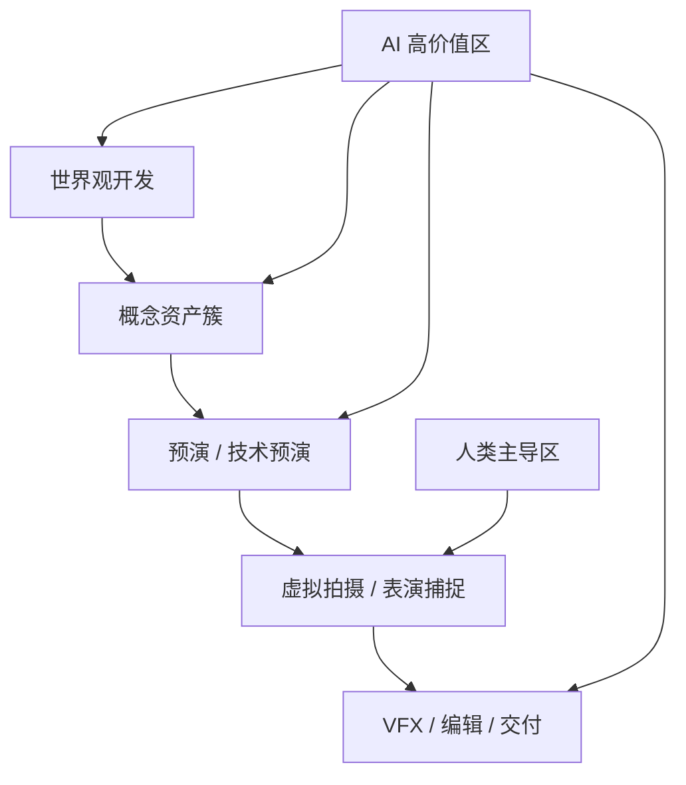
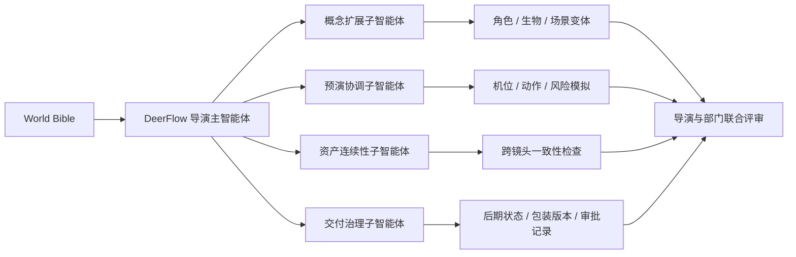

# 95. 导演案例：James Cameron 在 AI 时代的系统工程电影观

这一篇聚焦：

**James Cameron 不是把技术当成“辅助部门”的导演，而是把技术当成叙事引擎的一部分。到了 2026 年，最适合 Cameron 型项目的 AI，不是单点生成，而是世界观生产、资产连续性管理、虚拟拍摄协同和工业级研发闭环。**

---

## 1. 为什么 Cameron 是电影 AI 化最重要的正向样本之一

Cameron 和 Nolan 最大的不同，不在于谁更“先进”，而在于两人对技术在电影中的位置判断不同。

如果说 Nolan 更强调：

- 技术必须服从电影本体

那么 Cameron 更接近：

- 技术本身就是电影语言进化的一部分

从《深渊》《终结者 2》《泰坦尼克号》到《阿凡达》系列，Cameron 的方法一直是：

- 先判断一个故事需要怎样的新技术
- 再反向推动工具、流程和工业链升级

这使他天然成为 2026 年电影 AI 化的关键观察样本，因为他代表的不是“用不用 AI”，而是“如何把 AI 纳入长期工业体系”。

---

## 2. 从公开信息看，Cameron 型工作法的五个特点

### 2.1 技术研发和电影开发是并行的

《阿凡达》系列最典型的地方在于，世界构建、拍摄方式、资产系统和后期管线从一开始就是一起设计的。  
2025 年上线的《Fire and Water》幕后纪录，也再次强调了水下表演捕捉、自由潜训练、超大水池环境和跨团队试验是如何成为创作本身的一部分。

### 2.2 他把“复杂环境中的表演”当成核心问题来攻克

Avatar 相关公开材料显示，水下表演捕捉不是一个单点技巧，而是整套拍摄语言、演员训练、设备设计和后期流程的联动结果。  
这意味着 Cameron 型项目最在乎的，从来不是“有没有特效”，而是：

- 在复杂技术条件下，如何保住表演真实性

### 2.3 他对技术的态度是积极且前瞻的

Stability AI 在 2024 年宣布 Cameron 加入董事会时，Cameron 公开表示，生成式 AI 与 CGI 图像创作的交汇会开启新的讲故事方式。  
这意味着他并不把生成式 AI 仅仅看成短期工具，而是把它看成下一代视觉工业的一部分。

### 2.4 他看重的是“完整栈”，而不是模型演示

Cameron 真正会关心的问题通常是：

- 资产能不能跨镜头、跨集数、跨项目复用
- 世界观规则能不能持续维护
- 表演、镜头、VFX、交付是不是同一套系统语言

所以对 Cameron 型团队来说，AI 的价值不在 demo，而在 pipeline。

### 2.5 他是标准的“大系统导演”

这类导演的难点不是灵感不够，而是：

- 项目规模巨大
- 研发周期长
- 跨团队协作多
- 资产与版本跨度大

因此，非常适合 DeerFlow 这种“把对象、流程、审批、版本、知识连接起来”的系统。

---

## 3. 对 Cameron 型项目来说，2026 年 AI 最值得投入的环节

### 第一类：世界观与资产生成前置层

AI 最适合帮助 Cameron 型团队做：

- 世界观资料组织
- 生物、环境、道具系统的概念扩展
- 场景簇与资产簇的快速探索
- 大量概念变体的并行比较

这不是为了替代美术指导，而是为了让世界观设计更快形成系统化候选集。

### 第二类：虚拟拍摄与预演层

Cameron 型项目极度依赖：

- previs
- techvis
- performance planning
- environment planning

AI 在这里的价值，是帮助团队更快把剧本拆成：

- 表演要素
- 机位方案
- 场景约束
- 水下或复杂环境风险

### 第三类：跨资产连续性层

系列大片的真正成本黑洞之一，是资产连续性。

AI 可以在这里承担：

- 角色、服装、道具、环境的一致性检查
- 镜头间 continuity 提示
- 概念图、previz、final asset 的映射跟踪

### 第四类：后期与交付治理层

一旦项目进入大片级后期，问题会迅速变成：

- 哪一版才是当前正确版本
- 哪些镜头已通过
- 哪些资产仍在漂移
- 哪些镜头存在技术债

这就是 DeerFlow 进入 Cameron 型项目的关键位置。

---

## 4. 一张图：Cameron 型项目里的 AI 价值链

这张图说明：

- AI 对 Cameron 型项目的贡献，主要在“复杂系统压缩”和“长链路管理”
- 真正不可替代的核心，仍然是导演对世界与表演的判断

---

## 5. DeerFlow 如何服务 Cameron 型电影工业

### 5.1 作为世界观生产操作系统

DeerFlow 可以把 Cameron 型项目里最庞杂的前期资料组织成统一对象系统：

- 世界规则
- 角色族群
- 生物设定
- 场景生态
- 道具技术树
- 视觉风格约束

这样做的好处是，后续每一次概念扩展都不是“重新开始”，而是在已知系统中生成、比较和审批。

### 5.2 作为跨部门预演中枢

对 Cameron 型团队，previs 不是一个小部门的工作，而是导演、摄影、动作、表演捕捉、VFX、制片共同决策的界面。

DeerFlow 可以让：

- 剧本拆解
- 分镜对象
- 场景对象
- 表演约束
- 拍摄资源

进入同一个线程状态和工单体系。

### 5.3 作为系列资产治理系统

系列片最大的隐性收益，不是“某一个镜头更快”，而是：

- 下一部不用重建认知
- 同一世界观资产可复用
- 跨地区团队能共享语义

DeerFlow 如果把资产、版本、审批和知识图谱打通，就能让 Cameron 型 IP 的“长期主义红利”更稳定地释放。

---

## 6. 一张流程图：DeerFlow 在 Cameron 型项目中的部署方式

---

## 7. 对 Cameron 型项目，DeerFlow 的收益会体现在哪些地方

| 收益维度 | Cameron 型项目的痛点 | DeerFlow + AI 的改善方向 |
|------|----------------------|---------------------------|
| 世界构建 | 设定庞大、跨部门理解容易断裂 | 用对象化知识系统维持统一语义 |
| 预演效率 | 复杂镜头前置决策成本高 | 用多轮可视化预演压缩前期会议成本 |
| 资产连续性 | 系列项目跨镜头跨集数容易漂移 | 用连续性检查与版本图谱减少返工 |
| 工业研发 | 新技术、新工艺与创作并行推进 | 用 DeerFlow 把研发结果沉淀为可复用流程 |
| 交付治理 | 大后期项目状态复杂、风险隐蔽 | 用统一审批与状态机降低管理熵 |

---

## 8. 如果真的落地，最先该做什么

建议 Cameron 型项目不要一开始就押宝“最终画面生成”，而是先做四件更稳的事：

1. 世界观知识系统
2. 预演工单与状态系统
3. 资产连续性检查系统
4. 后期与交付治理系统

这四步一旦成立，未来无论接入：

- OpenAI 的推理层
- Google 的 Veo / Flow 路线
- Runway 的一致性路线
- Adobe 的后期路线
- 国内模型的本地化路线

都能被 DeerFlow 收进一个可治理的生产系统里。

---

## 9. 核心结论

James Cameron 型项目给我们的最大启发是：

**电影 AI 化真正有价值的方向，不是让模型“一次性替你创作”，而是让整个复杂世界的生产变得更可组织、更可复用、更可扩展。**

对于这类导演，DeerFlow 的价值很清楚：

- 它不是一个孤立工具
- 它是一个把世界观、预演、资产、审批、版本和知识沉淀联成闭环的电影工业操作系统

这恰好也是 2026 年电影制作 AI 化真正会大规模落地的方向。

---

## 参考资料

- [Stability AI: James Cameron joins the Board of Directors](https://stability.ai/news-updates/james-cameron-joins-stability-ai-board-of-directors)
- [Stability AI Board of Directors](https://stability.ai/board-of-directors)
- [Avatar.com: Fire and Water documentary on underwater performance capture](https://www.avatar.com/news/fire-and-water-making-the-avatar-films-documentary-premieres-november-7-on-disney-plus)
- [Academy: Avatar The Way of Water cinematography interview](https://newsletter.oscars.org/news/post/avatar-way-of-water-russell-carpenter-cinematography-interview)
- [Academy Conversations: Avatar The Way of Water](https://newsletter.oscars.org/features/avatar-the-way-of-water-academy-conversations-interview)
- [Avatar.com: concept art for The Way of Water](https://www.avatar.com/dive-into-new-avatar-the-way-of-water-concept-art)
