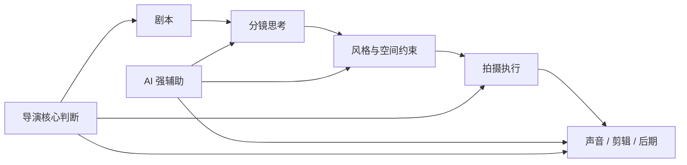
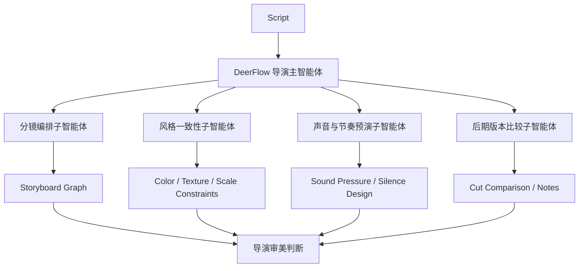

# 96. 导演案例：Denis Villeneuve 在 AI 时代如何守住“存在感”

这一篇聚焦：

**Denis Villeneuve 的电影价值，不在于信息量堆积，而在于画面、声音、节奏与空间共同制造出的“存在感”。到了 2026 年，最适合 Villeneuve 型项目的 AI，不是替代直觉，而是帮助导演把直觉更稳定地翻译成结构、分镜、场景、声音与后期治理。**

---

## 1. 为什么 Villeneuve 很重要

如果说：

- Nolan 代表作者性结构控制
- Cameron 代表技术系统工程

那么 Villeneuve 代表的是另一种更难被 AI 直接触碰的能力：

- 氛围
- 节奏
- 空间压迫感
- 人物在巨大世界中的存在感

这类导演最容易被误判。  
很多人会觉得，只要模型能“出一张很像的图”，就接近这种风格了。

但实际上，Villeneuve 的电影语言并不是单张图构成的，而是：

- 宽镜头与极近特写之间的强烈切换
- 声音和留白制造的心理空间
- 分镜阶段就开始决定的调度逻辑
- 把视觉奇观转化为情绪体验的整体组织

因此，他非常适合用来说明：

**2026 年的电影 AI 应该增强什么，不应该偷走什么。**

---

## 2. 从公开材料看，Villeneuve 型工作法的三个关键信号

### 2.1 分镜不是附属品，而是导演语言诞生的地方

DGA 围绕《沙丘 2》的对谈里，Villeneuve 明确说过：  
他几乎会把整部电影都 storyboard 一遍，而且在完成分镜之后还会回头重写剧本，因为从文字到图像会产生新的限制与新的想法。

这个信号非常关键。  
它说明对 Villeneuve 而言：

- 分镜不是执行文件
- 分镜本身就是思考过程

### 2.2 他的镜头组织来自“情绪与世界尺度”的对撞

在《沙丘 2》的公开讨论里，他解释过自己为什么偏爱 wide shot 与 extreme close-up 的极端组合，本质上是要让景观对人物灵魂产生冲击。  
这意味着他的风格不是单纯的美术风格，而是镜头与心理的耦合。

### 2.3 他对 AI 的警惕，核心不是技术恐惧，而是反算法化

在 2024 年末的采访中，Villeneuve 对 AI 的担忧并不是“工具本身”，而是创作者越来越像算法，电影越来越失去“在场感”和人的痕迹。  
所以，如果要服务 Villeneuve 型项目，AI 必须非常克制。

---

## 3. Villeneuve 型项目，AI 应该帮助什么

### 应该帮助的

- 把复杂叙事拆成更稳定的视觉规划对象
- 把导演的氛围直觉沉淀成世界观与风格约束
- 在分镜、镜头顺序、场景光线测试中提供候选
- 在声音预演、节奏分析、后期版本比较中提供辅助
- 在长链路协作中保护风格不漂移

### 不应该接管的

- 最终镜头美学判断
- 表演与沉默之间的张力组织
- 镜头节奏的终极决定权
- 视觉奇观背后的存在主义情绪

因为这些恰恰是 Villeneuve 型电影最难替代的部分。

---

## 4. 一张图：Villeneuve 型项目里 AI 的正确边界

这张图说明：

- AI 最适合在“帮助导演把模糊感受变成可协作对象”时发挥作用
- 一旦进入最终表达，AI 必须退到辅助位置

---

## 5. DeerFlow 如何服务 Villeneuve 型工作法

### 5.1 先把导演的“感觉”翻译成系统约束

Villeneuve 型项目最容易出现的问题是：

- 导演脑中有很强的整体感
- 部门执行时却只能拿到局部指令

DeerFlow 可以在开机前，把这些抽象感受转成明确对象：

- 角色主观性
- 场景空间情绪
- 色温与材质倾向
- 镜头亲疏关系
- 声音压迫度

这样 AI 不再是“瞎生成”，而是在明确风格约束里辅助工作。

### 5.2 把 storyboard 变成系统中枢

既然 Villeneuve 自己就把 storyboard 当成创作中心，那么 DeerFlow 最合理的做法是：

- 让剧本片段、分镜帧、镜头意图、声音备注、场景对象进入同一个图谱

一旦这个图谱存在，团队就能围绕同一个导演意图协作，而不是各自理解。

### 5.3 用 AI 做“风格守门员”，而不是“风格替身”

DeerFlow 可以让 AI 负责：

- 检查分镜间风格是否漂移
- 检查镜头顺序是否削弱情绪推进
- 检查声音方案与视觉方案是否同向
- 检查世界观规则是否被局部镜头破坏

这类工作本质上是“守门”，而不是“代创作”。

---

## 6. 一张流程图：DeerFlow 在 Villeneuve 型项目中的部署

---

## 7. 对 Villeneuve 型导演，DeerFlow 会带来什么收益

| 收益维度 | 传统问题 | DeerFlow + AI 的改善方向 |
|------|----------|---------------------------|
| 分镜阶段 | 导演意图容易停留在少数核心成员脑中 | 把分镜、镜头意图、氛围说明对象化 |
| 风格统一 | 大项目跨部门执行容易局部跑偏 | 用风格约束与一致性检查减少漂移 |
| 声画协同 | 视觉设计和声音设计常常串联较晚 | 让声音预演更早进入导演决策 |
| 后期比较 | 多版剪辑难以回看差异 | 用结构化版本比较辅助判断 |
| 作者保护 | AI 容易被误用为“代替风格” | 用 DeerFlow 把 AI 锁在辅助位置 |

---

## 8. 一个重要判断：Villeneuve 型项目最需要的是“低噪声 AI”

很多导演型项目失败，不是因为没有 AI，而是因为 AI 太吵。

所谓“太吵”包括：

- 候选太多
- 风格太散
- 输出太抢戏
- 系统把导演注意力拖走

Villeneuve 型工作流最需要的是：

- 少而准的候选
- 强约束的分镜与风格结构
- 明确的人工最终裁决

换句话说，这类项目里的 DeerFlow 应该设计成“安静的电影操作系统”。

---

## 9. 核心结论

Denis Villeneuve 给电影 AI 化带来的启发是：

**真正珍贵的不是让 AI 看起来像大师，而是让 AI 帮大师更稳地完成自己的电影。**

对这类导演，DeerFlow 的最佳定位是：

- 分镜与导演意图的结构化中枢
- 风格一致性的守门系统
- 声音、后期和版本比较的辅助平台

它应该增强作者的“在场感”，而不是让算法把作者磨平。

---

## 参考资料

- [DGA: Director Denis Villeneuve discusses Dune: Part Two](https://www.dga.org/Events/2024/May2024/DunePartTwo_QnA_0324)
- [Los Angeles Times interview with Denis Villeneuve](https://www.latimes.com/entertainment-arts/awards/story/2024-12-26/denis-villeneuve-dune-part-two-scorsese-spielberg-tarantino-christopher-nolan)
- [Variety AU: Denis Villeneuve and Luca Guadagnino interview](https://au.variety.com/2024/film/features/denis-villeneuve-luca-guadagnino-interview-dune-2-chalamet-19188/)
- [DGA Video Portal: Denis Villeneuve on researching the spice hallucinations of Dune](https://video.dga.org/detail/videos/meet-the-theatrical-feature-film-nominees-highlights/video/6300898710001/denis-villeneuve-on-researching-the-spice-hallucinations-of-dune)
- [DGA Quarterly: Villeneuve on sound and music collaboration](https://www.dga.org/craft/dgaq/issues/1701-winter-2017/collaborators-villeneuve-johannsson)
