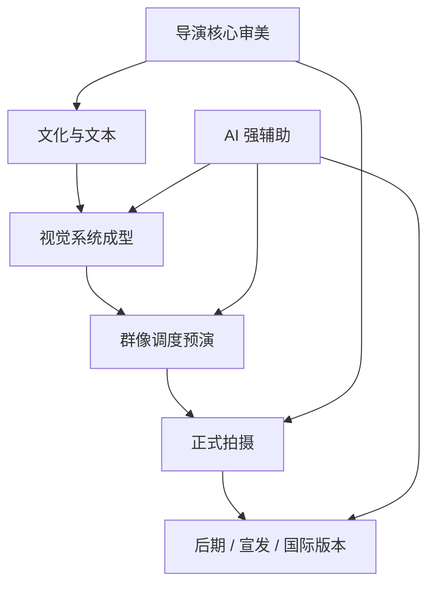
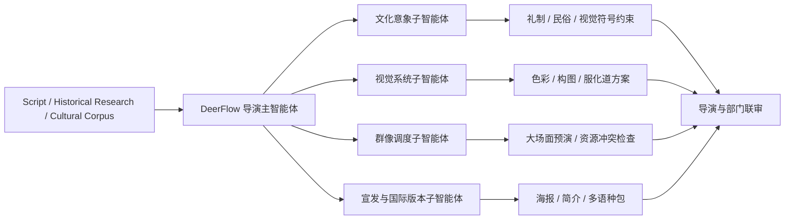
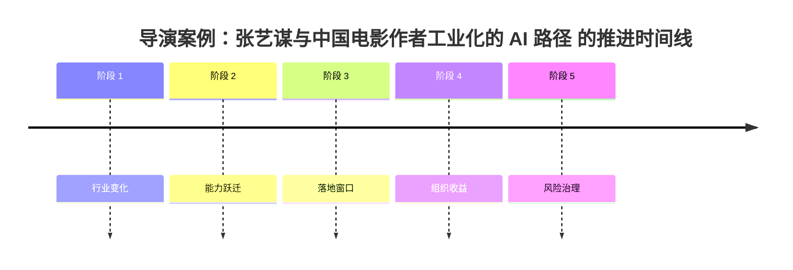

# 97. 导演案例：张艺谋与中国电影作者工业化的 AI 路径

这一篇聚焦：

**张艺谋代表的不是简单的“大导演”，而是中国电影里少见的“作者性、场面调度、文化视觉符号与大型工业执行”同时成立的导演类型。到了 2026 年，最适合张艺谋型项目的 AI，是能帮助中国式视觉表达进入更强前期组织、更快方案比较和更稳大规模执行的系统。**

---

## 1. 为什么张艺谋是中国电影 AI 化的关键样本

张艺谋的特殊性在于，他既是典型的作者导演，又长期处理：

- 大场面
- 大规模表演调度
- 强视觉符号系统
- 极高完成度的美术与色彩控制

这意味着他的项目天然有两种需求同时存在：

- 高度个人化的审美判断
- 高强度工业化的组织能力

而电影制作 AI 化真正有价值的地方，恰好就在这两者之间：

- 不是替代审美判断
- 而是帮助审美判断更快转化为可执行系统

---

## 2. 2025-2026 的公开信息说明了什么

### 2.1 张艺谋已经主动进入 AI 时代的创作讨论

在新华社关于《三体》动画电影与 AI 团队的报道中，张艺谋被明确描述为组建 AI 团队、推动电影级项目探索的一线导演之一。  
这说明中国头部作者导演已经不是在“围观 AIGC”，而是在主动试水。

### 2.2 他并没有把 AI 理解成“替代人”的捷径

在 2025 年关于 AI 时代影视创作的公开访谈里，张艺谋强调过：  
技术会改变流程和表达边界，但电影的情感、人文、人物和作者性仍然不能被工具替代。

### 2.3 中国院线与 AIGC 之间的距离正在缩短

新华网在 2025 年关于 AIGC 电影走进院线的报道中指出，AIGC 已经开始从短片、实验项目走向更正式的电影生产讨论。  
这意味着张艺谋式的大项目，未来不会直接被 AI “替代”，但一定会被 AI 重构前期和中期流程。

---

## 3. 张艺谋型项目，AI 最适合切入哪些地方

### 第一类：视觉系统快速成型

张艺谋型项目往往极度依赖：

- 色彩系统
- 群体调度关系
- 空间构图秩序
- 服化道与场景的统一感

AI 在这里可以帮助：

- 快速形成多轮风格版
- 对比不同色彩策略
- 提前测试大场面构图方向
- 在正式美术搭建前完成更充分的视觉对齐

### 第二类：大规模调度预演

大型场面、舞群、群众演员、道具、摄影机路径，本来就是成本很高的协调工作。

AI 结合 DeerFlow 可以提前做：

- 场面分区
- 队形与走位预演
- 镜头与动作冲突检查
- 大规模资源调度可行性分析

### 第三类：中国文化元素的本地化知识组织

张艺谋型项目常常会牵涉：

- 中国历史与礼制
- 民俗与象征符号
- 东方身体语言与视觉意象
- 地域化风格素材

这里 AI 的关键，不是生成几个“中国风画面”，而是让这些文化元素进入一个可检索、可比较、可追踪的知识层。

### 第四类：宣传物料与国际传播版本

张艺谋的作品往往兼具：

- 国内文化表达
- 国际节展传播

AI 可以在 DeerFlow 中帮助完成：

- 物料版本化
- 多语种说明
- 视觉资产归档
- 宣发与节展包装协同

---

## 4. 一张图：张艺谋型项目的 AI 价值结构

---

## 5. DeerFlow 如何服务张艺谋型项目

### 5.1 让作者性视觉先变成“可协作对象”

很多中国导演项目的问题不是没有想法，而是：

- 视觉意图讲得很强
- 但一进入执行层就变成口头传达

DeerFlow 可以把这些内容对象化：

- 色彩基调
- 场景秩序
- 角色群像层级
- 服化道约束
- 礼仪动作与文化符号

这样每个部门拿到的不是一句“要东方，要诗意”，而是一整套可执行约束。

### 5.2 让大场面项目提前暴露组织问题

对于张艺谋型大型调度项目，最贵的往往不是单个镜头，而是：

- 一旦正式进场，试错成本极高

DeerFlow 结合 AI 的高价值点在于：

- 先把不同方案拿来比
- 先把空间、人数、机位、时间窗口冲突暴露出来
- 再让导演决定最终走哪条路

### 5.3 让中国本土文化元素被系统化管理

中国电影做 AI 化时，很容易陷入一个误区：

- 视觉看似华丽
- 文化表达却非常空泛

DeerFlow 可以避免这一点，因为它并不只看图像输出，而是把：

- 资料出处
- 风格意图
- 版本变化
- 审批意见

全部记录在案。

---

## 6. 一张流程图：DeerFlow 在张艺谋型项目中的部署

---

## 7. 对张艺谋型项目，DeerFlow 的收益主要体现在哪里

| 收益维度 | 传统问题 | DeerFlow + AI 的改善方向 |
|------|----------|---------------------------|
| 视觉对齐 | 审美判断往往停留在少数主创脑中 | 用对象化风格系统把审美传递给执行团队 |
| 大场面执行 | 开机后试错成本极高 | 用预演与资源冲突分析把错误前移 |
| 文化准确性 | 视觉化表达容易流于空泛符号 | 用资料与审校链保持表达根基 |
| 多版本输出 | 宣发、节展、院线版本协作复杂 | 用版本治理降低重复沟通 |
| 本土模型适配 | 中文语境与中国题材需要本地化能力 | 用 DeerFlow 统一接入国产模型与知识库 |

---

## 8. 对中国电影尤其重要的一点：AI 不该削弱作者性，反而应该放大作者控制力

张艺谋型项目给中国电影 AI 化的一个重要启发是：

- 中国电影不缺个人审美
- 缺的是把强作者性稳定转成高质量工业执行的系统

如果 DeerFlow 能把：

- 导演意图
- 视觉系统
- 大场面预演
- 本土文化知识
- 审批与版本治理

串成闭环，它对中国电影的价值就会非常大。

---

## 9. 核心结论

张艺谋代表的是中国电影里非常有价值的一种未来方向：

**不是放弃作者电影去拥抱 AI，而是让 AI 帮作者电影进入更高完成度的工业化。**

对这类导演来说，DeerFlow 的最佳定位是：

- 中国语境下的作者型电影操作系统
- 大型视觉项目的预演与协同平台
- 文化表达、版本治理与宣发协同的中枢

这比单纯讨论“能不能生成一张东方美学图片”要现实得多。

---

## 参考资料

- [新华网：张艺谋与《三体》动画电影 AI 团队相关报道](https://www.news.cn/ent/20241021/1299131d0fbd4c9c836accb0027dfe97/c.html)
- [央视人物：张艺谋谈 AI 时代的电影创作](https://people.cctv.com/2025/11/17/ARTIcFgQtPQK40ql5Ezfa1th251116.shtml)
- [新华网：大模型技术发展推动影视创作升级，AIGC 电影走进院线](https://www.news.cn/ent/20250627/21088f7761404e2486fcd398c8e9893c/c.html)
- [浙江新闻：电影+科技的产业升级观察](https://zjnews.zjol.com.cn/zjnews/202507/t20250708_31099058.shtml)
- [中国日报：AI 影视产业论坛相关报道](https://caijing.chinadaily.com.cn/a/202503/31/WS67ea3320a31008317a2af846.html)

---

<!-- movie-visuals:start -->
## 补充图示：换一种视角看本篇

下面这张 时间线 把“导演案例：张艺谋与中国电影作者工业化的 AI 路径”再压缩成一个可快速扫读的结构视图，便于先抓关键关系，再回到正文细节。

<!-- movie-visuals:end -->

<!-- movie-doc-nav:start -->
## 文档导航

- 总入口：[README.md](./README.md)
- 阅读地图：[00-reading-map.md](./00-reading-map.md)
- 所在分组：91-102 行业趋势、导演案例与收益分析
- 上一篇：[96. 导演案例：Denis Villeneuve 在 AI 时代如何守住“存在感”](./96-director-case-denis-villeneuve.md)
- 下一篇：[98. 导演案例：郭帆与中国科幻工业化的 AI 操作系统](./98-director-case-guo-fan.md)

### 同组文档
- [91. 2026 模型版图与电影 AI 技术栈](./91-2026-model-landscape-and-film-ai-stack.md)
- [92. 2026 好莱坞电影制作 AI 化趋势](./92-hollywood-ai-film-production-trends-2026.md)
- [93. 2026 中国电影制作 AI 化趋势](./93-china-film-ai-production-trends-2026.md)
- [94. 导演案例：Christopher Nolan 在 AI 时代的工作法重构](./94-director-case-christopher-nolan.md)
- [95. 导演案例：James Cameron 在 AI 时代的系统工程电影观](./95-director-case-james-cameron.md)
- [96. 导演案例：Denis Villeneuve 在 AI 时代如何守住“存在感”](./96-director-case-denis-villeneuve.md)
- 97. 导演案例：张艺谋与中国电影作者工业化的 AI 路径（当前）
- [98. 导演案例：郭帆与中国科幻工业化的 AI 操作系统](./98-director-case-guo-fan.md)
- [99. DeerFlow 作为 2026 电影 AI 操作系统的总体收益框架](./99-deerflow-ai-film-operating-system-overview.md)
- [100. DeerFlow 在好莱坞电影制作 AI 化中的收益地图](./100-deerflow-benefit-map-for-hollywood.md)
- [101. DeerFlow 在中国电影制作 AI 化中的收益地图](./101-deerflow-benefit-map-for-china-film.md)
- [102. DeerFlow 在 2026-2027 电影行业中的 ROI、治理与落地路线图](./102-deerflow-roi-governance-and-adoption-roadmap-2026.md)
<!-- movie-doc-nav:end -->
