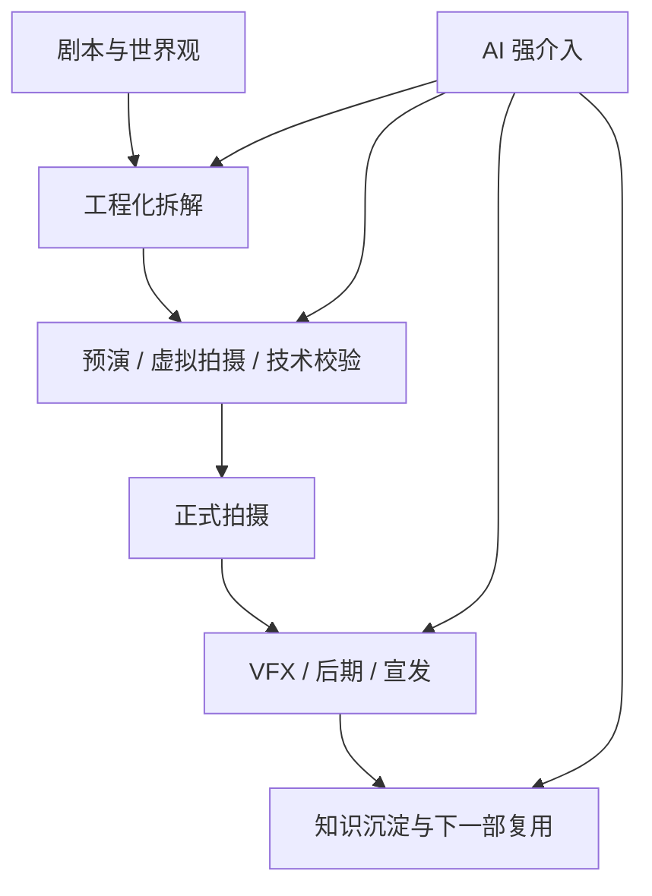
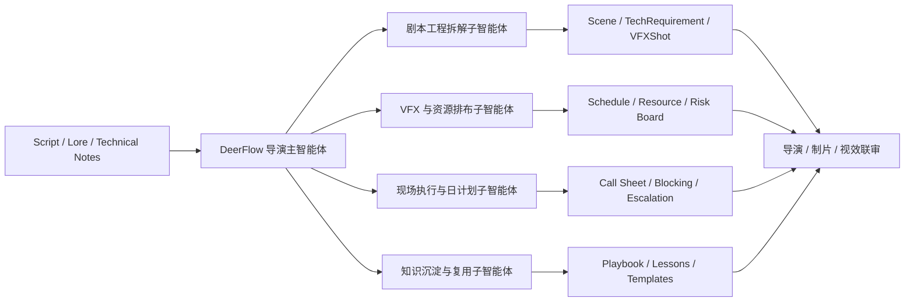
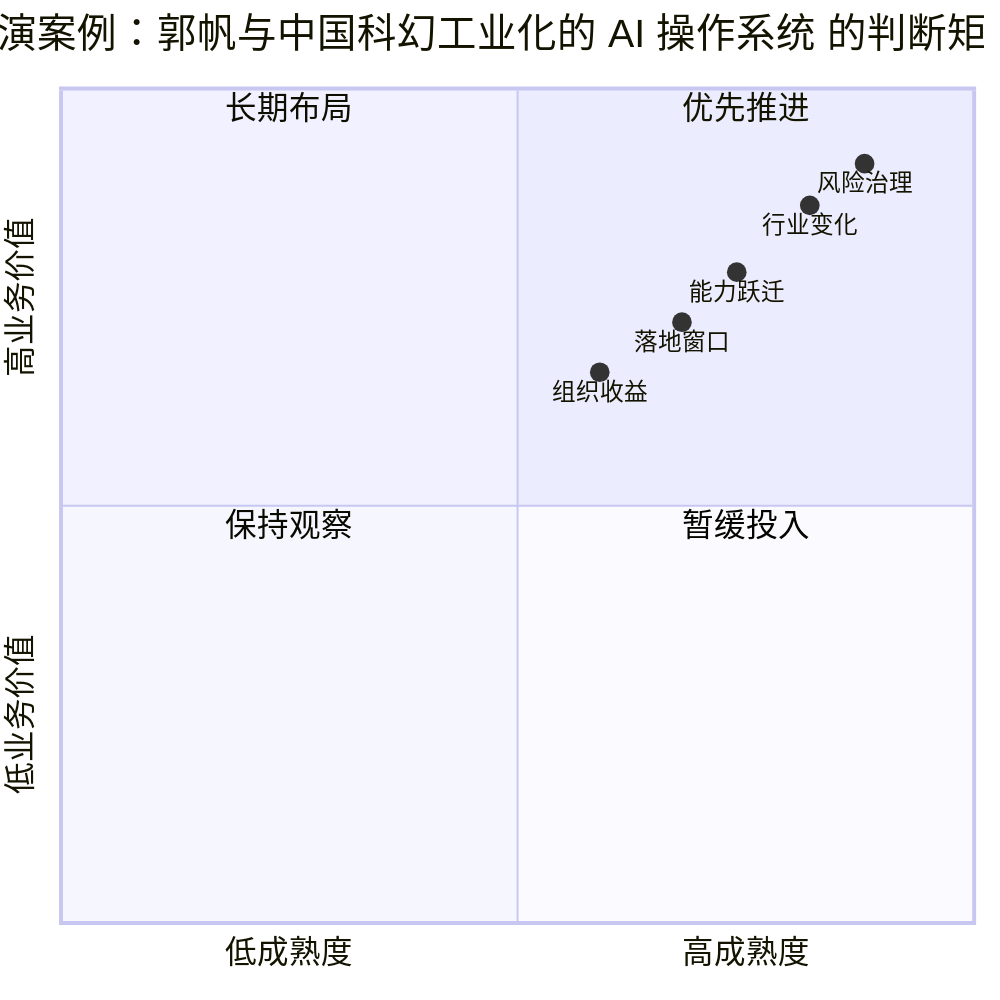

# 98. 导演案例：郭帆与中国科幻工业化的 AI 操作系统

这一篇聚焦：

**郭帆代表的是中国电影里最接近“系统工程导演”的路线。到了 2026 年，AI 对郭帆型项目最关键的意义，不是做一段炫技短片，而是进入科幻大片的项目拆解、技术协同、资产复用、拍摄执行与工业知识沉淀。**

---

## 1. 为什么郭帆是 DeerFlow 最值得研究的中国导演之一

郭帆的重要性，不只是因为《流浪地球》系列成功，而是因为他在公开表述里反复强调：

- 中国电影工业化需要标准化
- 需要工程化拆解
- 需要把制作过程写成“底层代码”
- 新技术应该成为电影的工具箱

这和 DeerFlow 的核心理念天然契合。  
DeerFlow 做的事情，本质上也是：

- 把复杂电影项目拆成对象、状态、工具、版本和工单

所以，在五位导演里，郭帆其实是与 DeerFlow 最容易形成直接方法论耦合的一位。

---

## 2. 2025-2026 的公开信息释放了哪些强信号

### 2.1 郭帆已经明确把 AI 看成“超级工具”

2026 年公开文章里，郭帆明确表示：

- 现阶段 AI 能帮助降本增效，让流程更科学高效
- 但要直接生成有情感深度的叙事，还有距离
- 应该把 AI 当成“超级工具”，而不是叙事核心的替身

这实际上就是对电影 AI 化最成熟的判断之一。

### 2.2 《流浪地球 3》已经出现“专属 AI 工具全程参与拍摄”的信号

新华网在 2025 年《流浪地球 3》开机报道中提到：

- 剧组带来了自主开发的专属 AI 问答应用
- 这类工具将全程参与拍摄

这说明中国头部科幻大片已经不再只是在外围试验 AI，而是开始把 AI 纳入正式项目流程。

### 2.3 中国工业体系正在和中国科幻电影相互借力

郭帆在公开文章里提到过，中国电影工业化不能只盯着好莱坞学，更要借力本国制造业和先进生产技术。  
《流浪地球 3》相关报道里，徐工等工业合作方也直接参与支持。  
这意味着郭帆型项目的 AI 化，不会只是软件问题，而会和工业装备、虚拟拍摄、动捕、渲染、现场调度一起构成完整系统。

---

## 3. 郭帆型项目里，AI 最应该切入哪里

### 第一类：剧本工程化拆解

郭帆型科幻项目通常具有：

- 大量设定
- 大量特效镜头
- 大量技术对象
- 大量跨部门依赖

AI 可以在前期帮助完成：

- 设定抽取
- 场景复杂度分级
- VFX 镜头预标注
- 特殊道具与机械需求梳理
- 任务依赖图构建

### 第二类：工程预演与拍摄排布

科幻大片的一个核心难点是：

- 每个镜头都不仅是创意问题，也是资源配置问题

AI 在 DeerFlow 中可以帮助：

- 做镜头风险分析
- 做跨部门排期模拟
- 做资源冲突提醒
- 做大型设备与基地能力匹配

### 第三类：资产与知识复用

《流浪地球》这类系列项目的真正壁垒之一，是：

- 世界观资产
- 管线经验
- 失败教训
- 国产工业合作经验

如果这些只是留在人脑里，价值就很难持续积累。  
DeerFlow 最适合做的，就是把这些内容沉淀为：

- 可查询知识
- 可复用模板
- 可追踪版本
- 可复制流程

### 第四类：面向中国本土模型的多模型协同

郭帆型项目并不适合依赖单一平台。  
更现实的路线是：

- 推理层使用强长上下文模型
- 视频层使用国内外多模型路由
- 本地素材管理与合规交给项目系统

这正是 DeerFlow 的优势。

---

## 4. 一张图：郭帆型科幻大片的 AI 工作流

---

## 5. DeerFlow 如何服务郭帆型项目

### 5.1 把“电影像工程项目一样被拆解”真正做成系统

郭帆在公开文章里已经把方向说得很清楚：

- 剧本格式标准化
- 预算精确控制
- 特效镜头统筹
- 把电影底层代码写清楚

DeerFlow 可以把这套方法变成正式系统对象：

- `Script`
- `Scene`
- `TechRequirement`
- `VFXShot`
- `Resource`
- `ReviewPackage`

这会把“经验”变成“平台能力”。

### 5.2 让 AI 真正参与项目主链，而不是只做外围玩具

郭帆型项目最需要的不是单独的聊天机器人，而是：

- 能读剧本
- 能拆任务
- 能连预算
- 能连排期
- 能连资产
- 能连审批

DeerFlow 的线程状态、对象体系、工单体系和版本体系，正好能把 AI 放进主链。

### 5.3 让中国科幻工业化经验能复用到更多项目

最有价值的一点是，郭帆型项目的经验一旦系统化，不只服务一部电影，而会形成：

- 中国科幻大片模板
- 重工业合作模板
- 复杂视效项目模板
- 本土 AI 工具接入模板

这会直接放大 DeerFlow 的平台价值。

---

## 6. 一张流程图：DeerFlow 在郭帆型项目中的部署

---

## 7. 对郭帆型项目，DeerFlow 的收益为什么最容易被量化

| 收益维度 | 传统问题 | DeerFlow + AI 的改善方向 |
|------|----------|---------------------------|
| 拆解效率 | 科幻项目设定多、部门依赖复杂 | 用 AI 辅助拆解大幅减少前期整理成本 |
| 资源协调 | 视效镜头、设备、拍摄窗口冲突多 | 用统一状态系统提前暴露矛盾 |
| 风险管理 | 复杂项目问题常在现场爆发 | 用预演与风险板把问题前移 |
| 资产复用 | 系列项目经验容易散落 | 用知识与模板系统把经验沉淀下来 |
| 平台复制 | 每个项目都像重新搭一遍班子 | 用 DeerFlow 把“项目能力”沉淀成“组织能力” |

---

## 8. 一个很现实的判断：郭帆型项目最适合成为 DeerFlow 的中国试点

原因有四个：

1. 本身就是工业化程度较高的电影项目
2. 已经公开表达过对 AI 的开放态度与边界判断
3. 有大量跨部门工程问题，最需要系统化平台
4. 成果一旦沉淀，可迁移到更多中国科幻与重制作项目

从平台策略看，这种项目非常适合做 DeerFlow 的高价值试点，因为它能直接证明：

- DeerFlow 不是“写写分镜提示词”的工具
- 而是能进入电影工业主链的操作系统

---

## 9. 核心结论

郭帆给中国电影 AI 化的最大启发是：

**真正的电影 AI 化，不是用 AI 取代电影工业，而是用 AI 把电影工业真正补齐。**

对这类导演来说，DeerFlow 最合理的角色是：

- 中国科幻项目的系统工程中枢
- AI 工具与传统制片流程的桥梁
- 经验复用与工业标准沉淀的平台

这比任何单次模型演示都更接近电影行业真正需要的东西。

---

## 参考资料

- [新浪财经转载北京日报：郭帆谈把 AI 当成“超级工具”](https://finance.sina.com.cn/jjxw/2026-04-04/doc-inhtiiqc8036312.shtml)
- [新华网：《流浪地球3》开机，全新自研专属人工智能参与制作](https://www.news.cn/ent/20250418/c1ebc2b27b1642248be4fc0948ac0859/c.html)
- [新华网：徐工机械已组建专项支持团队参与《流浪地球3》拍摄](https://www.news.cn/money/20250526/899432f34b8d43b5a67b9e661f13a83f/c.html)
- [新华网：2026 中国电影市场新消费与“电影+科技”观察](https://big5.news.cn/gate/big5/www.xinhuanet.com/ent/20260104/6a00a154295b4a46b25ecfcb9f1ab354/c.html)
- [新华网：影视产业中 AI 从“玩具”迈向“工具”](https://www.news.cn/ent/20251107/21fc93afab2946509a145c2bb4d1d35a/c.html)

---

<!-- movie-visuals:start -->
## 补充图示：换一种视角看本篇

下面这张 象限图 把“导演案例：郭帆与中国科幻工业化的 AI 操作系统”再压缩成一个可快速扫读的结构视图，便于先抓关键关系，再回到正文细节。

<!-- movie-visuals:end -->

<!-- movie-doc-nav:start -->
## 文档导航

- 总入口：[README.md](./README.md)
- 阅读地图：[00-reading-map.md](./00-reading-map.md)
- 所在分组：91-102 行业趋势、导演案例与收益分析
- 上一篇：[97. 导演案例：张艺谋与中国电影作者工业化的 AI 路径](./97-director-case-zhang-yimou.md)
- 下一篇：[99. DeerFlow 作为 2026 电影 AI 操作系统的总体收益框架](./99-deerflow-ai-film-operating-system-overview.md)

### 同组文档
- [91. 2026 模型版图与电影 AI 技术栈](./91-2026-model-landscape-and-film-ai-stack.md)
- [92. 2026 好莱坞电影制作 AI 化趋势](./92-hollywood-ai-film-production-trends-2026.md)
- [93. 2026 中国电影制作 AI 化趋势](./93-china-film-ai-production-trends-2026.md)
- [94. 导演案例：Christopher Nolan 在 AI 时代的工作法重构](./94-director-case-christopher-nolan.md)
- [95. 导演案例：James Cameron 在 AI 时代的系统工程电影观](./95-director-case-james-cameron.md)
- [96. 导演案例：Denis Villeneuve 在 AI 时代如何守住“存在感”](./96-director-case-denis-villeneuve.md)
- [97. 导演案例：张艺谋与中国电影作者工业化的 AI 路径](./97-director-case-zhang-yimou.md)
- 98. 导演案例：郭帆与中国科幻工业化的 AI 操作系统（当前）
- [99. DeerFlow 作为 2026 电影 AI 操作系统的总体收益框架](./99-deerflow-ai-film-operating-system-overview.md)
- [100. DeerFlow 在好莱坞电影制作 AI 化中的收益地图](./100-deerflow-benefit-map-for-hollywood.md)
- [101. DeerFlow 在中国电影制作 AI 化中的收益地图](./101-deerflow-benefit-map-for-china-film.md)
- [102. DeerFlow 在 2026-2027 电影行业中的 ROI、治理与落地路线图](./102-deerflow-roi-governance-and-adoption-roadmap-2026.md)
<!-- movie-doc-nav:end -->
