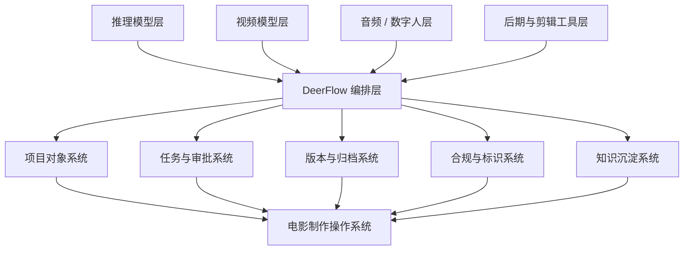
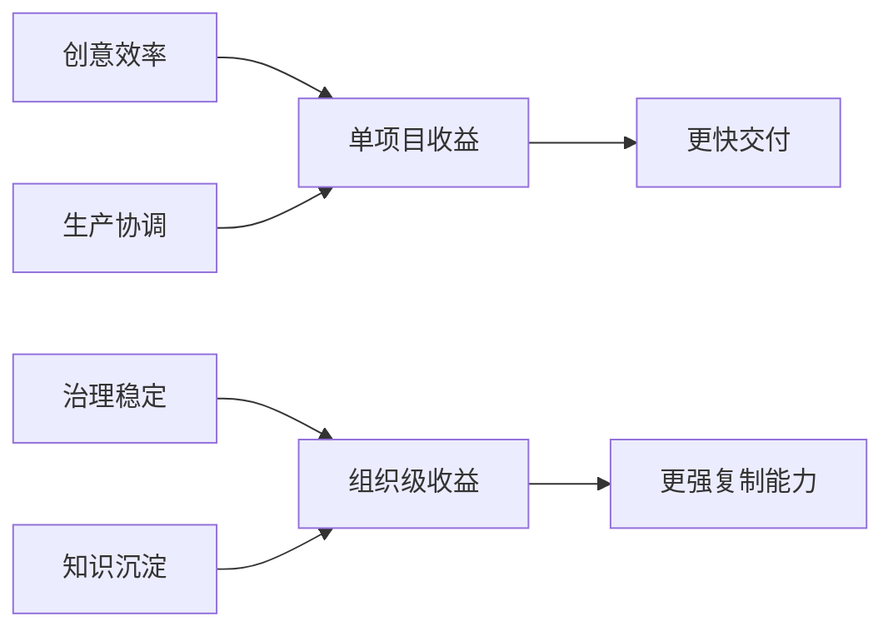

# 99. DeerFlow 作为 2026 电影 AI 操作系统的总体收益框架

这一篇聚焦：

**到了 2026 年，电影行业真正需要的已经不是“再多一个模型入口”，而是一个能把推理模型、视频模型、音频模型、后期工具、导演工作法、版权治理与团队协作串起来的电影操作系统。DeerFlow 的价值，恰好不在单点能力，而在组织能力。**

---

## 1. 为什么 2026 年需要的不是更多模型，而是更强编排

从 2025 到 2026，电影制作 AI 化进入了一个新阶段：

- OpenAI 路线强化了长上下文、代理式任务执行与视频能力
- Google 路线强化了视频、原生音频与 Flow 式创作工作台
- Runway 路线强化了跨镜头一致性与影视工作流
- Adobe 路线强化了后期与商业安全工作流
- 中国模型路线强化了本土化叙事、效率、开源与产业接入，并且前排模型更替速度明显加快

问题随之发生了变化。

过去的问题是：

- 模型能不能生成

现在的问题是：

- 哪个模型适合哪个阶段
- 不同模型产物怎么连接
- 版本与审批怎么治理
- 权利、合规与标识怎么处理
- 项目知识怎么沉淀

甚至连“这个模型和产品是否还会持续存在”都变成了问题。  
2026 年里，Sora 2 的官方停运安排，以及 Seedance 2.0、HappyHorse-1.0 这类中国视频模型对前排格局的快速改写，都说明模型层本身非常不稳定。

这已经不是模型问题，而是操作系统问题。

---

## 2. DeerFlow 的核心定位：把电影生产从“多工具拼接”提升为“可治理系统”

DeerFlow 的核心不是去替代 OpenAI、Veo、Runway、Firefly、Kling、Hunyuan 这些模型层能力，而是负责五件更稳定、也更稀缺的事情：

1. 把复杂电影项目拆成对象与状态
2. 把导演、制片、摄影、视效、后期等角色编织进统一流程
3. 把模型调用变成正式工单与审批链
4. 把版本、标识、风险、资产、交付纳入治理
5. 把经验沉淀成下一轮项目可复用的知识

这意味着 DeerFlow 的价值来源不是“某个模型今天更强”，而是：

- 即使模型层变化很快，系统层仍然稳定

---

## 3. 一张图：2026 电影 AI 栈与 DeerFlow 的位置

---

## 4. DeerFlow 相比“模型直连”最大的不同是什么

很多团队在 2026 年会自然地尝试一种路径：

- 给编剧一个模型
- 给分镜师一个模型
- 给后期一个模型
- 给宣发一个模型

这种方式短期看起来很快，但很容易出现五个问题：

- 输出分散
- 版本失控
- 权利边界不清
- 难以跨部门复用
- 经验无法沉淀

DeerFlow 的思路正相反：

- 先把项目组织起来，再让模型进入项目

这会让模型从“零散工具”变成“生产节点”。

---

## 5. DeerFlow 的收益不是一层，而是四层叠加

### 第一层：创意收益

- 更快完成剧本拆解
- 更快完成风格探索
- 更快完成分镜与预演

### 第二层：生产收益

- 更快暴露资源冲突
- 更快完成多部门对齐
- 更快进入正式拍摄与后期

### 第三层：治理收益

- 版本可追踪
- 审批可回溯
- AI 产物可标识
- 权利边界可记录

### 第四层：组织收益

- 项目经验变成组织经验
- 单次试验变成可复制模板
- 个人工作法变成可继承流程

真正大的价值，往往不在第一层，而在后三层。

---

## 6. 一张收益叠加图

---

## 7. DeerFlow 对好莱坞、中国电影、不同导演类型分别意味着什么

### 对好莱坞

重点价值在：

- 工会与合同约束下的 AI 可治理接入
- 数字替身、版权、同意与版本链管理
- 前期预演与后期治理的效率提升

### 对中国电影

重点价值在：

- 本土多模型接入
- 显式标识、隐式标识与发布链管理
- 工业化补课与 AI 同步推进

### 对作者型导演

重点价值在：

- 把导演直觉变成可执行系统

### 对工业型导演

重点价值在：

- 把复杂项目拆解成正式生产节点

---

## 8. 结合前面五位导演案例，可以看到 DeerFlow 的一个共同规律

虽然五位导演风格完全不同，但 DeerFlow 服务他们时都在做同一件事：

- 不是替他们做决定
- 而是让他们的决定更早成型、更稳传递、更易执行、更能沉淀

这就是 DeerFlow 与“单模型创作工具”的本质区别。

---

## 9. 2026 年最值得强调的一点：电影 AI 化的真正护城河已经从模型转向系统

模型层的领先会持续变化。  
今天是这个视频模型强，明天可能是另一个工作台强。

更现实一点说：

- 有的模型会突然跃升
- 有的产品会突然退出

因此平台如果把自己绑死在某一个消费级创作入口上，风险会非常高。

但对电影公司、导演团队和平台方来说，真正长期稳定的护城河会逐渐变成：

- 你有没有把对象体系建起来
- 你有没有把审批和版本体系建起来
- 你有没有把 AI 治理建起来
- 你有没有把经验沉淀成可复制的方法

这正是 DeerFlow 可以长期占位的地方。

---

## 10. 核心结论

如果用一句话总结 DeerFlow 在 2026 年电影行业里的定位，那就是：

**它不是另一个内容生成模型，而是让模型能力真正进入电影工业主链的操作系统。**

它带来的收益不是某一帧画面更惊艳，而是：

- 决策更快
- 协作更稳
- 治理更强
- 经验可复用

这也是为什么 DeerFlow 特别适合站在好莱坞、中国电影与不同导演方法论的交叉点上。

---

## 参考资料

- [OpenAI: GPT-4.1](https://openai.com/index/gpt-4-1//)
- [OpenAI: GPT-4.5](https://openai.com/index/introducing-gpt-4-5/)
- [OpenAI: Sora 2](https://openai.com/index/sora-2/)
- [OpenAI Help Center: What to know about the Sora discontinuation](https://help.openai.com/zh-hant/articles/20001152-what-to-know-about-the-sora-discontinuation)
- [Google: Veo 3, Imagen 4 and Flow](https://blog.google/technology/ai/generative-media-models-io-2025)
- [Google: Flow for filmmaking](https://blog.google/innovation-and-ai/products/google-flow-veo-ai-filmmaking-tool/)
- [Runway: Introducing Gen-4](https://runwayml.com/research/introducing-runway-gen-4)
- [Runway: Introducing Gen-4.5](https://runwayml.com/research/introducing-runway-gen-4.5)
- [Adobe: Firefly commercially safe video generation](https://news.adobe.com/news/2025/02/firefly-web-app-commercially-safe)
- [ByteDance Seed: Official launch of Seedance 2.0](https://seed.bytedance.com/en/blog/official-launch-of-seedance-2-0)
- [Caixin Global: Alibaba unveils HappyHorse](https://www.caixinglobal.com/2026-04-10/alibaba-unveils-happyhorse-after-ai-model-tops-video-rankings-under-alias-102432775.html)
- [CAC: 人工智能生成合成内容标识办法](https://www.cac.gov.cn/2025-03/14/c_1743654684782215.htm)
