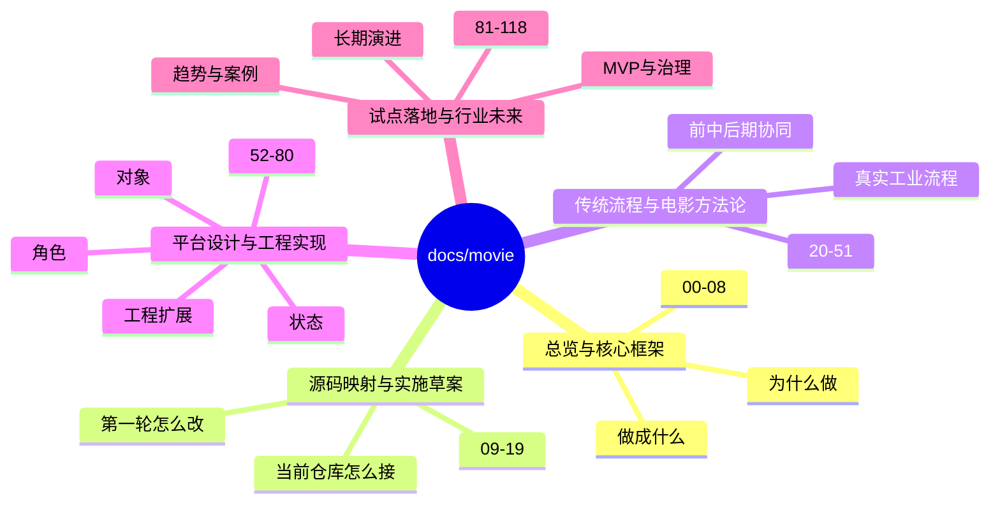
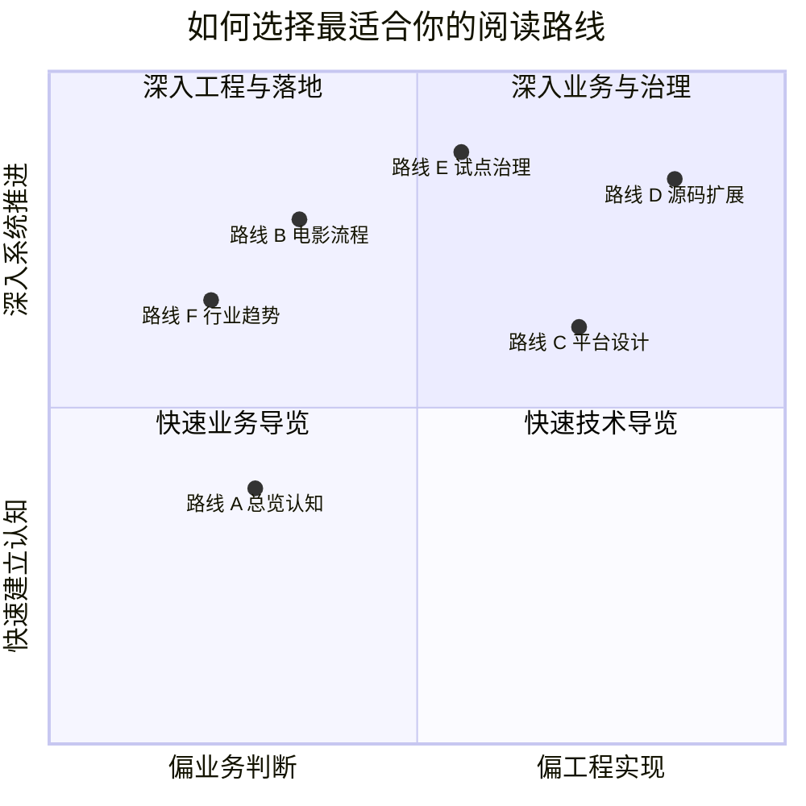

# Movie 导演智能体文档中心

`docs/movie` 用来系统化说明一件事：

**如何基于当前 DeerFlow，逐步演进出一个面向电影制作的导演智能体平台。**

这套文档已经覆盖了概念、流程、平台设计、源码映射、研发实施、行业趋势和组织落地，但原始阅读顺序更像“资料库”。这一版 README 的目标是把它整理成一个更好进入、也更容易串读的文档中心。

---

## 一张目录心智图

---

## 从哪里开始

如果你第一次进入这个目录，建议先读这 4 篇：

1. [00-reading-map.md](./00-reading-map.md)：整套文档的阅读地图与路线图
2. [01-overview.md](./01-overview.md)：先建立“导演智能体平台”是什么的总认知
3. [03-target-architecture.md](./03-target-architecture.md)：理解目标系统应该如何分层
4. [08-roadmap.md](./08-roadmap.md)：快速看到从当前仓库走向落地的阶段路径

如果你只想用 30 分钟建立全局认知，可以继续补读：

5. [20-master-plan-50-docs.md](./20-master-plan-50-docs.md)
6. [61-project-object-system-overview.md](./61-project-object-system-overview.md)
7. [71-lead-agent-transformation-plan.md](./71-lead-agent-transformation-plan.md)
8. [99-deerflow-ai-film-operating-system-overview.md](./99-deerflow-ai-film-operating-system-overview.md)
9. [103-deerflow-movie-integration-strategy-summary.md](./103-deerflow-movie-integration-strategy-summary.md)

---

## 推荐阅读路线

### 路线 A：先读懂“这到底是什么”

适合产品负责人、项目发起人、第一次接触该方案的人。

1. [00-reading-map.md](./00-reading-map.md)
2. [01-overview.md](./01-overview.md)
3. [02-current-project-mapping.md](./02-current-project-mapping.md)
4. [03-target-architecture.md](./03-target-architecture.md)
5. [04-production-phases.md](./04-production-phases.md)
6. [05-agent-system.md](./05-agent-system.md)
7. [06-data-models.md](./06-data-models.md)
8. [08-roadmap.md](./08-roadmap.md)

### 路线 B：按真实电影制作流程阅读

适合制片、导演、流程设计、行业研究。

1. [21-traditional-filmmaking-overview.md](./21-traditional-filmmaking-overview.md)
2. [22-non-ai-filmmaking-organization.md](./22-non-ai-filmmaking-organization.md)
3. [23-mapping-traditional-process-to-agent-platform.md](./23-mapping-traditional-process-to-agent-platform.md)
4. [24-deerflow-transformation-roadmap.md](./24-deerflow-transformation-roadmap.md)
5. [25-script-development-and-lock.md](./25-script-development-and-lock.md) 至 [36-dialogue-design-and-polish.md](./36-dialogue-design-and-polish.md)
6. [37-principal-photography-operations.md](./37-principal-photography-operations.md) 至 [44-dailies-output-and-review.md](./44-dailies-output-and-review.md)
7. [45-editing-workflow-and-versioning.md](./45-editing-workflow-and-versioning.md) 至 [51-project-retrospective-and-knowledge-capture.md](./51-project-retrospective-and-knowledge-capture.md)

### 路线 C：按平台设计与系统建模阅读

适合产品架构、系统设计、方案写作。

1. [05-agent-system.md](./05-agent-system.md)
2. [06-data-models.md](./06-data-models.md)
3. [07-tools-memory-skills.md](./07-tools-memory-skills.md)
4. [52-director-lead-agent-design.md](./52-director-lead-agent-design.md) 至 [60-cinematography-language-subagent-design.md](./60-cinematography-language-subagent-design.md)
5. [61-project-object-system-overview.md](./61-project-object-system-overview.md) 至 [70-artifact-version-and-archive-system.md](./70-artifact-version-and-archive-system.md)
6. [103-deerflow-movie-integration-strategy-summary.md](./103-deerflow-movie-integration-strategy-summary.md)
7. [104-deerflow-future-capability-blueprint.md](./104-deerflow-future-capability-blueprint.md)
8. [105-deerflow-future-reference-architecture.md](./105-deerflow-future-reference-architecture.md)

### 路线 D：按源码扩展与研发落地阅读

适合工程负责人、架构师、研发同学。

1. [09-source-mapping-overview.md](./09-source-mapping-overview.md)
2. [10-source-mapping-agent-runtime.md](./10-source-mapping-agent-runtime.md)
3. [11-source-mapping-subagents.md](./11-source-mapping-subagents.md)
4. [12-source-mapping-state-and-config.md](./12-source-mapping-state-and-config.md)
5. [13-system-blueprint.md](./13-system-blueprint.md)
6. [14-implementation-draft.md](./14-implementation-draft.md)
7. [15-a-code-design-draft.md](./15-a-code-design-draft.md)
8. [16-b-interfaces-and-data-contracts.md](./16-b-interfaces-and-data-contracts.md)
9. [17-c-first-code-drop-plan.md](./17-c-first-code-drop-plan.md)
10. [71-lead-agent-transformation-plan.md](./71-lead-agent-transformation-plan.md) 至 [80-observability-logging-and-evaluation.md](./80-observability-logging-and-evaluation.md)
11. [112-ai-coding-and-multi-agent-delivery-plan.md](./112-ai-coding-and-multi-agent-delivery-plan.md) 至 [118-program-governance-roadmap-and-operating-metrics.md](./118-program-governance-roadmap-and-operating-metrics.md)

### 路线 E：按试点、治理与企业化阅读

适合业务负责人、企业方案、治理与落地团队。

1. [81-mvp-scope-definition.md](./81-mvp-scope-definition.md)
2. [82-phase-1-development-plan.md](./82-phase-1-development-plan.md)
3. [83-phase-2-development-plan.md](./83-phase-2-development-plan.md)
4. [84-phase-3-development-plan.md](./84-phase-3-development-plan.md)
5. [85-pilot-project-implementation-manual.md](./85-pilot-project-implementation-manual.md)
6. [86-team-organization-and-role-allocation.md](./86-team-organization-and-role-allocation.md)
7. [87-data-and-asset-governance.md](./87-data-and-asset-governance.md)
8. [88-security-permissions-and-audit.md](./88-security-permissions-and-audit.md)
9. [89-metrics-and-roi.md](./89-metrics-and-roi.md)
10. [90-enterprise-rollout-roadmap.md](./90-enterprise-rollout-roadmap.md)
11. [102-deerflow-roi-governance-and-adoption-roadmap-2026.md](./102-deerflow-roi-governance-and-adoption-roadmap-2026.md)

### 路线 F：按行业判断与未来演进阅读

适合战略研究、市场判断、投资视角。

1. [91-2026-model-landscape-and-film-ai-stack.md](./91-2026-model-landscape-and-film-ai-stack.md)
2. [92-hollywood-ai-film-production-trends-2026.md](./92-hollywood-ai-film-production-trends-2026.md)
3. [93-china-film-ai-production-trends-2026.md](./93-china-film-ai-production-trends-2026.md)
4. [94-director-case-christopher-nolan.md](./94-director-case-christopher-nolan.md) 至 [98-director-case-guo-fan.md](./98-director-case-guo-fan.md)
5. [99-deerflow-ai-film-operating-system-overview.md](./99-deerflow-ai-film-operating-system-overview.md)
6. [100-deerflow-benefit-map-for-hollywood.md](./100-deerflow-benefit-map-for-hollywood.md)
7. [101-deerflow-benefit-map-for-china-film.md](./101-deerflow-benefit-map-for-china-film.md)
8. [103-deerflow-movie-integration-strategy-summary.md](./103-deerflow-movie-integration-strategy-summary.md)
9. [106-video-foundation-models-future-evolution.md](./106-video-foundation-models-future-evolution.md) 至 [111-video-agents-risk-evals-and-governance.md](./111-video-agents-risk-evals-and-governance.md)

---

## 一张选路象限图

这张图可以帮助第一次进入目录的人先判断：自己现在更接近“先建立方向感”，还是“直接推进方案与实现”。

---

## 一张阅读流转图

---

## 文档结构总表

### 00-08：总览与核心框架

回答“要做什么、为什么值得做、系统核心骨架是什么”。

- [00-reading-map.md](./00-reading-map.md)
- [01-overview.md](./01-overview.md)
- [02-current-project-mapping.md](./02-current-project-mapping.md)
- [03-target-architecture.md](./03-target-architecture.md)
- [04-production-phases.md](./04-production-phases.md)
- [05-agent-system.md](./05-agent-system.md)
- [06-data-models.md](./06-data-models.md)
- [07-tools-memory-skills.md](./07-tools-memory-skills.md)
- [08-roadmap.md](./08-roadmap.md)

### 09-19：源码映射与第一轮实施草案

回答“当前仓库能接什么、第一轮改造应怎么落地”。

- [09-source-mapping-overview.md](./09-source-mapping-overview.md)
- [10-source-mapping-agent-runtime.md](./10-source-mapping-agent-runtime.md)
- [11-source-mapping-subagents.md](./11-source-mapping-subagents.md)
- [12-source-mapping-state-and-config.md](./12-source-mapping-state-and-config.md)
- [13-system-blueprint.md](./13-system-blueprint.md)
- [14-implementation-draft.md](./14-implementation-draft.md)
- [15-a-code-design-draft.md](./15-a-code-design-draft.md)
- [16-b-interfaces-and-data-contracts.md](./16-b-interfaces-and-data-contracts.md)
- [17-c-first-code-drop-plan.md](./17-c-first-code-drop-plan.md)
- [18-solution-1-detailed-md-drafts.md](./18-solution-1-detailed-md-drafts.md)
- [19-solution-2-mvp-implementation-path.md](./19-solution-2-mvp-implementation-path.md)

### 20-24：方法论、传统流程与转型起点

回答“为什么必须从真实电影工业流程出发”。

- [20-master-plan-50-docs.md](./20-master-plan-50-docs.md)
- [21-traditional-filmmaking-overview.md](./21-traditional-filmmaking-overview.md)
- [22-non-ai-filmmaking-organization.md](./22-non-ai-filmmaking-organization.md)
- [23-mapping-traditional-process-to-agent-platform.md](./23-mapping-traditional-process-to-agent-platform.md)
- [24-deerflow-transformation-roadmap.md](./24-deerflow-transformation-roadmap.md)

### 25-36：前期制作

回答“从锁稿到风格统一，前期如何被平台化、对象化、智能体化”。

- [25-script-development-and-lock.md](./25-script-development-and-lock.md)
- [26-script-breakdown-and-breakdown-sheet.md](./26-script-breakdown-and-breakdown-sheet.md)
- [27-budgeting-and-line-producer-view.md](./27-budgeting-and-line-producer-view.md)
- [28-scheduling-and-first-ad-view.md](./28-scheduling-and-first-ad-view.md)
- [29-casting-and-actor-management.md](./29-casting-and-actor-management.md)
- [30-location-scouting-and-lock.md](./30-location-scouting-and-lock.md)
- [31-art-costume-props-collaboration.md](./31-art-costume-props-collaboration.md)
- [32-cinematography-lighting-vfx-preproduction.md](./32-cinematography-lighting-vfx-preproduction.md)
- [33-text-storyboard-and-shot-list.md](./33-text-storyboard-and-shot-list.md)
- [34-static-storyboards-and-moodboards.md](./34-static-storyboards-and-moodboards.md)
- [35-style-reference-analysis-and-unification.md](./35-style-reference-analysis-and-unification.md)
- [36-dialogue-design-and-polish.md](./36-dialogue-design-and-polish.md)

### 37-51：拍摄执行、后期与发行

回答“从现场调度到后期交付，平台如何承接正式生产”。

- [37-principal-photography-operations.md](./37-principal-photography-operations.md)
- [38-call-sheet-and-daily-plan.md](./38-call-sheet-and-daily-plan.md)
- [39-assistant-director-dispatch-system.md](./39-assistant-director-dispatch-system.md)
- [40-progress-and-cost-control.md](./40-progress-and-cost-control.md)
- [41-on-set-escalation-and-decision-making.md](./41-on-set-escalation-and-decision-making.md)
- [42-performance-direction-and-feedback.md](./42-performance-direction-and-feedback.md)
- [43-on-set-collaboration-camera-light-sound-vfx.md](./43-on-set-collaboration-camera-light-sound-vfx.md)
- [44-dailies-output-and-review.md](./44-dailies-output-and-review.md)
- [45-editing-workflow-and-versioning.md](./45-editing-workflow-and-versioning.md)
- [46-adr-music-sound-collaboration.md](./46-adr-music-sound-collaboration.md)
- [47-color-grading-and-visual-consistency.md](./47-color-grading-and-visual-consistency.md)
- [48-vfx-post-collaboration-and-delivery.md](./48-vfx-post-collaboration-and-delivery.md)
- [49-review-flow-versioning-and-release-package.md](./49-review-flow-versioning-and-release-package.md)
- [50-marketing-assets-and-distribution-collaboration.md](./50-marketing-assets-and-distribution-collaboration.md)
- [51-project-retrospective-and-knowledge-capture.md](./51-project-retrospective-and-knowledge-capture.md)

### 52-60：智能体角色设计

回答“导演主智能体与专业子智能体分别承担什么职责”。

- [52-director-lead-agent-design.md](./52-director-lead-agent-design.md)
- [53-producer-subagent-design.md](./53-producer-subagent-design.md)
- [54-script-analyst-subagent-design.md](./54-script-analyst-subagent-design.md)
- [55-storyboard-subagent-design.md](./55-storyboard-subagent-design.md)
- [56-budget-subagent-design.md](./56-budget-subagent-design.md)
- [57-scheduling-subagent-design.md](./57-scheduling-subagent-design.md)
- [58-casting-subagent-design.md](./58-casting-subagent-design.md)
- [59-location-subagent-design.md](./59-location-subagent-design.md)
- [60-cinematography-language-subagent-design.md](./60-cinematography-language-subagent-design.md)

### 61-70：对象、状态、审批与归档

回答“平台如何从对话工具升级为可治理的项目系统”。

- [61-project-object-system-overview.md](./61-project-object-system-overview.md)
- [62-movie-thread-state-design.md](./62-movie-thread-state-design.md)
- [63-script-scene-character-object-system.md](./63-script-scene-character-object-system.md)
- [64-budget-schedule-resource-object-system.md](./64-budget-schedule-resource-object-system.md)
- [65-shotplan-storyboard-promptpack-object-system.md](./65-shotplan-storyboard-promptpack-object-system.md)
- [66-review-approval-release-package-object-system.md](./66-review-approval-release-package-object-system.md)
- [67-workflow-state-machine-design.md](./67-workflow-state-machine-design.md)
- [68-approval-and-escalation-flow-design.md](./68-approval-and-escalation-flow-design.md)
- [69-memory-and-knowledge-capture-design.md](./69-memory-and-knowledge-capture-design.md)
- [70-artifact-version-and-archive-system.md](./70-artifact-version-and-archive-system.md)

### 71-80：源码扩展与工程设计

回答“这些平台设计在 DeerFlow 代码里应如何实现”。

- [71-lead-agent-transformation-plan.md](./71-lead-agent-transformation-plan.md)
- [72-task-tool-and-delegation-extension.md](./72-task-tool-and-delegation-extension.md)
- [73-subagent-registry-cinema-extension.md](./73-subagent-registry-cinema-extension.md)
- [74-thread-state-extension-plan.md](./74-thread-state-extension-plan.md)
- [75-movie-tools-design.md](./75-movie-tools-design.md)
- [76-movie-skills-design.md](./76-movie-skills-design.md)
- [77-movie-factory-design.md](./77-movie-factory-design.md)
- [78-custom-agent-configuration-system.md](./78-custom-agent-configuration-system.md)
- [79-workspace-artifacts-and-file-flow.md](./79-workspace-artifacts-and-file-flow.md)
- [80-observability-logging-and-evaluation.md](./80-observability-logging-and-evaluation.md)

### 81-90：MVP、试点与企业落地

回答“怎么从文档走向真实项目、组织与治理机制”。

- [81-mvp-scope-definition.md](./81-mvp-scope-definition.md)
- [82-phase-1-development-plan.md](./82-phase-1-development-plan.md)
- [83-phase-2-development-plan.md](./83-phase-2-development-plan.md)
- [84-phase-3-development-plan.md](./84-phase-3-development-plan.md)
- [85-pilot-project-implementation-manual.md](./85-pilot-project-implementation-manual.md)
- [86-team-organization-and-role-allocation.md](./86-team-organization-and-role-allocation.md)
- [87-data-and-asset-governance.md](./87-data-and-asset-governance.md)
- [88-security-permissions-and-audit.md](./88-security-permissions-and-audit.md)
- [89-metrics-and-roi.md](./89-metrics-and-roi.md)
- [90-enterprise-rollout-roadmap.md](./90-enterprise-rollout-roadmap.md)

### 91-102：行业趋势、导演案例与收益分析

回答“为什么是现在、为什么是电影行业、为什么值得投入”。

- [91-2026-model-landscape-and-film-ai-stack.md](./91-2026-model-landscape-and-film-ai-stack.md)
- [92-hollywood-ai-film-production-trends-2026.md](./92-hollywood-ai-film-production-trends-2026.md)
- [93-china-film-ai-production-trends-2026.md](./93-china-film-ai-production-trends-2026.md)
- [94-director-case-christopher-nolan.md](./94-director-case-christopher-nolan.md)
- [95-director-case-james-cameron.md](./95-director-case-james-cameron.md)
- [96-director-case-denis-villeneuve.md](./96-director-case-denis-villeneuve.md)
- [97-director-case-zhang-yimou.md](./97-director-case-zhang-yimou.md)
- [98-director-case-guo-fan.md](./98-director-case-guo-fan.md)
- [99-deerflow-ai-film-operating-system-overview.md](./99-deerflow-ai-film-operating-system-overview.md)
- [100-deerflow-benefit-map-for-hollywood.md](./100-deerflow-benefit-map-for-hollywood.md)
- [101-deerflow-benefit-map-for-china-film.md](./101-deerflow-benefit-map-for-china-film.md)
- [102-deerflow-roi-governance-and-adoption-roadmap-2026.md](./102-deerflow-roi-governance-and-adoption-roadmap-2026.md)

### 103-111：未来能力与媒体操作系统演进

回答“DeerFlow 未来应该长成什么，以及视频模型与智能体会如何汇合”。

- [103-deerflow-movie-integration-strategy-summary.md](./103-deerflow-movie-integration-strategy-summary.md)
- [104-deerflow-future-capability-blueprint.md](./104-deerflow-future-capability-blueprint.md)
- [105-deerflow-future-reference-architecture.md](./105-deerflow-future-reference-architecture.md)
- [106-video-foundation-models-future-evolution.md](./106-video-foundation-models-future-evolution.md)
- [107-agents-future-evolution.md](./107-agents-future-evolution.md)
- [108-video-models-and-agents-convergence.md](./108-video-models-and-agents-convergence.md)
- [109-ai-native-media-production-pipeline-future.md](./109-ai-native-media-production-pipeline-future.md)
- [110-deerflow-roadmap-for-video-agent-era.md](./110-deerflow-roadmap-for-video-agent-era.md)
- [111-video-agents-risk-evals-and-governance.md](./111-video-agents-risk-evals-and-governance.md)

### 112-118：AI 研发组织、交付与协作模式

回答“如何利用 AI 编程、多智能体和产出管理把方案真正做出来”。

- [112-ai-coding-and-multi-agent-delivery-plan.md](./112-ai-coding-and-multi-agent-delivery-plan.md)
- [113-human-team-and-ai-team-organization-design.md](./113-human-team-and-ai-team-organization-design.md)
- [114-ai-engineering-factory-and-collaboration-mode.md](./114-ai-engineering-factory-and-collaboration-mode.md)
- [115-human-ai-collaboration-playbook.md](./115-human-ai-collaboration-playbook.md)
- [116-output-management-and-agent-artifacts-system.md](./116-output-management-and-agent-artifacts-system.md)
- [117-digital-employees-expansion-framework.md](./117-digital-employees-expansion-framework.md)
- [118-program-governance-roadmap-and-operating-metrics.md](./118-program-governance-roadmap-and-operating-metrics.md)

---

## 如何使用这套目录

- 想快速入门：先看 [00-reading-map.md](./00-reading-map.md) 和 [01-overview.md](./01-overview.md)。
- 想按主题深入：直接从上面的“推荐阅读路线”进入。
- 想连续串读：每篇文档底部已经补了统一的“文档导航”，可以按上一页、下一页和同组文档继续走。
- 想定位某个设计点：优先根据编号区间判断它属于“流程、角色、对象、源码、试点、趋势、未来”中的哪一层。

---

## 一句话总结

这套文档不是零散文章集合，而是一张完整的知识地图：

**从电影工业流程出发，经过平台建模与源码扩展，最终走向试点落地、行业判断和未来演进。**
